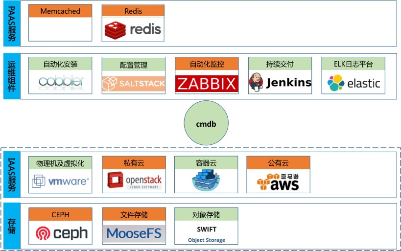

# 运维实践指南

[](https://github.com/meetbill/op_practice_book/stargazers)
[](https://github.com/meetbill/op_practice_book/fork)
[](https://github.com/meetbill/op_practice_book/watchers)



## 阅读本书

> * [网上阅读(gitbooks)](https://billwang139967.gitbooks.io/op_practice_book/content/)----gitbooks 网络被墙的厉害，可以通过下面链接在 github 上阅读
> * [网上阅读(github)](https://github.com/meetbill/op_practice_book/blob/master/SUMMARY.md)
> * [下载本书(pdf)](https://www.gitbook.com/download/pdf/book/billwang139967/op_practice_book)

## 相关内容

> * [文档规范](./standard.md)
> * [wiki](https://github.com/meetbill/op_practice_book/wiki)
> * [相关程序下载](https://github.com/meetbill/op_practice_code)
> * [点击进行反馈](https://github.com/meetbill/op_practice_book/issues)

## 参加步骤

* 在 GitHub 上 `fork` 到自己的仓库，然后 `clone` 到本地，并设置用户信息。
```
$ git clone https://github.com/meetbill/op_practice_book.git
$ cd op_practice_book
$ git config user.name "yourname"
$ git config user.email "your email"
```
* 修改代码后提交，并推送到自己的仓库。
```
$ #do some change on the content
$ git commit -am "Fix issue #1: change helo to hello"
$ git push
```
* 在 GitHub 网站上提交 pull request。
* 定期使用项目仓库内容更新自己仓库内容。
```
$ git remote add upstream https://github.com/meetbill/op_practice_book.git
$ git fetch upstream
$ git checkout master
$ git rebase upstream/master
$ git push -f origin master
```

## 小额捐款

如果觉得 `op_practice_book` 对您有帮助，可以请笔者喝杯咖啡（支付宝）


## Stargazers over time

[](https://starchart.cc/meetbill/op_practice_book)
