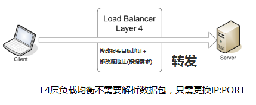
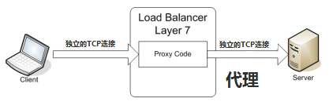

## 负载均衡

<!-- vim-markdown-toc GFM -->
* [解决的问题](#解决的问题)
* [网络层次上的负载均衡](#网络层次上的负载均衡)
    * [四层负载均衡](#四层负载均衡)
    * [七层负载均衡](#七层负载均衡)
* [负载均衡算法](#负载均衡算法)

<!-- vim-markdown-toc -->

## 解决的问题

* 能够将大规模并发访问和数据流量分发到多台内部服务器上，减少用户的等待时间；
* 当有重负载的计算请求时，能够将请求分解成多个任务，并将这些任务分配到内部多个计算服务器上，收集处理内部计算服务器的处理结果，汇总结果并返回给用户；
* 负载均衡能够大大提高系统的处理能力、提高系统灵活性；
* 高可用：当某服务器出现故障时，不影响其它服务器和用户的运行和使用；
* 当后端某个服务器出现故障时，能够将该服务器从服务列表中删除，当服务器恢复时，再将该服务器加入到列表中；
* 可伸缩：能够不影响其它服务器和用户的情况下进行扩容；

负载均衡的本质是数据包的转发，即如何将数据包转发到负载最小的服务器上去。最常用的硬件方案有 F5，软件方案有 LVS+Keepalived。

##  网络层次上的负载均衡

* 二层负载均衡，是通过一个虚拟的 MAC 地址接收请求，然后再分配到真实的 MAC 地址；
* 三层负载均衡，是通过一个虚拟的 IP 地址接收请求，然后分配到真实的 IP 地址；
* 四层负载均衡，是通过一个虚拟 IP+ 端口进行接收，然后分配到真实的服务器；
* 七层负载均衡，是通过一个虚拟的主机名或 URL 接收请求，然后分配到真实的服务器。可以根据 URL，浏览器类别，语言等，将请求发给不同的内部服务器。

### 四层负载均衡

* 首先会配置 frontend 的 IP:PORT 与 backend 的 IP:PORT 映射关系。当有客户端请求到来时，会根据映射关系，将请求转发到 backend 的服务器上去。
* 工作在 L4 层的负载均衡器，不需要对客户端的数据包内容进行解析。如 SYN 包到来时，负载均衡器只需要选择一个最佳的内部服务器，将 SYN 包中的 dst IP:PORT 替换为内部服务器的 IP:PORT，并直接转发给该内部服务器即可。对有些部署，可能还需要修改 source IP:PORT，这样负载均衡器可以收到内部服务器返回的包。

### 七层负载均衡

L7 层负载均衡，是应用层的负载均衡。

负载均衡器需要先和客户端建立连接 (TCP 三次握手），接收客户端发过来的报文，然后根据报文特定字段的内容，来选择内部服务器。L7 层负载均衡器，是一个代理服务器，需要与客户端和内部服务器间都建立连接。
一般来说，L7 层负载均衡的处理能力，低于 L4 层。

优点：
- 能够更好的拓展内部网络。如：能够将使用英语的和使用汉语的客户端请求，发送到不同的内部服务器。
- 能够将对图片的请求，发送到图片服务器，同时图片服务器可以加缓存。
- 能够提前过滤掉一些非法的请求和无用的数据包，而不用将这些请求发送到内部服务器，减轻内部服务器的压力。

缺点：
- 速度上，不如 L4 层快

## 负载均衡算法
- 轮循（Round Robin）：将每次请求，轮流的分配给内部服务器。当内部服务器的软硬件配置相当时，比较适合。
- 权重轮循（Weighted Round Robin）：根据内部服务器的配置不同，给每台服务器一个权重。如服务器 A 的权值被设计成 1，B 的权值是 3，C 的权值是 2，客户请求依次发给 [ABBBCC]。权重大的，分配到的任务就多。
- 随机（Random）：将请求随机分配给内部中的多个服务器。
- 权重随机（Weighted Random）：此种均衡算法类似于权重轮循算法，不过在处理请求分担时是个随机选择的过程。
- 响应速度（Response Time）：负载均衡器与内部服务器建立连接，并定时向内部服务器发 ping 包（或者其他包也行）。根据各服务器的响应速度，决定将用户请求发给哪台内部服务器。该均衡算法能够较好的反应内部服务器运行状况。
- 连接数（Connections）：有些内部服务器可能直接与客户端建立连接。这时可以询问内部服务器当前的用户连接数，并将新的用户请求发送给连接数最少的内部服务器。比较适合长连接。
- 处理能力（Processing　Capacity）：将内部服务器的 CPU/ 内存 /IO/ 当前负载，根据一定的算法换成负载值，并定时上报给负载均衡器。负载均衡器每次将用户请求转发给当前 Load 值最低的内部服务器。
- DNS 轮询：DNS 也可以用来做负载均衡。网络上，客户端一般通过域名来找到服务器的 IP 地址，DNS 服务器在接收客户端查询时，按顺序将服务器的 IP 地址返回给客户端，来达到均衡的目的。比较适合全局负载均衡。
- Hash：将访问用户的 IP 地址进行 hash，根据 hash 的结果来决定将该用户定向到哪台后端服务器。

