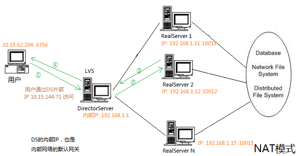
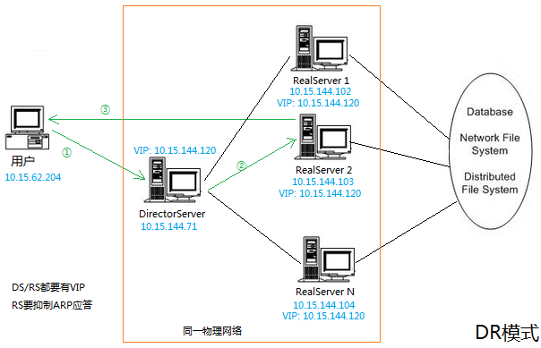
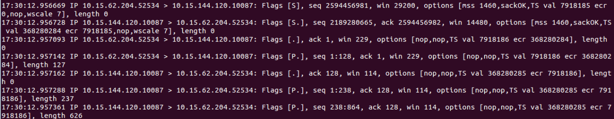

#  LVS

* [LVS 简介](#lvs-简介)
* [数据包三种转发方式](#数据包三种转发方式)
	* [NAT，网络地址翻译技术](#nat网络地址翻译技术)
	* [TUN，IP隧道技术](#tunip隧道技术)
	* [DR，直接转发](#dr直接转发)
* [配置脚本](#配置脚本)
* [ipvsadm](#ipvsadm)
* [tcpdump抓包分析](#tcpdump抓包分析)
* [问题分析](#问题分析)

## LVS 简介

[LVS](http://www.linuxvirtualserver.org/)(Linux Virtual Server)，早已加入到Linux内核中。
LVS使用的是IP负载均衡技术(ipvs模块实现)。LVS安装在DirectorServer(DS)上，DS根据配置信息虚拟出一个ip(VIP)，同时根据配置信息，生成路由表，将用户的数据包按照一定的法则转发到后端RealServer(RS)上。

LVS进行L4层转发，且在内核中，速度极快。与Keepalived相比，缺少对内部服务器的健康检查，且存在单点故障。
LVS使用ipvsadm来配置ipvs。

数据包的转发，有三种方法：NAT/TUN/DR。

| 模式 | 网络要求 | 是否需要VIP | 端口映射 | DS参与回包 | ARP隔离 | 效率 |
| ---- | ----------------------- | ----------- | -------- | ---------- | ------- | ---- |
| NAT | 同一网段 | 不需要 | 支持 | 是 | 不需要  | 最慢 |
| TUN | 可在同一物理网络或不同物理网络 | 需要 | - | 否 | - | 中等 |
| DR | 同一物理网络 | 需要 | 不支持 | 否 | 需要 | 最高 |

## 数据包三种转发方式

### NAT，网络地址翻译技术



DS和RS，都在同一个网段，才能进行NAT模式转发。同时需要将DS的内部IP设置为内部网络的默认网关，RS在回包时，直接发给内部网关（即DS），由内部网关进行转发。
用户通过DS的外部IP地址进行访问。
NAT模式下，是可以进行端口映射的。

整个数据包流程如下：
```sh
假设用户IP为10.15.62.204，使用端口6356；
用户->DS: src(10.15.62.204:6356) dst(10.15.144.71:80)
DS的外部IP收到数据包后，内核进行转发
DS->RS2: src(10.15.62.204:6356) dst(192.168.1.12:10012)
RS2收到数据包，处理完毕后，将回包通过内部网关发出去
RS2->DS: src(192.168.1.12:10012) dst(10.15.62.204:6356)
DS收到会包后，由内核转发给用户
DS->用户: src(10.15.144.71:80) dst(10.15.62.204:6356)
```

### TUN，IP隧道技术


调度器采用IP隧道技术，将用户的请求转发到RS，RS直接将响应发给用户。
TUN模式下，RS的回包，不需要经过DS，而是直接发给客户端。 

### DR，直接转发



DS通过改写请求报文的MAC地址，将请求发给RS，RS直接将响应发给用户。
**DR方式的效率最高**，但要求DS和RS在同一物理网络。
DR模式不支持端口映射；同时RS需要抑制关于VIP的ARP应答。

整个数据包处理过程：
```sh
假设客户端IP 10.15.62.204，使用端口6356
用户->DS: src(10.15.62.204:63565) dst(10.15.144.120:80)
DS收到包后，通过负载均衡算法，选择RS2，改写包的目的MAC地址，将数据包发给RS2
DS->RS2: src(10.15.62.204:63565) dst(10.15.144.120:80)，目的MAC发生改变
RS2处理完毕后，将回包直接发给客户端
RS2->用户: src(10.15.144.120:80) dst(10.15.62.204:63565)
```
从转发效率来讲，NAT最差；TUN多了ip隧道的处理，次之；DR效率最高。

## 配置脚本
以DR模式为例
```sh
# 安装LVS机器（即DirectorServer）脚本, lvs-DR.sh
# 设置VIP，并设置转发规则

#!/bin/sh

VIP=10.15.144.120
RIP1=10.15.144.102
RIP2=10.15.144.103
RIP3=10.15.144.104

. /etc/rc.d/init.d/functions
case "$1" in
    start)
        echo " start LVS of Director Server"
        /sbin/ifconfig eth0:1 $VIP broadcast $VIP netmask 255.255.255.255 up # 添加虚拟设备eth0:1和虚拟IP
        /sbin/route add -host $VIP dev eth0:1
        echo "1" >/proc/sys/net/ipv4/ip_forward # 允许转发

        /sbin/ipvsadm -C   #Clear IPVS table
        #set LVS
        /sbin/ipvsadm -A -t $VIP:10087 -s wrr -p 60 
        /sbin/ipvsadm -a -t $VIP:10087 -r $RIP1 -g -w 2 # -g 为DR模式， -w 为权重
        /sbin/ipvsadm -a -t $VIP:10087 -r $RIP2 -g -w 1
        /sbin/ipvsadm -a -t $VIP:10087 -r $RIP3 -g -w 1

        /sbin/ipvsadm  # 打印 ipvs 信息
    ;;
    stop)
        echo "close LVS Directorserver"
        echo "0" >/proc/sys/net/ipv4/ip_forward
        /sbin/ipvsadm -C
        /sbin/ifconfig eth0:1 down
    ;;
    *)
        echo "Usage: $0 {start|stop}"
        exit 1
esac

#-----------------------------------------------------------------------
# 在3台RealServer上，配置VIP，关闭对该VIP的ARP应答，所执行的脚本: rs-DR.sh
#!/bin/bash

VIP=10.15.144.120

. /etc/rc.d/init.d/functions
case "$1" in
    start)
        echo " Start LVS  of  Real Server"
        /sbin/ifconfig lo:0 $VIP netmask 255.255.255.255 broadcast $VIP up
        /sbin/route add -host $VIP dev lo:0
        # 忽略收到的arp广播
        echo "1" >/proc/sys/net/ipv4/conf/lo/arp_ignore   
        # 封装数据包时，忽略源ip(lvs服务器ip),而是将VIP做为源ip
        echo "2" >/proc/sys/net/ipv4/conf/lo/arp_announce  
        echo "1" >/proc/sys/net/ipv4/conf/all/arp_ignore
        echo "2" >/proc/sys/net/ipv4/conf/all/arp_announce
        sysctl -p > /dev/null 2>&1
        ;;
    stop)
        /sbin/ifconfig lo:0 down
        echo "close LVS Director server"
        route del $VIP > /dev/null 2>&1
        echo "0" >/proc/sys/net/ipv4/conf/lo/arp_ignore
        echo "0" >/proc/sys/net/ipv4/conf/lo/arp_announce
        echo "0" >/proc/sys/net/ipv4/conf/all/arp_ignore
        echo "0" >/proc/sys/net/ipv4/conf/all/arp_announce
        ;;
    *)
        echo "Usage: $0 {start|stop}"
        exit 1
esac
```
在DS和RS上运行相应的脚本后，LVS负载均衡系统就搭建完毕了。 

## ipvsadm

利用ipvs管理工具ipvsadm，查看DS内部情况
```sh
[root@10.15.144.71 lvs]# ipvsadm
IP Virtual Server version 1.2.1 (size=4096)
Prot LocalAddress:Port Scheduler Flags
  -> RemoteAddress:Port Forward Weight ActiveConn InActConn
TCP 10.15.144.120:10087 wrr persistent 2
  -> 10.15.144.102:10087 Route 2 0 4
  -> 10.15.144.103:10087 Route 1 0 0
  -> 10.15.144.104:10087 Route 1 0 0 

# 在10.15.62.204上进行测试，常用命令有： 
ll@ll-rw:~$ wget http://10.15.144.120:10087/index.html
ll@ll-rw:~$ ab -n 100 -c 10 http://10.15.144.120:10087/index.html

[root@10.15.144.71 lvs]# ipvsadm -L -c
IPVS connection entries
pro expire state       source               virtual             destination
TCP 00:22 FIN_WAIT 10.15.62.204:50937 10.15.144.120:10087 10.15.144.102:10087
TCP 00:04 FIN_WAIT 10.15.62.204:50930 10.15.144.120:10087 10.15.144.102:10087
TCP 01:50 FIN_WAIT 10.15.62.204:50959 10.15.144.120:10087 10.15.144.103:10087
TCP 00:50 NONE 10.15.62.204:0 10.15.144.120:10087 10.15.144.103:10087
TCP 00:22 NONE 10.15.62.204:0 10.15.144.120:65535 10.15.144.102:65535
TCP 00:06 FIN_WAIT 10.15.62.204:50931 10.15.144.120:10087 10.15.144.102:10087

# 关掉RealServer服务器中的服务，再次在10.15.62.204测试时，收到的错误信息
ll@ll-rw:~$ wget http://10.15.144.120:10087/index.html
--2014-11-18 16:47:40-- http://10.15.144.120:10087/index.html
Connecting to 10.15.144.120:10087... failed: No route to host.
```
当DR模式时，数据包是直接从RS返回到客户端的，所以在RS上也需要虚拟出设备和IP（lo:0 10.15.14.120）。RS直接利用该IP进行返回。
同时，在同一子网内，有多个Server都拥有10.15.14.120这个IP。当其它机器进行ARP查询时(who has ip 10.15.1.120)，只能够由DS进行响应，其他Server不能够响应。这也是RS需要使用echo "0" >/proc/sys/net/ipv4/conf/lo/arp_ignore的原因。 

## tcpdump抓包分析
使用tcpdump在DS上抓包，可以看到从User来的数据包，直接转发给了RS；RS收到数据包后，也是直接回复给了User，不需要再经过DS转发。下图是在RS(10.15.14.102)上抓包的截图：



## 问题分析
LVS存在单点故障。当LVS服务器挂掉了，整个系统就完了。
LVS不检测内部服务器的状态。当内部服务器挂掉时，仍然将请求发往该服务器。

**LVS+Keepalived**解决方案：
- 实现主备模式解决单点故障。
- 内部服务器有问题时，将其从可用服务器列表中删除；当其恢复时，再将其加入到可用服务器列表。
