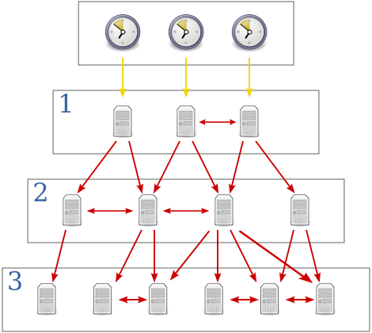

# 常见服务架设

<!-- vim-markdown-toc GFM -->

* [NTP](#ntp)
    * [简介](#简介)
    * [ntpd](#ntpd)
        * [NTP Server 安装配置](#ntp-server-安装配置)
        * [配置选项说明](#配置选项说明)
        * [相关命令](#相关命令)
    * [chrony](#chrony)
        * [chrony server](#chrony-server)
        * [chrony client](#chrony-client)
* [Cron](#cron)
    * [Cron 基础](#cron-基础)
        * [什么是 cron, crond, crontab](#什么是-cron-crond-crontab)
        * [crontab 选项](#crontab-选项)
        * [crontab 格式](#crontab-格式)
    * [使用举例](#使用举例)
* [rsync](#rsync)
    * [rsync 基本介绍](#rsync-基本介绍)
    * [rsync 工作场景](#rsync-工作场景)
    * [使用方法](#使用方法)
        * [rsync 选项](#rsync-选项)
        * [常用选项](#常用选项)
    * [一些命令](#一些命令)
        * [常用命令](#常用命令)
        * [ssh 端口非默认 22 同步](#ssh-端口非默认-22-同步)
        * [ssh 自动接受公钥和修改 known_hosts 文件](#ssh-自动接受公钥和修改-known_hosts-文件)
    * [inotify+rsync 实现实时文件同步](#inotifyrsync-实现实时文件同步)
        * [存储数据异地灾备](#存储数据异地灾备)
            * [需求背景](#需求背景)
            * [架构](#架构)
            * [脚本内容](#脚本内容)
            * [原理](#原理)
        * [常见问题](#常见问题)
            * [对大磁盘进行 inotify 监听时出错](#对大磁盘进行-inotify-监听时出错)
* [telnet-server](#telnet-server)
    * [安装使用](#安装使用)
    * [测试](#测试)
* [ftp](#ftp)
    * [ftp 简介](#ftp-简介)
    * [安装配置](#安装配置)
    * [设置 FTP 虚拟账号密码](#设置-ftp-虚拟账号密码)
        * [修改 proftpd 配置文件（早期系统镜像的默认 FTP 配置路径为 /etc/proftpd.conf）](#修改-proftpd-配置文件早期系统镜像的默认-ftp-配置路径为-etcproftpdconf)
        * [获取 ftpasswd 用于设置虚拟账号](#获取-ftpasswd-用于设置虚拟账号)
        * [设置账号密码](#设置账号密码)
        * [删除 ftpasswd](#删除-ftpasswd)
        * [重启 FTP 服务（如启动失败，proftpd -t -d5 检查配置文件出错点）](#重启-ftp-服务如启动失败proftpd--t--d5-检查配置文件出错点)
        * [wget 使用](#wget-使用)

<!-- vim-markdown-toc -->
# NTP
## 简介

Network Time Protocol-NTP 是用来使计算机时间同步化的一种协议，它可以使计算机对其服务器或时钟源（如石英钟，GPS 等等）做同步化，它可以提供高精准度的时间校正（LAN 上与标准间差小于 1 毫秒，WAN 上几十毫秒），且可使用加密确认的方式来防止恶毒的协议攻击。默认使用 `UDP 123 端口`

NTP 提供准确时间，首先需要一个准确的 UTC 时间来源，NTP 获得 UTC 的时间来源可以从原子钟、天文台、卫星，也可从 Internet 上获取。时间服务器按照 NTP 服务器的等级传播，根据离外部 UTC 源的远近将所有服务器归入不用的层 (Stratum) 中。Stratum-1 在顶层由外部 UTC 接入，stratum-1 的时间服务器为整个系统的基础，Stratum 的总数限制在 15 以内。下图为 NTP 层次图：



## ntpd
### NTP Server 安装配置

关于 NTP 服务器的安装，根据不同版本安装方法也不同。REDHAT 系统则可以使用 yum 安装，Ubuntu 系列可以使用 `apt-get` 安装，这里不做具体的介绍，主要详细介绍配置文件的信息。

对于 CentOS 过滤注释和空行后，NTP 配置文件内容如下

```
# grep -vE '^#|^$' /etc/ntp.conf
driftfile /var/lib/ntp/drift

# 默认对所有 client 拒绝所有的操作
restrict default kod nomodify notrap nopeer noquery
restrict -6 default kod nomodify notrap nopeer noquery

# 允许本机地址的一切操作
restrict 127.0.0.1
restrict -6 ::1

# 允许其他机器连接
restrict default kod nomodify

server 0.centos.pool.ntp.org
server 1.centos.pool.ntp.org
server 2.centos.pool.ntp.org
includefile /etc/ntp/crypto/pw
keys /etc/ntp/keys
```

### 配置选项说明

* `driftfile` 选项， 用来保存系统时钟频率偏差。 ntpd 程序使用它来自动地补偿时钟的自然漂移， 从而使时钟即使在切断了外来时源的情况下， 仍能保持相当的准确度。`无需更改`
* `restrict` 语法为：restrict IP mask 掩码 参数
    * IP 规定了允许或不允许访问的地址（此处若为 default，即为 0.0.0.0 所有 ip），配合掩码可以对某一网段进行限制。
        * `ignore`:     关闭所有 NTP 服务
        * `nomodiy`:    客户端不能修改服务端的时间，但可以作为客户端的校正服务器
        * `notrust`:    拒绝没有通过认证的客户端
        * `kod`:        kod 技术科阻止 "Kiss of Death" 包（一种 DOS 攻击）对服务器的破坏
        * `nopeer`:     不与其它同一层的 NTP 服务器进行同步
        * `noquery`:    不提供时间查询，即用户端不能使用 ntpq，ntpc 等命令来查询 ntp 服务器
        * `notrap`:     不提供 trap 远端事件登陆的功能
* `server [IP|FQDN|prefer]`指该服务器上层 NTP Server，使用 prefer 的优先级最高，没有使用 prefer 则按照配置文件顺序由高到低，默认情况下至少 15min 和上层 NTP 服务器进行时间校对
* `fudge`:          可以指定本地 NTP Server 层，如 `fudge 127.0.0.1 stratum 9`
* `broadcast 网段 子网掩码`:    指定 NTP 进行时间广播的网段，如`broadcast 192.168.1.255`
* `logfile`:        可以指定 NTP Server 日志文件

**bill 提醒**
```
restrict 用于权限控制，server 用于设定上级时间服务器
主要是这两个参数
```

几个与 NTP 相关的配置文件：` /usr/share/zoneinfo/`、`/etc/sysconfig/clock`、`/etc/localtime`

* `/usr/share/zoneinfo/`:  存放时区文件目录
* `/etc/sysconfig/clock`:  指定当前系统时区信息
* `/etc/localtime`:        相应的时区文件

如果需要修改当前时区，则可以从 /usr/share/zoneinfo/ 目录拷贝相应时区文件覆盖 /etc/localtime 并修改 /etc/sysconfig/clock 即可

```
cp /usr/share/zoneinfo/Asia/Shanghai /etc/localtime
sed -i 's:ZONE=.*:ZONE="Asia/Shanghai":g' /etc/sysconfig/clock
```

### 相关命令

`ntpstat` 查看同步状态

```
# ntpstat
synchronised to NTP server (192.168.0.18) at stratum 4
   time correct to within 88 ms  	# 表面时间校正 88ms
   polling server every 1024 s		# 每隔 1024s 更新一次
```

`ntpq` 列出上层状态

```
# ntpq -np
   remote refid  st t when poll reach   delay   offset  jitter
==============================================================
* NTPD(IP)  IP   3  u  101 1024  377   14.268    0.998   0.143
```

输出说明：

* `remote`:  NTP Server
* `refid` :  参考的上层 ntp 地址
* `st`    :  层次
* `when`  :  上次更新时间距离现在时常
* `poll`  :  下次更新时间
* `reach` :  更新次数
* `delay` :  延迟
* `offset`:  时间补偿结果
* `jitter`:  与 BIOS 硬件时间差异

`ntpdate` 同步当前时间：`ntpdate NTP 服务器地址`

## chrony

使用安装命令安装 chrony 包即可

### chrony server

配置文件：/etc/chrony.conf

对于 chrony server 来说，主要配置两项，上游的 ntp 服务器和对下游的权限

> * 上游的 ntp 服务器
>   * 有固定的 ntp 服务器或者可连互联网
>     * 配置 `server 0.centos.pool.ntp.org iburst` 即可
>   * 无外网环境使用本地的时间进行往下游同步
>     * 配置 `local stratum 10`
> * 对下游的权限
>   * `allow 10.0.0.0/24` 对 10.0.0 网段开放
>   * `allow 0/0` 对所有 IP 开放

**bill 提醒**
```
(1) 无外网环境时，如果没有设置 local stratum 0，下游服务器显示的状态是不可达状态
(2) 不加 allow 记录时，默认拒绝所有连接
(3) chrony 端口为 udp 123
```
启动并设置开机自启
```
# systemctl enable chronyd.service
# systemctl start chronyd.service
```
### chrony client

对于 client 来说，只需要配置上游的服务器

配置文件：/etc/chrony.conf

添加 `server 上游服务器 IP/ 主机名 iburst`即可

启动并设置开机自启
```
# systemctl enable chronyd.service
# systemctl start chronyd.service
```

**查看同步状态**

```
#chronyc sources -v
```
上面命令会输出上游服务器的连接状态
> * `* 正常`
> * `? 不可达`

# Cron
## Cron 基础

### 什么是 cron, crond, crontab

> **cron** is the general name for the service that runs scheduled actions. **crond** is the name of the daemon that runs in the background and reads **crontab** files.

简单理解：cron 是服务，crond 是守护进程， crontab 的 crond 的配置文件。

### crontab 选项

+ `crontab -e` : Edit your crontab file, or create one if it doesn't already exist. # 推荐使用命令新增计划任务 -- 语法检查
+ `crontab -l` : Display your crontab file.
+ `crontab -r` : Remove your crontab file. # 慎用
+ `crontab -u user` : Used in conjunction with other options, this option allows you to modify or view the crontab file of user. When available, only administrators can use this option.

### crontab 格式

    minute(s) hour(s) day(s) month(s) weekday(s) command(s)

```
# Use the hash sign to prefix a comment
# +—————- minute (0 – 59)
# |  +————- hour (0 – 23)
# |  |  +———- day of month (1 – 31)
# |  |  |  +——- month (1 – 12)
# |  |  |  |  +—- day of week (0 – 7) (Sunday=0 or 7)
# |  |  |  |  |
# *  *  *  *  *  command to be executed
```

## 使用举例

使用命令 `crontab -e` 编辑 crontab 文件。

(1) 在每天的 7 点同步服务器时间

    0 7 * * * ntpdate 192.168.1.112


(2) 每两个小时执行一次

    0 */2 * * * echo "2 minutes later" >> /tmp/output.txt

(3) 每周五早上十点写周报

    0 10 * * * 5 /home/jerryzhang/update_weekly.py

(4) 每天 6, 12, 18 点执行一次命令

    0 6,12,18 * * *  /bin/echo hello

(5) 每天 13, 14, 15, 16, 17 点执行一次命令

    0 13-17 * * *  /bin/echo hello

__注：__

* 程序执行完毕，系统会给对应用户发送邮件，显示该程序执行内容，如果不想收到，可以重定向内容 `> /dev/null 2>&1`
* 如果执行语句中有 `%` 号，需要使用反斜杠 '\' 转义

# rsync

## rsync 基本介绍

`rsync` 是类 unix 系统下的数据镜像备份工具，从软件的命名上就可以看出来了—— remote sync。它的特性如下：


* 1、可以镜像保存整个目录树和文件系统
* 2、可以很容易做到保持原来文件的权限、时间、软硬链接等等
* 3、无须特殊权限即可安装
* 4、优化的流程，文件传输效率高
* 5、可以使用 rsh、ssh 等方式来传输文件，当然也可以通过直接的 socket 连接
* 6、支持匿名传输

在使用 rsync 进行远程同步时，可以使用两种方式：__远程 Shell 方式__（用户验证由 ssh 负责）和 __C/S 方式__（即客户连接远程 rsync 服务器，用户验证由 rsync 服务器负责）。

无论本地同步目录还是远程同步数据，首次运行时将会把全部文件拷贝一次，以后再运行时将只拷贝有变化的文件（对于新文件）或文件的变化部分（对于原有文件）。

## rsync 工作场景

> * 两台服务器之间数据同步。
> * 把所有客户服务器数据同步到备份服务器，生产场景集群架构服务器备份方案。
> * rsync 结合 inotify 的功能做实时的数据同步。

## 使用方法

rsync 可以使用 ssh 和 C/S 方式进行传输文件，以下使用 ssh 方式

```
rsync [OPTION]... SRC [SRC]... [USER@]HOST:DEST # 执行“推”操作
or   rsync [OPTION]... [USER@]HOST:SRC [DEST]   # 执行“拉”操作
```
### rsync 选项

```
Usage: rsync [OPTION]... SRC [SRC]... DEST
  or   rsync [OPTION]... SRC [SRC]... [USER@]HOST:DEST
  or   rsync [OPTION]... SRC [SRC]... [USER@]HOST::DEST
  or   rsync [OPTION]... SRC [SRC]... rsync://[USER@]HOST[:PORT]/DEST
  or   rsync [OPTION]... [USER@]HOST:SRC [DEST]
  or   rsync [OPTION]... [USER@]HOST::SRC [DEST]
  or   rsync [OPTION]... rsync://[USER@]HOST[:PORT]/SRC [DEST]
The ':' usages connect via remote shell, while '::' & 'rsync://' usages connect
to an rsync daemon, and require SRC or DEST to start with a module name.
```

__注：__ 在指定复制源时，路径是否有最后的 “/” 有不同的含义，例如：

* /data ：表示将整个 /data 目录复制到目标目录
* /data/ ：表示将 /data/ 目录中的所有内容复制到目标目录

### 常用选项

* `-v` : Verbose (try -vv for more detailed information)            # 详细模式显示
* `-e` "ssh options" : specify the ssh as remote shell              # 指定 ssh 作为远程 shell
* `-a` : archive mode   # 归档模式，表示以递归方式传输文件，并保持所有文件属性，等于 -rlptgoD
    * `-r`(--recursive) : 目录递归
    * `-l`(--links) ：保留软链接
    * `-p`(--perms) ：保留文件权限
    * `-t`(--times) ：保留文件时间信息
    * `-g`(--group) ：保留属组信息
    * `-o`(--owner) ：保留文件属主信息
    * `-D`(--devices) ：保留设备文件信息
* `-z` : 压缩文件
* `-h` : 以可读方式输出
* `-H` : 复制硬链接
* `-X` : 保留扩展属性
* `-A` : 保留 ACL 属性
* `-n` : 只测试输出而不正真执行命令，推荐使用，特别防止 `--delete` 误删除！
* `--stats` : 输出文件传输的状态
* `--progress` : 输出文件传输的进度
* `––exclude=PATTERN` : 指定排除一个不需要传输的文件匹配模式
* `––exclude-from=FILE` : 从 FILE 中读取排除规则
* `––include=PATTERN` : 指定需要传输的文件匹配模式
* `––include-from=FILE` : 从 FILE 中读取包含规则
* `--numeric-ids` : 不映射 uid/gid 到 user/group 的名字
* `-S, --sparse` : 对稀疏文件进行特殊处理以节省 DST 的空间（有空洞文件时使用）
* `--delete` : 删除 DST 中 SRC 没有的文件，也就是所谓的镜像 [mirror] 备份
* `-P` 等同于 `--partial` 保留那些因故没有完全传输的文件，以是加快随后的再次传输


## 一些命令

### 常用命令

```
#rsync -avzP --delete [SRC] [DEST]
```

__注：__ 日常传输时参数记不清楚时，只需要加 `-a` 参数即可，如果有稀疏文件，则添加 `-S` 选项可以提升传输性能。

```
[tips]
稀疏文件（Sparse File）

在 UNIX 文件操作中，文件位移量可以大于文件的当前长度，在这种情况下，对该文件的下一次写将延长该文件，并在文件中构成一个空洞。位于文件中但没有写过的字节都被设为 0。

稀疏文件与其他普通文件基本相同，区别在于文件中的部分数据是全 0，且这部分数据不占用磁盘空间。
下面是稀疏文件的创建与查看方法
[root@Linux ceshi]# dd if=/dev/zero of=sparse-file bs=1 count=1 seek=1024k
[root@Linux ceshi]#  ls -l sparse-file
-rw-r--r-- 1 root root 1048577 6 月  19 10:20 sparse-file
[root@Linux ceshi]# du -sh sparse-file
4.0K    sparse-file
[root@Linux ceshi]# cat sparse-file  >> meetbill_file
[root@Linux ceshi]# du -sh meetbill_file
1.1M    meetbill_file
[root@Linux ceshi]# ll
总用量 1032
-rw-r--r-- 1 root root 1048577 6 月  19 10:21 meetbill_file
-rw-r--r-- 1 root root 1048577 6 月  19 10:20 sparse-file
[root@Linux ceshi]# ll -h
总用量 1.1M
-rw-r--r-- 1 root root 1.1M 6 月  19 10:21 meetbill_file
-rw-r--r-- 1 root root 1.1M 6 月  19 10:20 sparse-file
```

### ssh 端口非默认 22 同步

使用 ssh 方式传输时如果连接服务器 ssh 端口非标准，则需要通过 `-e` 选项指定：

```
#rsync -avzP --delete  -e "ssh -p 22222" [USER@]HOST:SRC [DEST]
```
### ssh 自动接受公钥和修改 known_hosts 文件

```
#rsync -a -e "ssh -oUserKnownHostsFile=/dev/null -oStrictHostKeyChecking=no" [USER@]HOST:SRC [DEST]
```

## inotify+rsync 实现实时文件同步

### 存储数据异地灾备

#### 需求背景

服务器文件需要实时同步，即使是轮询，也存在同步延迟，inotify 的出现让真正的实时成为了现实
我们可以用 inotify 去监控文件系统的事件变化，一旦有我们期望的事件发生，就使用 rsync 进行冗余同步

#### 架构


| 用途        | IP           |
| ------------- |:-------------:|
| 服务端 A| 192.168.199.101 |
| 服务器 B（备份服务器） | 192.168.199.102|

```
   +--------+          +-------------------+
   |服务器 A |--------->|服务器 B（备份服务器）|
   +--------+          +-------------------+

  inotify+rsync             rsync

```

#### 脚本内容

所有配置只需要在服务器 A 上配置即可

(1) 安装 `inotify-tools`(yum -y install inotify-tools)

(2) 配置服务器 A 使用秘钥登录服务器 B

(3) 在服务器 A 上编写脚本，主要配置服务器 B 的机器 IP，登录用户，以及服务器器 A 的存储目录和存储数据异地灾备目录

将此文件保存到 /opt/inotify_rsync.sh

``` bash
    #!/bin/bash
    host=192.168.199.102
    user=root
    # 服务器存储目录
    src='/tmp/src1/'
    # 存储数据异地灾备目录
    dest='/tmp/dest1'

    inotifywait -mrq -e modify,attrib,moved_to,moved_from,move,move_self,create,delete,delete_self --timefmt='%d/%m/%y %H:%M' --format='%T %w%f %e' $src | while read chgeFile
    do
        rsync -avPz --delete $src $user@$host:$dest &>>./rsync.log
    done
```

下载脚本

```
#curl -o inotify_rsync.sh https://raw.githubusercontent.com/meetbill/op_practice_code/master/Linux/service/inotify_rsync.sh
```

(3) 启动异地灾备程序

```
    #nohup /bin/bash /opt/inotify_rsync.sh &  // 后台不挂断地运行命令
    #echo "nohup /bin/bash /opt/inotify_rsync.sh &" >> /etc/rc.local // 设置 linux 服务器启动自动启动 nohup
```

#### 原理

1. 使用 inotifywait 监控文件系统时间变化
2. while 通过管道符接受内容，传给 read 命令
3. read 读取到内容，则执行 rsync 程序

### 常见问题

#### 对大磁盘进行 inotify 监听时出错
```
Failed to watch /mnt/;upper limit on inotify watches reached!
Please increase the amount of inotify watches allowed per user via `/proc/sys/fs/inotify/max_user_watches’.`
```
cat 一下这个文件，默认值是 8192，echo 8192000 > /proc/sys/fs/inotify/max_user_watches 即可~

# telnet-server

## 安装使用

```
#curl -o telnet-server.tar.gz https://raw.githubusercontent.com/meetbill/op_practice_code/master/Linux/service/telnet-server.tar.gz
#tar -zxvf telnet-server.tar.gz
#cd telnet-server*
#sh start.sh
```
执行程序后有三项，执行第一项可以进行安装并启动 telnet-server，第二项会关闭 telnet-server 并将开机自动启动关闭

## 测试

需要测试 telnet 是否成功开启
```
#telnet localhost
```
输入用户名密码能登录成功。同时需要测试下其他机器远程 telnet 是否成功，如果不成功，那么很有可能是防火墙的问题

```
#iptables -I INPUT -p tcp --dport 23 -jACCEPT
#service iptables save
#service iptables restart
```
# ftp

## ftp 简介

ftp 工作会启动两个通道：控制通道 ， 数据通道。在 ftp 协议中，控制连接均是由客户端发起的，而数据连接有两种模式：port 模式（主动模式）和 pasv 模式（被动模式）

* **PORT 模式：**
在客户端需要接收数据时，ftp_client （大于 1024 的随机端口） —> PORT 命令 —> ftp_server (21)  发送 PORT 命令，这个 PORT 命令包含了客户端是用什么端口来接收数据（大于 1024 的随机端口），在传送数据时， ftp_server 将通过自己的 TCP 20 端口和 PORT 中包含的端口建立新的连接来传送数据。

* **PASV 模式：**
传送数据时，ftp_client —> PASV 命令 —> ftp_server(21) 发送 PASV 命令时，ftp_server 自动打开一个 1024--5000 之间的随机端口并且通知 ftp_client 在这个端口上传送数据，然后客户端向指定的端口发出请求连接，建立一条数据链路进行数据传输。


如果想对访问 FTP 的帐户给予更多的权限，可以用本地帐户来实现。但是，本地帐户默认情况下是可以登陆 Linux 系统的，这样对 Linux 系统来说是一个安全隐患。那么怎么能在灵活的赋予 FTP 用户权限的前提下，保证 FTP 服务器乃至整个 Linux 系统的安全呢？使用虚拟用户就是一种解决办法

安装包
> * vsftpd
> * db4*

## 安装配置

```
[root@meetbill ~]#curl -o ftptool.sh https://raw.githubusercontent.com/meetbill/op_practice_code/master/Linux/service/ftptool.sh
[root@meetbill ~]#chmod +x ftptool.sh
[root@meetbill ~]#./ftptool.sh install_server
[root@meetbill ~]#./ftptool.sh add_user
[root@meetbill ~]#./ftptool.sh start
```

## 设置 FTP 虚拟账号密码

### 修改 proftpd 配置文件（早期系统镜像的默认 FTP 配置路径为 /etc/proftpd.conf）

```
注释<Anonymous ~ftp> … </Anonymous>之间相关配置

<Anonymous ~ftp> … </Anonymous>之外新增如下配置
AuthOrder mod_auth_file.c

AuthUserFile /etc/proftpd.passwd

RequireValidShell off
```


### 获取 ftpasswd 用于设置虚拟账号

拉取 proftpd 源码包中的 ftpasswd 文件
```
cd /usr/sbin;wget https://github.com/downloads/proftpd/proftpd.github.com/proftpd-1.3.4b.tar.gz -O proftpd-1.3.4b.tar.gz; tar -zxvf proftpd-1.3.4b.tar.gz; mv ./proftpd-1.3.4b/contrib/ftpasswd .;rm -rf proftpd-1.3.4b*
```
### 设置账号密码
```
ftpasswd --file=/etc/proftpd.passwd --home=xxx --shell=/bin/false --name=xxx --uid=99 --gid=99 --passwd
```
配置说明

> * --home=xxx 指定 ftp 用户登录后的根目录（eg. --home=/home）
> * --name=xxx 指定 ftp 用户名
> * --uid=99 --gid=99 指定账号关联对应系统用户和组
> * wget 获取文件路径以–home 指定路径为基础进行拼接（eg. --home=/home; wget ftp://…/home/work => wget ftp://…/work ）

> demo
```
id meetbill
uid=500(meetbill) gid=501(meetbill) groups=501(meetbill)

ftpasswd --file=/etc/proftpd.passwd --home=/home/meetbill/ --shell=/bin/false --name=meetbill --uid=500 --gid=501 --passwd
这里会输入两次密码
```

### 删除 ftpasswd
```
cd /usr/sbin; rm -f ftpasswd
```
### 重启 FTP 服务（如启动失败，proftpd -t -d5 检查配置文件出错点）
```
service proftpd restart
```

### wget 使用
```
wget --ftp-user=meetbill  --ftp-password=xxxxxxxxx  ftp://xxxx/test_dif/test_file -O test_file

test_dif/test_file 在物理机上的绝对路径为 /home/meetbill/test_dif/test_file
```
