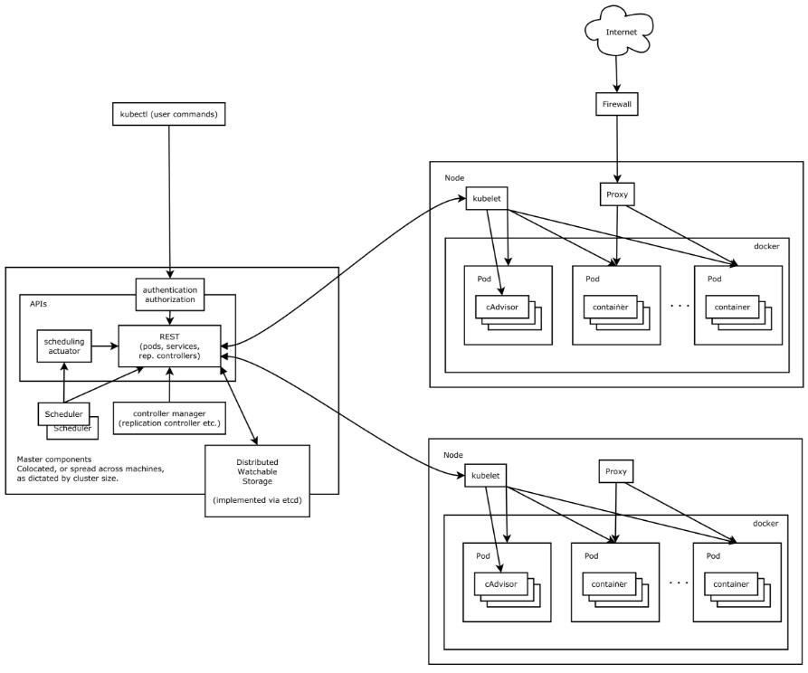
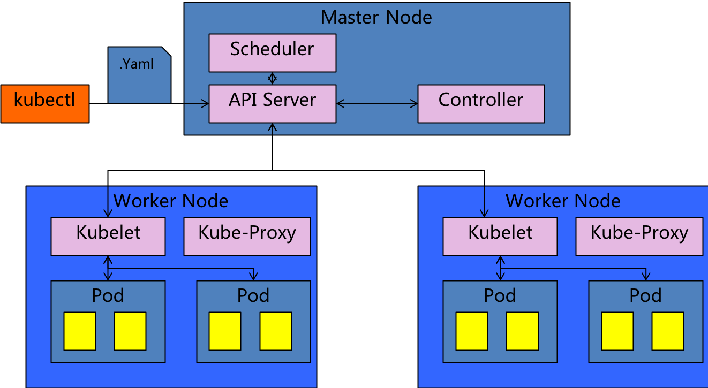

## K8s

<!-- vim-markdown-toc GFM -->

* [1 Kubernetes 概述](#1-kubernetes-概述)
    * [1.1 简介](#11-简介)
    * [1.2 特性](#12-特性)
* [2 Kubernetes 设计架构](#2-kubernetes-设计架构)
    * [2.1 官网体验教程](#21-官网体验教程)
* [3 重要概念](#3-重要概念)
* [4 使用 yaml 文件来部署应用实践](#4-使用-yaml-文件来部署应用实践)
    * [4.1 扩容及缩容](#41-扩容及缩容)
        * [创建 namespace](#创建-namespace)
        * [创建应用](#创建应用)
        * [扩容](#扩容)
        * [创建 service 及访问 service](#创建-service-及访问-service)
    * [4.2 版本更新](#42-版本更新)
        * [push 新版本的 image](#push-新版本的-image)
        * [更新 kube 的 image 版本](#更新-kube-的-image-版本)
        * [查询版本](#查询版本)
        * [检查是否符合预期](#检查是否符合预期)
        * [回滚](#回滚)
    * [4.3 小流量测试](#43-小流量测试)
        * [创建 2 个 deployment](#创建-2-个-deployment)
        * [创建访问节点](#创建访问节点)
    * [4.4 自动扩容](#44-自动扩容)
        * [清空之前环境](#清空之前环境)
        * [创建 deployment](#创建-deployment)
        * [设置自动扩容规则](#设置自动扩容规则)
        * [设置 service](#设置-service)
        * [压测服务](#压测服务)
        * [删除自动扩容策略](#删除自动扩容策略)
* [5 K8s 日常调试](#5-k8s-日常调试)
    * [5.1 查看 Pod 生命周期的事件](#51-查看-pod-生命周期的事件)
    * [5.2 查看资源 (CPU/Memory) 使用情况](#52-查看资源-cpumemory-使用情况)
    * [5.3 如何摘下某个 Pod 进行 Debug](#53-如何摘下某个-pod-进行-debug)

<!-- vim-markdown-toc -->
## 1 Kubernetes 概述

### 1.1 简介
Kubernetes 是一个开源的，用于管理云平台中多个主机上的容器化的应用，Kubernetes 的目标是让部署容器化的应用简单并且高效（powerful）,Kubernetes 提供了应用部署，规划，更新，维护的一种机制。

### 1.2 特性

> * 服务发现和负载均衡
> * 自我修复 - 重新启动失败的容器
> * 横向缩放 - 使用简单的命令或 UI，或者根据 CPU 的使用情况自动调整应用程序副本数
> * 自动部署和回滚
> * 密钥和配置管理 - 部署和更新密钥和应用程序配置，不会重新编译镜像，不会暴露
> * 更多

## 2 Kubernetes 设计架构

Kubernetes 集群包含有节点代理 kubelet 和 Master 组件 (APIs, scheduler, etc)，一切都基于分布式的存储系统。下面这张图是 Kubernetes 的架构图。



k8s 全景简图



### 2.1 官网体验教程

https://kubernetes.io/docs/tutorials/kubernetes-basics/

官网通过如下 6 部分来实践如何玩转 k8s

> * 创建 k8s 集群
> * 部署应用
> * 内部访问应用
> * 外部访问应用
> * Scale 应用
> * 滚动更新

## 3 重要概念

> * Cluster : 计算，存储和网络资源的集合，K8s 利用这些资源运行各种基于容器的应用
>   * 比如在百度 CCE 上首先需要创建个集群（购买 N 台 BCC 实例时，实际后台是创建了 N+3 实例，其中 3 台用于创建 Master 节点）
> * Master : 主要负责调度，决定应用放在哪里运行
> * Node ：Node 的职责是运行容器应用。
>   * Node 由 Master 管理，Node 负责监控并汇报容器的状态
>   * 根据 Master 的要求管理容器的生命周期
> * Pod ：K8s 的最小工作单元。每个 Pod 包含一个或者多个容器。
>   * Pod 中的容器会作为一个整体被 Master 调度到一个 Node 上运行
> * Controller : K8s 通过 Controller 来管理 Pod，Controller 定义了 Pod 的部署特性：
>   * Deployment: 记录版本更新信息，通过控制 replicaset，完成版本更新，回滚等操作
>   * ReplicaSet: 控制 pods 数量
>   * DaemonSet
>   * StatefuleSet
>   * Job
> * Service：定义了外界访问一组 Pod 的方式
>   * ClusterIP
>   * NodePort
>   * LoadBalancer
> * Namespace
>   * 多个用于或者项目可以使用同一个 cluster , 然后使用不同的 Namespace
>   * --namespace=name 名

## 4 使用 yaml 文件来部署应用实践

### 4.1 扩容及缩容

#### 创建 namespace

> kubectl create -f namespace.yaml

namespace.yaml:
```
apiVersion: v1
kind: Namespace
metadata:
  name: meetbill
```
> kubectl get deployments --namespace=meetbill

空的

#### 创建应用

> kubectl create -f mypython.yaml

mypython.yaml:
```
apiVersion: extensions/v1beta1
kind: Deployment
metadata:
  name: mypython-deployment
  namespace: meetbill
spec:
  replicas: 3
  template:
    metadata:
      labels:
        app: mypython
        track: stable
        version: 1.0.0
    spec:
      containers:
        - name: mypython
          image: "hub.baidubce.com/xxxx/mypython:1.0.0"
          ports:
            - name: http
              containerPort: 8080
```
> * apiVersion 是当前配置格式的版本。
> * kind 是要创建的资源类型，这里是 Deployment。
> * metadata 是该资源的元数据，name 是必需的元数据项。
> * spec 部分是该 Deployment 的规格说明。
> * replicas 指明副本数量，默认为 1。
> * template 定义 Pod 的模板，这是配置文件的重要部分。
> * metadata 定义 Pod 的元数据，至少要定义一个 label。label 的 key 和 value 可以任意指定。
> * spec 描述 Pod 的规格，此部分定义 Pod 中每一个容器的属性，name 和 image 是必需的。

> kubectl get pods --namespace=meetbill 能看到实例是 3

```
NAME                                  READY     STATUS    RESTARTS   AGE
mypython-deployment-b5f8f646d-b2dzs   1/1       Running   0          23s
mypython-deployment-b5f8f646d-f7vwz   1/1       Running   0          23s
mypython-deployment-b5f8f646d-vnqqm   1/1       Running   0          23s
```

#### 扩容

> $kubectl scale deployments/mypython-deployment --replicas=4 --namespace=meetbill
> $kubectl get pods  --namespace=meetbill 能看到实例已经变为 4 个

#### 创建 service 及访问 service

> kubectl create -f mypython-svc.yaml

mypython-svc.yaml:
```
apiVersion: v1
kind: Service
metadata:
  name: mypython-svc
  namespace: meetbill
  labels:
    app: mypython
spec:
  ports:
  - port: 8080
    targetPort: 8080
  type: NodePort
  selector:
    app: mypython
```

> export NODE_PORT=$(kubectl get services/mypython-svc -o go-template='{{(index .spec.ports 0).nodePort}}' --namespace=meetbill)

获得 NODE_PORT

> $while (true); do curl http://$VM_IP:$NODE_PORT; sleep 1;done

重复的刷，能看到是多个实例的返回

### 4.2 版本更新

#### push 新版本的 image

> $docker build -t hub.baidubce.com/xxxx/mypython:2.0.0 .
> $docker push hub.baidubce.com/xxxx/mypython:2.0.0

#### 更新 kube 的 image 版本

> $kubectl set image deployments/mypython-deployment  mypython=hub.baidubce.com/xxxx/web-server:2.0 --namespace=meetbill

mypython 为 Deployment 中 Pod 的 name 名

#### 查询版本

> $kubectl get pods --namespace=meetbill（能看到新的 pod 被创建，老 pod 被销毁）
> $kubectl rollout status deployments/mypython-deployment --namespace=meetbill

```
deployment "mypython-deployment" successfully rolled out
```
#### 检查是否符合预期

> export NODE_PORT=$(kubectl get services/mypython-svc -o go-template='{{(index .spec.ports 0).nodePort}}' --namespace=meetbill)

获得 NODE_PORT

> $while (true); do curl http://$VM_IP:$NODE_PORT; sleep 1;done

可以看到版本逐渐变为新版本

#### 回滚

> kubectl rollout undo deployment/mypython-deployment --namespace=meetbill 回滚

### 4.3 小流量测试

#### 创建 2 个 deployment
> kubectl create -f deployments/mypython.yaml 创建 3 个 pod，运行 v1.0.0
> kubectl create -f deployments/mypython-canary.yaml 创建一个 pod，运行 v2.0.0

deployments/mypython.yaml:
```
apiVersion: extensions/v1beta1
kind: Deployment
metadata:
  name: mypython-deployment
  namespace: meetbill
spec:
  replicas: 3
  template:
    metadata:
      labels:
        app: mypython
        track: stable
        version: 1.0.0
    spec:
      containers:
        - name: mypython
          image: "hub.baidubce.com/xxxx/mypython:1.0.0"
          ports:
            - name: http
              containerPort: 8080

```
deployments/mypython-canary.yaml:
```
apiVersion: extensions/v1beta1
kind: Deployment
metadata:
  name: mypython-canary
  namespace: meetbill
spec:
  replicas: 1
  template:
    metadata:
      labels:
        app: mypython
        track: canary
        version: 2.0.0
    spec:
      containers:
        - name: hello
          image: "hub.baidubce.com/xxxx/mypython:2.0.0"
          ports:
            - name: http
              containerPort: 8080
```

#### 创建访问节点
> kubectl create -f services/mypython-svc.yaml

通过 selector(app: mypython) 将两个版本的服务放在一个 service 中

services/mypython-svc.yaml:
```
apiVersion: v1
kind: Service
metadata:
  name: mypython-svc
  namespace: meetbill
  labels:
    app: mypython
spec:
  ports:
  - port: 8080
    targetPort: 8080
  type: NodePort
  selector:
    app: mypython
```
### 4.4 自动扩容

#### 清空之前环境

删除 service
> kubectl delete service -l app=mypython --namespace=meetbill

删除 deployment
> kubectl delete deployment mypython-deployment --namespace=meetbill

#### 创建 deployment

创建 deployment，包含一个有资源限制的 pod

> kubectl create -f ./mypython-autoscale.yaml

```
apiVersion: extensions/v1beta1
kind: Deployment
metadata:
  name: mypython-deployment
  namespace: meetbill
spec:
  replicas: 1
  template:
    metadata:
      labels:
        app: mypython
        track: stable
        version: 1.0.0
    spec:
      containers:
        - name: mypython
          resources:
              requests:
                  cpu: "300m"
                  memory: 1Gi
              limits:
                  cpu: "500m"
                  memory: 2Gi
          imagePullPolicy: Always
          image: "hub.baidubce.com/xxxx/mypython:autoscale"
          ports:
            - name: http
              containerPort: 8080
```
#### 设置自动扩容规则

> kubectl autoscale deployment mypython-deployment --min=1 --max=3 --cpu-percent=2 --namespace=meetbill

设置该 deployment 中 pod cpu 超过 2% 进行自动扩容，最多扩容 3 个

#### 设置 service
> kubectl create -f services/mypython-svc.yaml 创建一个 service，使得这个 pod 可以被访问到

通过下面方式也可以获取到 service 的端口，如下 32410 即要访问的端口
> kubectl get service --namespace=meetbill
```
NAME           TYPE       CLUSTER-IP       EXTERNAL-IP   PORT(S)          AGE
mypython-svc   NodePort   172.16.244.116   <none>        8080:32410/TCP   26s
```

#### 压测服务
> ab -c 100 -n 100000 "http://$VM_IP:$NODE_PORT/"

使用 ab 进行压测

> watch -n 1 'kubectl top pod --namespace=meetbill'

使用 kubectl top 命令查看 pod 资源利用状态，可以看到 cpu 超过 200m 时，自动扩容至 3 个 pod

> kubectl get pod --namespace=meetbill
```
NAME                                  READY     STATUS    RESTARTS   AGE
mypython-deployment-8dc88bc89-5kml8   1/1       Running   0          1m
mypython-deployment-8dc88bc89-6m5tz   1/1       Running   0          1m
mypython-deployment-8dc88bc89-rxmrd   1/1       Running   0          8m
```

#### 删除自动扩容策略

> kubectl delete horizontalpodautoscaler.autoscaling/mypython-deployment --namespace=meetbill

```
horizontalpodautoscaler.autoscaling "mypython-deployment" deleted
```
## 5 K8s 日常调试

### 5.1 查看 Pod 生命周期的事件
通过如下命令，看命令末尾 events 一节，查看 kubelet 给 APIServer 发送的 Pod 生命周期里发生的事件

> kubectl describe pod podname

### 5.2 查看资源 (CPU/Memory) 使用情况
资源使用最多的节点
> $ kubectl top nodes

资源使用最多的 Pod
> $ kubectl top pods

### 5.3 如何摘下某个 Pod 进行 Debug
使用 label 机制，对 Pod 进行标记。在 Service 定义中，我们添加 status: serving 字段。当需要摘下某个 Pod 做 Debug，而又不影响整个服务，可以：

> $ kubectl get pods --selector="status=serving"
> $ kubectl label pods webserver-rc-lxag2 --overwrite status=debuging

此时 kubelet 就会把这个 Pod 从 Service 的后端列表中删掉。等到 Debug 完，想恢复？再改回去就好了：

> $ kubectl label pods webserver-rc-lxag2 --overwrite status=serving


