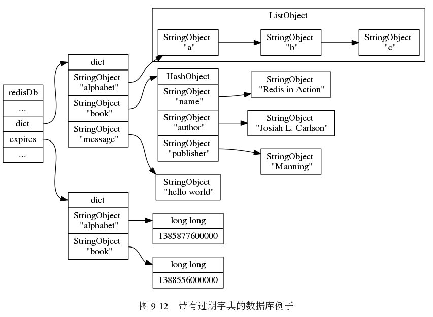
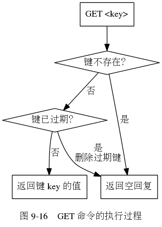
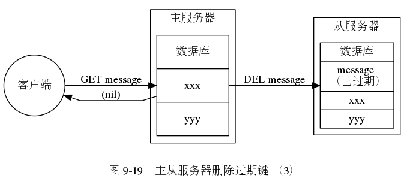
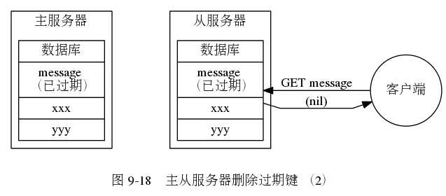

<!-- vim-markdown-toc GFM -->

* [1 Redis](#1-redis)
    * [1.1 持久化](#11-持久化)
        * [1.1.1 AOF 重写机制](#111-aof-重写机制)
    * [1.2 主从同步](#12-主从同步)
        * [1.2.1 repl-timeout](#121-repl-timeout)
        * [1.2.2 写入量太大超出 output-buffer](#122-写入量太大超出-output-buffer)
        * [1.2.3 repl-backlog-size 太小导致失败](#123-repl-backlog-size-太小导致失败)
        * [1.2.4 主库磁盘故障](#124-主库磁盘故障)
            * [主库磁盘异常示例记录](#主库磁盘异常示例记录)
    * [1.3 Redis bug](#13-redis-bug)
        * [1.3.1 AOF 句柄泄露 bug](#131-aof-句柄泄露-bug)
            * [表现](#表现)
            * [分析](#分析)
            * [解决](#解决)
        * [1.3.2 在 AOF 文件 rewrite 期间如果设置 config set appendonly no，会导致 redis 进程一直死循环不间断触发 rewrite AOF](#132-在-aof-文件-rewrite-期间如果设置-config-set-appendonly-no会导致-redis-进程一直死循环不间断触发-rewrite-aof)
            * [根因](#根因)
        * [1.3.3 redis slots 迁移的时候，永不过期的 key 因为 ttl>0 而过期，导致迁移丢失数据](#133-redis-slots-迁移的时候永不过期的-key-因为-ttl0-而过期导致迁移丢失数据)
            * [根因](#根因-1)
        * [1.3.4 3.x 执行 exists 可以获取到，但 get 时则无法获取到数据](#134-3x-执行-exists-可以获取到但-get-时则无法获取到数据)
            * [3.x exists 逻辑](#3x-exists-逻辑)
            * [4.x exists 逻辑](#4x-exists-逻辑)
    * [1.4 redis 日志](#14-redis-日志)
        * [1.4.1 日常日志](#141-日常日志)
    * [1.5 redis 协议说明](#15-redis-协议说明)
        * [1.5.1 网络层](#151-网络层)
        * [1.5.2 请求](#152-请求)
        * [1.5.3 新的统一请求协议](#153-新的统一请求协议)
        * [1.5.4 回复](#154-回复)
        * [1.5.6 多批量回复中的 Nil 元素](#156-多批量回复中的-nil-元素)
        * [1.5.7 多命令和管道](#157-多命令和管道)
        * [1.5.8 旧协议发送命令](#158-旧协议发送命令)
    * [1.6 Redis RDB 文件格式](#16-redis-rdb-文件格式)
        * [1.6.1 解析 RDB 的高层算法](#161-解析-rdb-的高层算法)
            * [魔术数](#魔术数)
            * [RDB 版本号](#rdb-版本号)
            * [数据库选择器](#数据库选择器)
            * [键值对](#键值对)
                * [键保存期限时间戳](#键保存期限时间戳)
                * [值类型](#值类型)
                * [键](#键)
                * [值](#值)
        * [1.6.2 长度编码](#162-长度编码)
        * [1.6.3 字符串编码](#163-字符串编码)
            * [长度前缀字符串](#长度前缀字符串)
            * [整数作为字符串](#整数作为字符串)
            * [压缩字符串](#压缩字符串)
        * [1.6.4 List 编码](#164-list-编码)
        * [1.6.5 Set 编码](#165-set-编码)
        * [1.6.6 Sorted Set 编码](#166-sorted-set-编码)
        * [1.6.7 Hash 编码](#167-hash-编码)
        * [1.6.8 Zipmap 编码](#168-zipmap-编码)
        * [1.6.9 Ziplist 编码](#169-ziplist-编码)
        * [1.6.10 Intset 编码](#1610-intset-编码)
        * [1.6.11 以 Ziplist 编码的 Sorted Set](#1611-以-ziplist-编码的-sorted-set)
        * [1.6.12 Ziplist 编码的 Hashmap](#1612-ziplist-编码的-hashmap)
            * [CRC32 校验和](#crc32-校验和)
    * [1.7 Redis 内存](#17-redis-内存)
        * [1.7.1 used_memmory](#171-used_memmory)
        * [1.7.2 used_memmory 会大于 maxmemory 吗？](#172-used_memmory-会大于-maxmemory-吗)
* [2 Redis twemproxy 集群](#2-redis-twemproxy-集群)
    * [2.1 Twemproxy 特性](#21-twemproxy-特性)
    * [2.2 环境说明](#22-环境说明)
    * [2.2 安装依赖](#22-安装依赖)
    * [2.3 安装 Twemproxy](#23-安装-twemproxy)
    * [2.4 配置 Twemproxy](#24-配置-twemproxy)
    * [2.5 启动 Twemproxy](#25-启动-twemproxy)
        * [2.5.1 启动命令详解](#251-启动命令详解)
        * [2.5.2 启动](#252-启动)
    * [2.6 查看状态](#26-查看状态)
        * [2.6.1 状态参数](#261-状态参数)
        * [2.6.2 状态实例](#262-状态实例)
        * [2.6.3 获取 Twemproxy 状态](#263-获取-twemproxy-状态)
    * [2.7 其他](#27-其他)
        * [2.7.1 发送信号修改日志级别以及重新打开日志文件](#271-发送信号修改日志级别以及重新打开日志文件)
* [3 redis cluster](#3-redis-cluster)
    * [3.1 cluster 命令](#31-cluster-命令)
    * [3.2 redis cluster 配置](#32-redis-cluster-配置)
    * [3.3 redis cluster 状态](#33-redis-cluster-状态)
    * [3.4 redis cluster 的 failover 机制](#34-redis-cluster-的-failover-机制)
        * [3.4.1 故障 failover](#341-故障-failover)
            * [探测阶段](#探测阶段)
            * [准备阶段](#准备阶段)
            * [执行阶段](#执行阶段)
        * [3.4.2 人为 failover](#342-人为-failover)
            * [缺省](#缺省)
            * [force](#force)
            * [takeover](#takeover)
    * [3.5 弃用 redis cluster 的原因](#35-弃用-redis-cluster-的原因)
        * [3.5.1 集群规模比较大时，容易出现 handshake 节点](#351-集群规模比较大时容易出现-handshake-节点)
        * [3.5.2 网络问题导致某个 node 隔离后，在很长时间后， node 网络恢复，可能发生集群融合](#352-网络问题导致某个-node-隔离后在很长时间后-node-网络恢复可能发生集群融合)
* [4 原理说明](#4-原理说明)
    * [4.1 一致性 hash](#41-一致性-hash)
        * [4.1.1 传统的取模方式](#411-传统的取模方式)
        * [4.1.2 一致性哈希方式](#412-一致性哈希方式)
        * [4.1.3 虚拟节点](#413-虚拟节点)
    * [4.2 redis 过期数据存储方式以及删除方式](#42-redis-过期数据存储方式以及删除方式)
        * [4.2.1 存储方式](#421-存储方式)
        * [4.2.2 删除方式](#422-删除方式)
            * [惰性删除](#惰性删除)
            * [定期删除](#定期删除)
        * [4.2.3 redis 主从删除过期 key 方式](#423-redis-主从删除过期-key-方式)
        * [4.2.4 总结](#424-总结)
    * [4.3 cluster 选举算法 Raft](#43-cluster-选举算法-raft)
* [5 常见问题处理](#5-常见问题处理)
    * [5.1 内核参数 overcommit](#51-内核参数-overcommit)
        * [什么是 Overcommit 和 OOM](#什么是-overcommit-和-oom)
    * [5.2 Redis CPU 100% 时分析](#52-redis-cpu-100-时分析)
* [6 数据迁移](#6-数据迁移)
    * [6.1 目标](#61-目标)
    * [6.2 怎么实现](#62-怎么实现)
        * [6.2.1 方案](#621-方案)
    * [6.3 问题](#63-问题)
        * [6.3.1 aof 不是幂等的](#631-aof-不是幂等的)
        * [6.3.2 切流量时的不一致](#632-切流量时的不一致)
    * [6.4 实现](#64-实现)
* [7 redis 服务准入](#7-redis-服务准入)
    * [7.1 数据设计](#71-数据设计)
        * [7.1.1 value 大小约束](#711-value-大小约束)
        * [7.1.2 value 复杂度约束](#712-value-复杂度约束)
        * [7.1.3 冷热数据设计约束](#713-冷热数据设计约束)
        * [7.1.4 分片数据量约束](#714-分片数据量约束)
    * [7.2 运行时约束](#72-运行时约束)
        * [7.2.1 多 key 命令注意事项](#721-多-key-命令注意事项)
        * [7.2.2 pipline 命令注意事项](#722-pipline-命令注意事项)
        * [7.2.3 不支持的命令](#723-不支持的命令)
    * [7.3 风险点](#73-风险点)
        * [7.3.1 无协议保障的 io 流程](#731-无协议保障的-io-流程)
        * [7.3.2 单线程带来的风险](#732-单线程带来的风险)

<!-- vim-markdown-toc -->
# 1 Redis

## 1.1 持久化

### 1.1.1 AOF 重写机制

AOF 重写触发条件

AOF 重写可以由用户通过调用 BGREWRITEAOF 手动触发。
服务器在 AOF 功能开启的情况下，会维持以下三个变量：

> * 记录当前 AOF 文件大小的变量 aof_current_size。
> * 记录最后一次 AOF 重写之后，AOF 文件大小的变量 aof_rewrite_base_size。
> * 增长百分比变量 aof_rewrite_perc。

每次当 serverCron（服务器周期性操作函数，在 src/redis.c 中）函数执行时，它会检查以下条件是否全部满足，如果全部满足的话，就触发自动的 AOF 重写操作：

> * 没有 BGSAVE 命令（RDB 持久化）/AOF 持久化在执行；
> * 没有 BGREWRITEAOF 在进行；
> * auto-aof-rewrite-percentage 参数不为 0
> * 当前 AOF 文件大小要大于 server.aof_rewrite_min_size（默认为 1MB）
> * 当前 AOF 文件大小和最后一次重写后的大小之间的比率等于或者等于指定的增长百分比（在配置文件设置了 auto-aof-rewrite-percentage 参数，不设置默认为 100%）

如果前面四个条件都满足，并且当前 AOF 文件大小比最后一次 AOF 重写时的大小要大于指定的百分比，那么触发自动 AOF 重写。

源码如下：
```
 /* Trigger an AOF rewrite if needed */
        // 触发 BGREWRITEAOF
         if (server.rdb_child_pid == -1 &&
             server.aof_child_pid == -1 &&
             server.aof_rewrite_perc &&
             // AOF 文件的当前大小大于执行 BGREWRITEAOF 所需的最小大小
             server.aof_current_size > server.aof_rewrite_min_size)
         {
            // 上一次完成 AOF 写入之后，AOF 文件的大小
            long long base = server.aof_rewrite_base_size ?
                            server.aof_rewrite_base_size : 1;

            // AOF 文件当前的体积相对于 base 的体积的百分比
            long long growth = (server.aof_current_size*100/base) - 100;

            // 如果增长体积的百分比超过了 growth ，那么执行 BGREWRITEAOF
            if (growth >= server.aof_rewrite_perc) {
                redisLog(REDIS_NOTICE,"Starting automatic rewriting of AOF on %lld%% growth",growth);
                // 执行 BGREWRITEAOF
                rewriteAppendOnlyFileBackground();
            }
         }
```
## 1.2 主从同步

主从同步相关参数

> * repl-backlog-size: 增量重传 buf
> * repl-timeout: 主动超时
> * client-output-buffer-limit（和写入量有关）
>   * 这个参数分为 3 部分，第二部分涉及 slave
>   * slave 部分默认值：256M 64M 60 秒
>   * output-buffer 缓冲区里放的是主库待同步给从库的操作数据。
>   * 如果 output-buffer>256M 则从节点需要重新全同步，如果 256>output-buffer>64 且持续时间 60 秒，则从节点需要重新全同步。

主从同步

分别启动 master 和 slave 后，会自动启动同步
slave 出现如下类似日志，则同步已完成：
```
[4611] 24 Aug 19:11:46.843 * MASTER <-> SLAVE sync started
[4611] 24 Aug 19:11:46.844 * Non blocking connect for SYNC fired the event.
[4611] 24 Aug 19:11:46.844 * Master replied to PING, replication can continue...
[4611] 24 Aug 19:11:46.844 * Partial resynchronization not possible (no cached master)
[4611] 24 Aug 19:11:46.844 * Full resync from master: 0629e2e6e79c13c21ff38b638b6009183140939a:1
[4611] 24 Aug 19:13:55.662 * MASTER <-> SLAVE sync: receiving 5774276835 bytes from master
[4611] 24 Aug 19:14:45.578 * MASTER <-> SLAVE sync: Flushing old data
[4611] 24 Aug 19:16:57.509 * MASTER <-> SLAVE sync: Loading DB in memory
[4611] 24 Aug 19:19:44.191 * MASTER <-> SLAVE sync: Finished with success
```
> 4.x 后的 redis 从库日志
```
13382:S 20 May 20:33:45.487 * SLAVE OF {master_ip}:{master_port} enabled (user request from 'id=3 addr={client_ip}:54054 fd=8 name= age=1 idle=0 flags=N db=0 sub=0 psub=0 multi=-1 qbuf=0 qbuf-free=32768 obl=0 oll=0 omem=0 events=r cmd=slaveof')
13382:S 20 May 20:33:45.802 * Connecting to MASTER {master_ip}:{master_port}
13382:S 20 May 20:33:45.802 * MASTER <-> SLAVE sync started
13382:S 20 May 20:33:45.802 * Non blocking connect for SYNC fired the event.
13382:S 20 May 20:33:45.802 * start send sync cmd :PING        # 如果 master 没有返回异常，而是返回 pong，则说明 master 可用
                                                               # 如果 Redis 设置了密码，slave 会发送 auth $masterauth 指令，进行鉴权。

13382:S 20 May 20:33:45.802 * Master replied to PING, replication can continue...
13382:S 20 May 20:33:45.802 * start send sync cmd :REPLCONF listening-port 2051    # 从库通过 replconf 发送自己的端口及 IP 给 master。

13382:S 20 May 20:33:45.802 * start send sync cmd :REPLCONF capa eof capa psync2   # slave 通过 replconf 发送 capa eof capa psync2 进行复制版本校验

13382:S 20 May 20:33:45.802 * Partial resynchronization(mem) not possible (no cached master)
13382:S 20 May 20:33:45.802 * start send sync cmd :PSYNC ? -1                      # 从库接下来就通过 psync 将自己的复制 id、复制偏移发送给 master，正式开始准备数据同步

13382:S 20 May 20:33:45.882 * Full resync from master: 3abf1447d61679bf3b83c1e3b8f6402446ab0d6b:0
13382:S 20 May 20:34:02.574 * MASTER <-> SLAVE sync: receiving 736712380 bytes from master
13382:S 20 May 20:34:04.306 * MASTER <-> SLAVE sync: Flushing old data
13382:S 20 May 20:34:04.306 * MASTER <-> SLAVE sync: Loading DB in memory
13382:S 20 May 20:34:11.706 * MASTER <-> SLAVE sync: Finished with success
13382:S 20 May 20:34:13.118 * SLAVE OF would result into synchronization with the master we are already connected with. No operation performed.
```
### 1.2.1 repl-timeout
若 slave 日志出现如下行：
```
# Timeout receiving bulk data from MASTER... If the problem persists try to set the    'repl-timeout' parameter in redis.conf to a larger value.
```
调整 slave 的 redis.conf 参数：
```
repl-timeout 60  # 将数值设得更大
如：config set repl-timeout 600
```
### 1.2.2 写入量太大超出 output-buffer

若 slave 日志出现如下行：
```
# I/O error reading bulk count from MASTER: Resource temporarily unavailable
# I/O error trying to sync with MASTER: connection lost
```

调整 master 分配给 slave client buffer：
```
client-output-buffer-limit slave 256mb 64mb 60
# 256mb 是一个硬性限制，当 output-buffer 的大小大于 256mb 之后就会断开连接
# 64mb 60 是一个软限制，当 output-buffer 的大小大于 64mb 并且超过了 60 秒的时候就会断开连接
# 或者全部设为 0，取消限制。

如：config set client-output-buffer-limit "slave 0 0 0"
```
### 1.2.3 repl-backlog-size 太小导致失败

当 master-slave 复制连接断开，server 端会释放连接相关的数据结构。replication buffer 中的数据也就丢失，当断开的 slave 重新连接上 master 的时候，slave 将会发送 psync 命令（包含复制的偏移量 offset），请求 partial resync。如果请求的 offset 不存在，那么执行全量的 sync 操作，相当于重新建立主从复制。

```
Unable to partial resync with slave $slaveip:6379 for lack of backlog (Slave request was: 5974421660).
```
调整 repl-backlog-size 大小

### 1.2.4 主库磁盘故障

触发全量同步时，主库磁盘故障，主库 RDB 无法落盘，导致全量同步失败

```
* replication.c: 1646 Full resync from master: 1a0b22011aff6ea5d53710acff4ee32adde636ec:399255497708
# replication.c: 1262 I/O error reading bulk count from MASTER: Operation now in progress
```

> repl-diskless-sync no #是否使用无盘复制 Diskless replication，默认是 no

```
对 master 进行操作
config set repl-diskless-sync yes
```
#### 主库磁盘异常示例记录
> 新增从库(4.0.10 版本), 从库日志
```
13475:S 13 May 05:51:08.134 * Connecting to MASTER {Master IP}:{Master port}
13475:S 13 May 05:51:08.135 * MASTER <-> SLAVE sync started
13475:S 13 May 05:51:08.135 * Non blocking connect for SYNC fired the event.
13475:S 13 May 05:51:08.135 * start send sync cmd :PING

13475:S 13 May 05:51:08.135 * Master replied to PING, replication can continue...
13475:S 13 May 05:51:08.135 * start send sync cmd :REPLCONF listening-port 2019

13475:S 13 May 05:51:08.135 * start send sync cmd :REPLCONF capa eof capa psync2

13475:S 13 May 05:51:08.135 * Partial resynchronization(mem) not possible (no cached master)
13475:S 13 May 05:51:08.135 * start send sync cmd :PSYNC ? -1

13475:S 13 May 05:51:08.196 * Full resync from master: 7f0c1af873f9704ef0a55357ea8dc2a9bf89b7a9:0
13475:S 13 May 05:51:08.399 # I/O error reading bulk count from MASTER: Resource temporarily unavailable
```
> 修改为无盘复制后从库日志
```
13475:S 13 May 06:37:56.103 * Connecting to MASTER {Master IP}:{Master port}
13475:S 13 May 06:37:56.103 * MASTER <-> SLAVE sync started
13475:S 13 May 06:37:56.103 * Non blocking connect for SYNC fired the event.
13475:S 13 May 06:37:56.103 * start send sync cmd :PING

13475:S 13 May 06:37:56.103 * Master replied to PING, replication can continue...
13475:S 13 May 06:37:56.103 * start send sync cmd :REPLCONF listening-port 2019

13475:S 13 May 06:37:56.103 * start send sync cmd :REPLCONF capa eof capa psync2

13475:S 13 May 06:37:56.104 * Partial resynchronization(mem) not possible (no cached master)
13475:S 13 May 06:37:56.104 * start send sync cmd :PSYNC ? -1

13475:S 13 May 06:38:02.777 * Full resync from master: 7f0c1af873f9704ef0a55357ea8dc2a9bf89b7a9:659176439
13475:S 13 May 06:38:02.846 * MASTER <-> SLAVE sync: receiving streamed RDB from master        // 从这里看已经是无盘复制模式
13475:S 13 May 06:38:03.256 # I/O error trying to sync with MASTER: connection lost
```

//todo

## 1.3 Redis bug

### 1.3.1 AOF 句柄泄露 bug
#### 表现
日志中提示
```
* Residual parent diff successfully flushed to the rewritten AOF (329.83 MB)
* Background AOF rewrite finished successfully
* Starting automatic rewriting of AOF on 100% growth
# Can't rewrite append only file in background: fork: Cannot allocate memory
* Starting automatic rewriting of AOF on 100% growth
# Can't rewrite append only file in background: fork: Cannot allocate memory
* Starting automatic rewriting of AOF on 100% growth
# Can't rewrite append only file in background: fork: Cannot allocate memory
* Starting automatic rewriting of AOF on 100% growth
# Error opening /setting AOF rewrite IPC pipes: Numerical result out of range
* Starting automatic rewriting of AOF on 100% growth
# Error opening /setting AOF rewrite IPC pipes: Numerical result out of range
# Error registering fd event for the new client: Numerical result out of range (fd=10128)
# Error registering fd event for the new client: Numerical result out of range (fd=10128)
```
使用 lsof 命令检查 fd 数，发现当时进程打开的 fd 数已经达到 10128 个，而其中大部分基本都是 pipe. 在 Redis 中，pipe 主要用于父子进程间通信，如 AOF 重写、基于 socket 的 RDB 持久化等场景。

#### 分析

**fd 限制**

首先，我们定位到 client 连接报错的主要调用链为 networking.c/acceptCommonHandler => networking.c/createClient => ae.c/aeCreateFileEvent：
```
static void acceptCommonHandler(int fd, int flags, char *ip) {
    client *c;
    if ((c = createClient(fd)) == NULL) {
        serverLog(LL_WARNING,
            "Error registering fd event for the new client: %s (fd=%d)",
            strerror(errno),fd);
        close(fd); /* May be already closed, just ignore errors */
        return;
    }
    //……
}
int aeCreateFileEvent(aeEventLoop *eventLoop, int fd, int mask,
        aeFileProc *proc, void *clientData)
{
    if (fd >= eventLoop->setsize) {
        errno = ERANGE;
        return AE_ERR;
    }
//……
}
```
而 eventLoop->setsize 则是在 server.c/initServer 中被初始化和设置的，大小为 maxclient+128 个。而我们 maxclient 采用 Redis 默认配置 10000 个，所以当 fd=10128 时就出错了。
```
server.el = aeCreateEventLoop(server.maxclients+CONFIG_FDSET_INCR);

```


**aof 重写子进程启动失败为何不关闭 pipe**

aof 重写过程由 server.c/serverCron 定时时间事件处理函数触发，调用 aof.c/rewriteAppendOnlyFileBackground 启动 aof 重写子进程。在 rewriteAppendOnlyFileBackground 方法中我们注意到如果 fork 失败，过程就直接退出了。

```
int rewriteAppendOnlyFileBackground(void) {
    //……
    if (aofCreatePipes() != C_OK) return C_ERR; // 创建 pipe
    //……
    if ((childpid = fork()) == 0) {
        /* Child */
        //……
    } else {
        /* Parent */
        // 子进程启动出错处理
        if (childpid == -1) {
            serverLog(LL_WARNING,
                "Can't rewrite append only file in background: fork: %s",
                strerror(errno)); // 最初内存不足正是这里打出的错误 log
            return C_ERR;
        }
    //……
    }
}
```
而关闭 pipe 的方法，是在 server.c/serverCron => aof.c/backgroundRewriteDoneHandler 中发现 AOF 重写子进程退出后被调用：
```
//……
    /* Check if a background saving or AOF rewrite in progress terminated. */
    if (server.rdb_child_pid != -1 || server.aof_child_pid != -1 ||
        ldbPendingChildren())
    {
        //……
        // 任意子进程退出时执行
        if ((pid = wait3(&statloc,WNOHANG,NULL)) != 0) {
            //……
            if (pid == -1) {
                serverLog(……);
            } else if (pid == server.rdb_child_pid) {
                backgroundSaveDoneHandler(exitcode,bysignal);
            } else if (pid == server.aof_child_pid) { // 发现是 aof 重写子进程完成
                backgroundRewriteDoneHandler(exitcode,bysignal); // 执行后续工作，包括关闭 pipe
            }
            //……
        }
    }
//……
```

由此可见，如果 aof 重写子进程没有启动，则 pipe 将不会被关闭。而下次尝试启动 aof 重写时，又会调用 aof.c/aofCreatePipes 创建新的 pipe。

#### 解决

> * 2015 年就被两次在社区上报（参考 https://github.com/antirez/redis/issues/2857
> * 2016 年有开发者提交代码修复此问题，直至 2017 年 2 月相关修复才被合入主干（参考 https://github.com/antirez/redis/pull/3408）
> * 这只长寿的 bug 在 3.2.9 版本已修复

### 1.3.2 在 AOF 文件 rewrite 期间如果设置 config set appendonly no，会导致 redis 进程一直死循环不间断触发 rewrite AOF

此 BUG 在 4.0.7 版本修复 (2018.1 月）

https://github.com/antirez/redis/commit/a18e4c964e9248008e0fba7efc1cad9ba9b8b1c3

#### 根因

redis 在 AOF rewrite 期间设置了 appendonly no，会 kill 子进程，设置 server.aof_fd = -1，但是并未更新 server.aof_rewrite_base_size。

在 serverCron 中触发 AOF rewrite 时未判断当前 appendonly 是否为 yes，只判断了 server.aof_current_size 和 server.aof_rewrite_base_size 增长是否超过阈值

AOF rewrite 重写完成后发现 server.aof_fd=-1 也未更新 server.aof_rewrite_base_size，导致 serverCron 中一直触发 AOF rewrite。

### 1.3.3 redis slots 迁移的时候，永不过期的 key 因为 ttl>0 而过期，导致迁移丢失数据

详细见博客 https://blog.csdn.net/doc_sgl/article/details/53825892

对应 PR: https://github.com/antirez/redis/pull/3673/files

在 4.0rc2 版本中进行修复

#### 根因

所有丢失 key 的 ttl 因为没有处理而使用了前一个 key 的 ttl！

问题出在下面代码的 for 循环，对于不过期的 key,ttl 应该是 0，但是如果前面有过期的 key,ttl>0. 那么在下一个处理不过期 key 时，expireat=-1，不会进入 if，ttl 还是使用前一个 ttl，导致一个永不过期的 key 因为 ttl>0 而过期。

```
/* MIGRATE host port key dbid timeout [COPY | REPLACE]
 *
 * On in the multiple keys form:
 *
 * MIGRATE host port "" dbid timeout [COPY | REPLACE] KEYS key1 key2 ... keyN */
void migrateCommand(client *c) {
    long long ttl, expireat;
    ttl = 0;
    ...

    /* Create RESTORE payload and generate the protocol to call the command. */
    /*
        问题出在这个 for 循环，对于不过期的 key,ttl 应该是 0，但是如果前面有过期的 key,ttl>0. 在处理不过期 key 时，expireat=-1，导致 ttl 还是使用前一个 ttl.
        导致一个永不过期的 key 因为 ttl>0 而过期。
    */
    for (j = 0; j < num_keys; j++) {
        /
        expireat = getExpire(c->db,kv[j]);
        if (expireat != -1) {
            ttl = expireat-mstime();
            if (ttl < 1) ttl = 1;
        }
        serverAssertWithInfo(c,NULL,rioWriteBulkCount(&cmd,'*',replace ? 5 : 4));
        if (server.cluster_enabled)
            serverAssertWithInfo(c,NULL,
                rioWriteBulkString(&cmd,"RESTORE-ASKING",14));
        else
            serverAssertWithInfo(c,NULL,rioWriteBulkString(&cmd,"RESTORE",7));
        serverAssertWithInfo(c,NULL,sdsEncodedObject(kv[j]));
        serverAssertWithInfo(c,NULL,rioWriteBulkString(&cmd,kv[j]->ptr,
                sdslen(kv[j]->ptr)));
        serverAssertWithInfo(c,NULL,rioWriteBulkLongLong(&cmd,ttl));

        /* Emit the payload argument, that is the serialized object using
         * the DUMP format. */
        createDumpPayload(&payload,ov[j]);
        serverAssertWithInfo(c,NULL,
            rioWriteBulkString(&cmd,payload.io.buffer.ptr,
                               sdslen(payload.io.buffer.ptr)));
        sdsfree(payload.io.buffer.ptr);

        /* Add the REPLACE option to the RESTORE command if it was specified
         * as a MIGRATE option. */
        if (replace)
            serverAssertWithInfo(c,NULL,rioWriteBulkString(&cmd,"REPLACE",7));
    }
```
### 1.3.4 3.x 执行 exists 可以获取到，但 get 时则无法获取到数据

#### 3.x exists 逻辑
> exists
```
redis.c:    {"exists",existsCommand,-2,"rF",0,NULL,1,-1,1,0,0}
```

> db.c:void existsCommand
```
// EXISTS key1 key2 ... key_N.  Return value is the number of keys existing.
void existsCommand(redisClient *c) {
    long long count = 0;
    int j;

    for (j = 1; j < c->argc; j++) {
        expireIfNeeded(c->db,c->argv[j]);
        if (dbExists(c->db,c->argv[j])) count++;
    }
    addReplyLongLong(c,count);
}
```

在从库上执行 exists 时，3.x 版本先执行的 expireIfNeeded ，在从库时不会进行主动淘汰，然后进行判断此 key 是否存在

#### 4.x exists 逻辑

> db.c:void existsCommand
```
/*/EXISTS key1 key2 ... key_N. Return value is the number of keys existing.
void existsCommand(client *c) {
    long long count = 0;
    int j;

    for (j = 1; j < c->argc; j++) {
        if (lookupKeyRead(c->db,c->argv[j])) count++;
    }
    addReplyLongLong(c,count);
}
```

> db.c:lookupKeyRead
```
robj *lookupKeyReadWithFlags(redisDb *db, robj *key, int flags) {
    robj *val;

    if (expireIfNeeded(db,key) == 1) {
        /* Key expired. If we are in the context of a master, expireIfNeeded()
         * returns 0 only when the key does not exist at all, so it's safe
         * to return NULL ASAP. */
        if (server.masterhost == NULL) return NULL;

        /* However if we are in the context of a slave, expireIfNeeded() will
         * not really try to expire the key, it only returns information
         * about the "logical" status of the key: key expiring is up to the
         * master in order to have a consistent view of master's data set.
         *
         * However, if the command caller is not the master, and as additional
         * safety measure, the command invoked is a read-only command, we can
         * safely return NULL here, and provide a more consistent behavior
         * to clients accessign expired values in a read-only fashion, that
         * will say the key as non exisitng.
         *
         * Notably this covers GETs when slaves are used to scale reads. */
        if (server.current_client &&
            server.current_client != server.master &&
            server.current_client->cmd &&
            server.current_client->cmd->flags & CMD_READONLY)
        {
            return NULL;
        }
    }
    val = lookupKey(db,key,flags);
    if (val == NULL)
        server.stat_keyspace_misses++;
    else
        server.stat_keyspace_hits++;
    return val;
}

/* Like lookupKeyReadWithFlags(), but does not use any flag, which is the
 * common case. */
robj *lookupKeyRead(redisDb *db, robj *key) {
    return lookupKeyReadWithFlags(db,key,LOOKUP_NONE);
}
```


## 1.4 redis 日志

### 1.4.1 日常日志
```
DB 0: 1 keys (0 volatile) in 4 slots HT
```
> * Redis 中的 DB 是相互独立存在的，所以可以出现重复的 key。好处一是，对小型项目可以做如下设置： 1 号 DB 做开发，2 号 DB 做测试等等。
>   * Redis Cluster 方案只允许使用 0 号数据库
> * 0 volatile: 目前 0 号 DB 中没有 volatile key，volatile key 的意思是 过特定的时间就被 REDIS 自动删除，在做缓存时有用。
> * 4 slots HT: 目前 0 号 DB 的 hash table 只有 4 个 slots(buckets)
>   * //todo

## 1.5 redis 协议说明

Redis 的客户端和服务端之间采取了一种独立名为 RESP(REdis Serialization Protocol) 的协议

Redis 协议在以下几点之间做出了折衷：

> * 简单的实现
> * 快速地被计算机解析
> * 简单得可以能被人工解析

注意：RESP 虽然是为 Redis 设计的，但是同样也可以用于其他 C/S 的软件。

### 1.5.1 网络层

Redis 在 TCP 端口 6379 上监听到来的连接，客户端连接到来时，Redis 服务器为此创建一个 TCP 连接。

在客户端与服务器端之间传输的每个 Redis 命令或者数据都以、r\n 结尾。

### 1.5.2 请求

Redis 接收由不同参数组成的命令。一旦收到命令，将会立刻被处理，并回复给客户端。

### 1.5.3 新的统一请求协议

新的统一协议已在 Redis 1.2 中引入，但是在 Redis 2.0 中，这就成为了与 Redis 服务器通讯的标准方式。

在这个统一协议里，发送给 Redis 服务端的所有参数都是二进制安全的。以下是通用形式：

```
    *<number of arguments> CR LF
    $<number of bytes of argument 1> CR LF
    <argument data> CR LF
    ...
    $<number of bytes of argument N> CR LF
    <argument data> CR LF
```
例子如下：
```
    *3
    $3
    SET
    $5
    mykey
    $7
    myvalue
```
上面的命令看上去像是单引号字符串，所以可以在查询中看到每个字节的准确值：

```
    "*3\r\n$3\r\nSET\r\n$5\r\nmykey\r\n$7\r\nmyvalue\r\n"
```
在 Redis 的回复中也使用这样的格式。批量回复时，这种格式用于每个参数 $6\r\nmydata\r\n。

实际的统一请求协议是 Redis 用于返回列表项，并调用 Multi-bulk 回复。 仅仅是 N 个以以`*\r\n` 为前缀的不同批量回复，是紧随的参数（批量回复）数目。

### 1.5.4 回复
Redis 用不同的回复类型回复命令。它可能从服务器发送的第一个字节开始校验回复类型：
```
    用单行回复，回复的第一个字节将是“+”
    错误消息，回复的第一个字节将是“-”
    整型数字，回复的第一个字节将是“:”
    批量回复，回复的第一个字节将是“$”
    多个批量回复，回复的第一个字节将是“*”
```
通俗点讲，则如下

> * (+) 表示一个正确的状态信息，具体信息是当前行 + 后面的字符。
> * (-)  表示一个错误信息，具体信息是当前行－后面的字符。
> * (`*`) 表示消息体总共有多少行，不包括当前行，`*`后面是具体的行数。
> * ($) 表示下一行数据长度，不包括换行符长度 `\r\n`,$ 后面则是对应的长度的数据。
> * (:) 表示返回一个数值，：后面是相应的数字节符。

(1)Simple Strings

状态回复（或者单行回复）以“+”开始以“\r\n”结尾的单行字符串形式。例如：
```
"+OK\r\n"

127.0.0.1:6379> set name meetbill
+OK\r\n  # 服务端实际返回
-------------------
OK       # redis-cli 客户端显示
```
客户端库将在“+”后面返回所有数据，正如上例中字符串“OK”一样。


(2)Errors

错误回复发送类似于状态回复。唯一的不同是第一个字节用“-”代替“+”。

错误回复仅仅在一些意料之外的事情发生时发送，例如：如果你试图执行一个操作来应付错误的数据类型，或者如果命令不存在等等。所以当收到一个错误回复时，客户端将会出现一个异常。

```
127.0.0.1:6379> meetbill
-ERR unknown command 'meetbill'\r\n  # 服务端实际返回，下同
---
(error) ERR unknown command 'meetbill'  # redis-cli 客户端显示，下同
```


(3)Integers

这种回复类型只是用 CRLF 结尾字符串来表示整型，用一个字节的“：”作为前缀。例如：“：0\r\n”，或者“:1000\r\n”是整型回复。

像 INCR 或者 LASTAVE 命令用整型回复作为实际回复值，此时对于返回的整型没有特殊的意思。它仅仅是为 INCR、LASTSAVE 的 UNIX 时间等增加数值。

一些命令像 EXISTS 将为 true 返回 1，为 false 返回 0。

其它命令像 SADD、SREM 和 SETNX 如果操作实际完成了的话将返回 1，否则返回 0。

接下来的命令将回复一个整型回复：SETNX、DEL、EXISTS、INCR、INCRBY、DECR、DECRBY、DBSIZE、LASTSAVE、RENAMENX、MOVE、LLEN、SADD、SREM、SISMEMBER、SCARD。

```
27.0.0.1:6379> LPUSH info meetbill hello
:2\r\n  # 服务端实际返回，下同
---
(integer) 2  # redis-cli 客户端显示，下同

127.0.0.1:6379> LLEN info
:2\r\n
---
(integer) 2

127.0.0.1:6379> EXISTS info
:1\r\n
---
(integer) 1

127.0.0.1:6379> DEL info
:1\r\n
---
(integer) 1

127.0.0.1:6379> EXISTS info
:0\r\n
---
(integer) 0
```


(4)Bulk Strings

批量回复被服务器用于返回一个单二进制安全字符串。

```
C: GET mykey
S: $6\r\nfoobar\r\n
```
服务器发送第一行回复，该行以“$”开始后面跟随实际要发送的字节数，随后是 CRLF，然后发送实际数据，随后是 2 个字节的额外数据用于最后的 CRLF。服务器发送的准确序列如下：

```
"$6\r\nfoobar\r\n"
```
如果请求的值不存在，批量回复将使用特殊的值 -1 来作为数据长度，例如：

```
C: GET nonexistingkey
S: $-1
```
当请求的对象不存在时，客户端库 API 不会返回空字符串，而会返回空对象。例如：Ruby 库返回‘nil’，而 C 库返回 NULL（或者在回复的对象里设置指定的标志）等等。

```
127.0.0.1:6379> set site moelove.info
+OK\r\n  # 服务端实际返回，下同
---
OK   # redis-cli 客户端显示，下同

127.0.0.1:6379> get site
$12\r\nmoelove.info\r\n
---
"moelove.info"

127.0.0.1:6379> del site
:1\r\n
---
(integer) 1

127.0.0.1:6379> get site
$-1\r\n
---
(nil)

127.0.0.1:6379> set site ''
+OK\r\n
---
OK

127.0.0.1:6379> get site
$0\r\n\r\n
---
""
```

(5)Arrays

像命令 LRNGE 需要返回多个值（列表的每个元素是一个值，而 LRANGE 需要返回多于一个单元素）。使用多批量写是有技巧的，用一个初始行作为前缀来指示多少个批量写紧随其后。

批量回复的第一个字节总是`*`，例如：

```
    C: LRANGE mylist 0 3
    s: *4
    s: $3
    s: foo
    s: $3
    s: bar
    s: $5
    s: Hello
    s: $5
    s: World
```
正如您可以看到的多批量回复是以完全相同的格式使用 Redis 统一协议将命令发送给服务器。

服务器发送的第一行是`*4\r\n`，用于指定紧随着 4 个批量回复。然后传送每个批量写。

如果指定的键不存在，则该键被认为是持有一个空的列表，且数值 0 被当作多批量计数值来发送，例如：

```
    C: LRANGE nokey 0 1
    S: *0
```
当 BLPOP 命令超时时，它返回 nil 多批量回复。这种类型多批量回复的计数器是 -1，且值被当作 nil 来解释。例如：

```
    C: BLPOP key 1
    S: *-1
```
当这种情况发生时，客户端库 API 将返回空 nil 对象，且不是一个空列表。这必须有别于空列表和错误条件（例如：BLPOP 命令的超时条件）。

```
    127.0.0.1:6379> LPUSH info TaoBeier moelove.info
    :2\r\n   # 服务端实际返回，下同
    ---
    (integer) 2  # redis-cli 客户端显示，下同

    127.0.0.1:6379> LRANGE info 0 -1
    *2\r\n$12\r\nmoelove.info\r\n$8\r\nTaoBeier\r\n
    ---
    1) "moelove.info"
    2) "TaoBeier"

    127.0.0.1:6379> LPOP info
    $12\r\nmoelove.info\r\n
    ---
    "moelove.info"

    127.0.0.1:6379> LPOP info
    $8\r\nTaoBeier\r\n
    ---
    "TaoBeier"

    127.0.0.1:6379> LRANGE info 0 -1
    *0\r\n
    ---
    (empty list or set)
```

### 1.5.6 多批量回复中的 Nil 元素
多批量回复的单元素长度可能是 -1，为了发出信号这个元素被丢失且不是空字符串。这种情况发送在 SORT 命令时，此时使用 GET 模式选项且指定的键丢失。一个多批量回复包含一个空元素的例子如下：

```
    S: *3
    S: $3
    S: foo
    S: $-1
    S: $3
    S: bar
```
第二个元素是空。客户端库返回如下：
```
    ["foo",nil,"bar"]
```
### 1.5.7 多命令和管道

客户端能使用同样条件为了发出多个命令。管道用于支持多命令能够被客户端用单写操作来发送，它不需要为了发送下一条命令而读取服务器的回复。所有回复都能在最后被读出。

通常 Redis 服务器和客户端拥有非常快速的连接，所以在客户端的实现中支持这个特性不是那么重要，如果一个应用需要在短时间内发出大量的命令，管道仍然会非常快。

### 1.5.8 旧协议发送命令

在统一请求协议出现前，Redis 用不同的协议发送命令，现在仍然支持，它简单通过手动 telnet。在这种协议中，有两种类型的命令：

> * 内联命令：简单命令其参数用空格分割字符串。非二进制安全。
> * 批量命令：批量命令准确如内联命令，但是最后的参数用特殊方式来处理用于保证最后参数二进制安全。 内联命令

最简单的发送 Redis 命令的方式是通过内联命令。下面是一个使用内联命令聊天的服务器 / 客户端的例子（服务器聊天用 S: 开始，客户端聊天用 C: 开始）。

```
C: PING
S: +PONG
```
下面是另外一个内联命令返回整数的例子：

```
    C: EXISTS somekey
    S: :0
```
因为‘somekey’不存在，所以服务器返回‘:0’。

注意：EXISTS 命令带有一个参数。参数用空格分割。

批量命令

一些命令当用内联命令发送时需要一种特殊的格式用于支持最后参数二进制安全。这种命令用最后参数作为“字节计数器”，然后发送批量数据（因为服务器知道读取多少个字节，所以是二进制安全的）。

请看下面的例子：

```
    C: SET mykey 6
    C: foobar
    S: +OK
```
这条命令的最后一个参数是‘6’。这用于指定随后数据的字节数，即字符串“foobar”。注意：虽然这个字节流是以额外的两个 CRLF 字节结尾的。

所有批量命令都是用这种准确的格式：用随后数据的字节数代替最后一个参数，紧跟着后面是组成参数本身的字节和 CRLF。为了更清楚程序，下面是通过客户端发送字符串的例子：

```
"SET mykey 6\r\nfoobar\r\n"
```
Redis 有一个内部列表，用于表示哪些命令是内联，哪些命令是批量，所以你不得不发送相应的命令。强烈建议使用新的统一请求协议来代替老的协议。

## 1.6 Redis RDB 文件格式

翻译自：
<https://github.com/sripathikrishnan/redis-rdb-tools/wiki/Redis-RDB-Dump-File-Format>


`Redis *.rdb` 文件是一个内存内存储的二进制表示法。这个二进制文件足以完全恢复 Redis 的状态。

rdb 文件格式为快速读和写优化。LZF 压缩可以用来减少文件大小。通常，对象前面有它们的长度，这样，在读取对象之前，你可以准确地分配内存大小。


为快速读 / 写优化意味着磁盘上的格式应该尽可能接近于在内存里的表示法。这种方式正是 rdb 文件采用的。
导致的结果是，在不了解 Redis 在内存里表示数据的数据结构的情况下，你没法解析 rdb 文件。


### 1.6.1 解析 RDB 的高层算法
在高层层面看，RDB 文件有下面的格式：
```
----------------------------# RDB 是一个二进制文件。文件里没有新行或空格。
52 45 44 49 53              # 魔术字符串 "REDIS"
30 30 30 33                 # RDB 版本号，高位优先。在这种情况下，版本是 0003 = 3
----------------------------
FE 00                       # FE = code 指出数据库选择器。数据库号 = 00
----------------------------# 键值对开始
FD $unsigned int            # FD 指出 "有效期限时间是秒为单位". 在这之后，读取 4 字节无符号整数作为有效期限时间。
$value-type                 # 1 字节标记指出值的类型 － set，map，sorted set 等。
$string-encoded-key         # 键，编码为一个 redis 字符串。
$encoded-value              # 值，编码取决于 $value-type.
----------------------------
FC $unsigned long           # FC 指出 "有效期限时间是豪秒为单位". 在这之后，读取 8 字节无符号长整数作为有效期限时间。
$value-type                 # 1 字节标记指出值的类型 － set，map，sorted set 等。
$string-encoded-key         # 键，编码为一个 redis 字符串。
$encoded-value              # 值，编码取决于 $value-type.
----------------------------
$value-type                 # 这个键值对没有有效期限。$value_type 保证 != to FD, FC, FE and FF
$string-encoded-key
$encoded-value
----------------------------
FE $length-encoding         # 前一个数据库结束，下一个数据库开始。数据库号用长度编码读取。
----------------------------
...                         # 这个数据库的键值对，另外的数据库。
FF                          ## RDB 文件结束指示器
8 byte checksum             ## 整个文件的 CRC32 校验和。
```

#### 魔术数
文件开始于魔术字符串 `REDIS`。这是一个快速明智的检查是否正在处理一个 redis rdb 文件。
`52 45 44 49 53 # "REDIS" `


#### RDB 版本号
接下来 `4` 个字节存储了 rdb 格式的版本号。这 `4` 个字节解释为 ascii 字符，然后使用字符串到整数的转换法转换为一个整数。
`00 00 00 03 # Version = 3`


#### 数据库选择器
一个 Redis 实例可以有多个数据库。
单一字节 `0xFE` 标记数据库选择器的开始。在这个字节之后，一个可变长度的字段指出数据库序号。
见“长度编码”章节来了解如何读取数据库序号。


#### 键值对
在数据库选择器之后，文件包含了一序列的键值对。

每个键值对有 4 部分：
>  1.  键保存期限时间戳。这是可选的。
>  2.  一个字节标记值的类型。
>  3.  键编码为 Redis 字符串。见“Redis 字符串编码”。
>  4.  值根据值类型进行编码。见“Redis 值编码”。


##### 键保存期限时间戳
这个区块开始于一字节标记。值 `FD` 指出保存期限是以秒为单位指定。值 `FC` 指出有效期限是以毫秒为单位指定。

如果时间指定为毫秒，接下来 `8` 个字节表示 unix 时间。这个数字是 unix 时间戳，精确到秒或毫秒，表示这个键的有效期限。

数字如何编码见“Redis 长度编码”章节。

在导入过程中，已经过期的键将必须丢弃。


##### 值类型
一个字节标记指示用于保存值的编码。

>  1.  `0` ＝ “String 编码”
>  2.  `1` ＝ “ List 编码”
>  3.  `2` ＝ “Set 编码”
>  4.  `3` ＝ “Sorted Set 编码”
>  5.  `4` ＝ “Hash 编码”
>  6.  `9` ＝ “Zipmap 编码”
>  7.  `10` ＝ “Ziplist 编码”
>  8.  `11` ＝ “IntSet 编码”
>  9.  `12` ＝ “以 Ziplist 编码的 Sorted Set”
>  10.  `13` ＝ “以 Ziplist 编码的 Hashmap” （在 rdb 版本 4 中引入）


##### 键
键简单地编码为 Redis 字符串。见“字符串编码”章节了解键如何被编码。


##### 值
值的编码取决于值类型标记。

* 当值类型等于 `0`，值是简单字符串。
* 当值类型是 `9`， `10`， `11` 或 `12` 中的一个，值被包装为字符串。读取字符串后，它必须进一步解析。
* 当值类型是 `1`，`2`，`3` 或 `4` 中的一个，值是一序列字符串。这个序列字符串用于构造 list，set，sorted set 或 hashmap。


### 1.6.2 长度编码
长度编码用于存储流中接下来对象的长度。长度编码是一个可变字节编码，为尽可能少用字节而设计。

这是长度编码如何工作：
> 1.  从流中读取一个字节，最高 `2` bit 被读取。
> 2.  如果开始 bit 是 `00` ，接下来 `6` bit 表示长度。
> 3.  如果开始 bit 是 `01`，从流再读取额外一个字节。这组合的的 `14` bit 表示长度。
> 4.  如果开始 bit 是 `10`，那么剩余的 `6`bit 丢弃，从流中读取额外的 `4` 字节，这 `4` 个字节表示长度。
> 5.  如果开始 bit 是 `11`，那么接下来的对象是以特殊格式编码的。剩余 `6` bit 指示格式。这种编码通常用于把数字作为字符串存储或存储编码后的字符串。见字符串编码。

作为这种编码的结果：
>  1.  数字 `[0 - 63]` 可以在 `1` 个字节里存储
>  2.  数字 `[0 - 16383]` 可以在 `2` 个字节里存储
>  3.  数字 `[0 - (2^32 - 1)]` 可以在 `4` 个字节里存储


### 1.6.3 字符串编码
Redis 字符串是二进制安全的－－这意味着你可以在这里存储任何东西。它们没有任何特殊的字符串结束记号。
最好认为 Redis 字符串是一个字节数组。

Redis 里有三种类型的字符串：
> 1.  长度前缀字符串。
> 2.  一个 `8`，`16` 或 `32` bit 整数。
> 3.  LZF 压缩的字符串。


#### 长度前缀字符串
长度前置字符串是很简单的。字符串字节的长度首先编码为“长度编码”，在这之后存储字符串的原始字节。


#### 整数作为字符串
首先读取“长度编码”块，特别是第一个 `2` bit 是 `11`。在这种情况下，读取剩余的 `6` bit。如果这 `6` bit 的值是：
> 1.  `0` 表示接下来是 `8` bit 整数
> 2.  `1` 表示接下来是 `16` bit 整数
> 3.  `2` 表示接下来是 `32` bit 整数

这些整数都是以 little endian 格式编码的。

#### 压缩字符串
首先读取“长度编码”，特别是第一个 `2` bit 是 `11`. 在这种情况下，读取剩余 `6` bit。如果这 `6` bit 值是 `3`，它表示接下来是一个压缩字符串。

压缩字符串按如下读取：
> 1.  从流中读取压缩后的长度 `clen`，按“长度编码”。
> 2.  从流中读取未压缩长度，按“长度编码”。
> 3.  接下来从流中读取 `clen` 个字节。
> 4.  最后，这些字节按 LZF 算法解压。


### 1.6.4 List 编码
一个 Redis list 表示为一序列字符串。

> 1.  首先，从流中读取 list 的大小： `size`，按“长度编码”。
> 2.  然后，`size` 个字符串从流中读取，按“字符串编码”。
> 3.  使用这些字符串重新构建 list。


### 1.6.5 Set 编码
Set 编码与 list 完全类似。


### 1.6.6 Sorted Set 编码
> 1.  首先，从流中读取 sorted set 大小 `size`，按“长度编码”
> 2.  先后读取两个字符串作为 set 的元素和它的分值，作为一个元组。
> 3.  一共读取 `size` 个上面的元组作为 sorted set 集合。


### 1.6.7 Hash 编码
> 1.  首先，从流中读取 hash 大小 `size`，按“长度编码”。
> 2.  下一步，从流中读取 `2 * size` 个字符串，按“字符串编码”。
> 3.  交替的字符串是键和值。
> 4.  例如，`2 us washington india delhi` 表示 map `{"us" => "washington", "india" => "dlhi"}`。


### 1.6.8 Zipmap 编码
*注意：Zipmap 编码从 Redis 2.6 开始已弃用。小的的 hashmap 编码为 ziplist。*

Zipmap 是一个被序列化为一个字符串的 hashmap。本质上，键值对按顺序存储。在这种结构里查找一个键的复杂度是 `O(N)`。
当键值对数量很少时，这个结构用于替代 dictionary。

为解析 zipmap，首先用“字符串编码”从流读取一个字符串。这个字符串包装了 zipmap。字符串的内容表示了 zipmap。

字符串里的 zipmap 结构如下： `<zmlen><len>"foo"<len><free>"bar"<len>"hello"<len><free>"world"<zmend>`

1.  `zmlen` : `1` 字节长，保存 zipmap 的大小。如果大于等于 `254`，值不使用。将需要迭代整个 zipmap 来找出长度。
2.  `len` : 后续字符串的长度，可以是键或值的。这个长度存储为 `1` 个或 `5` 个字节（与上面描述的“长度编码”不同）。
            如果第一个字节位于 `0` 到 `252`，那么它是 zipmap 的长度。如果第一个字节是 `253`，读取下 `4` 个字节作为无符号整数来表示 zipmap 的长度。
            `254` 和 `255` 对这个字段是非法的。
3.  `free` : 总是 `1` 字节，指出值后面的空闲字节数。例如，如果键的值是 `America`，更新为 `USA` 后，将有 `4` 个空闲的字节。
4.  `zmend` : 总是 `255`. 指出 `zipmap` 结束。

*有效的例子*：
`18 02 06 4d 4b 44 31 47 36 01 00 32 05 59 4e 4e 58 4b 04 00 46 37 54 49 ff ..`

1.  从使用“字符串编码”开始解码。你会注意到 18 是字符串的长度。因此，我们将读取下 24 个字节，直到 ff。
2.  现在，我们开始解析从  @02 06… @ 开始的字符串，使用 “Zipmap 编码”
3.  02 是 hashmap 里条目的数量。
4.  06 是下一个字符串的长度。因为长度小于 254, 我们不需要读取任何额外的字节
5.  我们读取下 6 个字节  4d 4b 44 31 47 36 来得到键 “MKD1G6”
6.  01 是下一个字符串的长度，这个字符串应当是值
7.  00 是空闲字节的数量
8.  读取下一个字节 0x32，得到值“2”
9.   在这种情况下，空闲字节是 0，所以不需要跳过任何东西
10.  05 是下一个字符串的长度，在这种情况下是键。
11.  读取下 5 个字节 59 4e 4e 58 4b, 得到键 “YNNXK”
12.  04 是下一个字符串的长度，这是一个值
13.  00 是值后面的空闲字节数
14.  读取下 4 个字节 46 37 54 49 来得到值 “F7TI”
15.  最终，遇到 FF, 这表示这个 zipmap 的结束
16. 因此，这个 zipmap 表示 hash {"MKD1G6" => "2", "YNNXK" => "F7TI"}


### 1.6.9 Ziplist 编码
一个 Ziplist 是一个序列化为一个字符串的 list。本质上，list 的元素按顺序地存储，借助于标记（`flag`）和偏移（`offset`）来达到高校地双向遍历 list。

为解析一个 ziplist，首先从流中读取一个字符串，按“字符串编码”。这个字符串是 ziplist 的封装。这个字符串的内容表示了 ziplist。

字符串里的 ziplist 的结构如下：<zlbytes><zltail><zllen><entry><entry><zlend>

> 1.  `zlbytes` ：这是一个 `4` 字节无符号整数，表示 ziplist 的总字节数。这 `4` 字节是 little endian 格式－－最先出现的是最低有效位组。
> 2.  `zltail`：这是一个 `4` 字节无符号整数，little endian 格式。它表示到 ziplist 的尾条目（tail entry）的偏移。
> 3.  `zllen`：这是一个 `2` 字节无符号整数，little endian 格式。它表示 ziplist 的条目的数量
> 4.  `entry`：一个条目表示 ziplist 的元素。细节在下面
> 5.  `zlend`：总是等于 `255`。它表示 ziplist 的结束

ziplist 的每个条目有下面的格式：
`<length-prev-entry><special-flag><raw-bytes-of-entry>`

>  `length-prev-enty`： 这个字段存储上一个条目的长度，如果是第一个条目则是 0。这允许容易地进行反向遍历 list。这个长度存储为 1 或 5 个字节。
     如果第一个字节小于等于 253，它被认为是长度，如果第一个字节是 254，接下来 4 个字节用于存储长度。4 字节按无符号整数读取。
>
>  `special-flag`：这个标记指出条目是字符串还是整数。它也指示字符串长度或整数的大小。这个标记的可变编码如下：
>  >  1.  |00pppppp|  － 1 字节：字符串值长度小于等于 63 字节（6 bit）
>  >  2.  |01pppppp|qqqqqqqq|  － 2 字节：字符串值长度小于等于 16383 字节（14 bit）
>  >  3.  |10______|qqqqqqqq|rrrrrrrr|ssssssss|tttttttt|  － 5 字节：字符串值长度大于等于 16384 字节
>  >  4.  |1100____|  － 读取后面 2 个字节作为 16 bit 有符号整数
>  >  5.  |1101____|  － 读取后面 4 个字节作为 32 bit 有符号整数
>  >  6.  |1110____|  － 读取后面 8 个字节作为 64 bit 有符号整数
>  >  7.  |11110000|  － 读取后面 3 个字节作为 2 4bit 有符号整数
>  >  8.  |11111110|  － 读取后面 1 个字节作为 8 bit 有符号整数
>  >  9.  |1111xxxx|  － （当 xxxx 位于 0000 到 1101）直接 4 bit 整数。0 到 12 的无符号整数。被编码的实际值是从 1 到
               13，因为 0000 和 1111 不能使用，所以应当从编码的 4bit 值里减去 1 来获得正确的值。
>
>  `Raw Bytes`：在 `special flag` 后，是原始字节。字节的数字由前面的 `special flag` 部分决定。
>
>  *举例*
`23 23 00 00 00 1e 00 00 00 04 00 00 e0 ff ff ff ff ff ff ff 7f 0a d0 ff ff 00 00 06 c0 fc 3f 04 c0 3f 00 ff ... `
  |           |           |     |                             |                 |           |           |

>  >  1.  从使用“字符串编码”开始解码。23 是字符串的长度，然后读取 35 个字节直到 ff
>  >  2.  使用“Ziplist 编码”解析开始于 23 00 00  ... 的字符串
>  >  3.  前 4 个字节 23 00 00 00 表示 Ziplis 长度的字节总数。注意，这是 little endian 格式
>  >  4.  接下来 4 个字节 1e 00 00 00 表示到尾条目的偏移。 0x1e = 30，这是一个基于 0 的偏移。
>  >       0th position = 23, 1st position = 00 and so on. It follows that the last entry starts at 04 c0 3f 00 .. 。
>  >  5.  接下来 2 个字节 04 00 表示 list 里条目的数量。
>  >  6.  从现在开始，读取条目。
>  >  7.  00 表示前一个条目的长度。0 表示这是第一个条目。
>  >  8.  e0 是特殊标记，因为它开始于位模式 1110____，读取下 8 个字节作为整数。这是 list 的第一个条目。
>  >  9.  现在开始读取第二个条目。
>  >  10.  0a 是前一个条目的长度。10 字节 ＝ 1 字节 prev 长度 ＋ 1 字节特殊标记长度 ＋ 8 字节整数
>  >  11.  d0 是特殊标记，因为它开始于位模式 1101____，读取下 4 个字节作为整数。这是 list 的第二个条目。
>  >  12.  现在开始第二个条目。
>  >  13.  06 是前一个条目的长度。 6 字节 ＝ 1 字节 prev 长度 ＋ 1 字节特殊标记 ＋ 4 字节整数。
>  >  14.  c0 是特殊标记，因为它开始于位模式 1100____，读取下 2 个字节作为整数。这是 list 的第三个条目。
>  >  15.  现在开始读取第四个条目。
>  >  16.  04 是前一个题目的长度。
>  >  17.  c0 指出是 2 字节整数。
>  >  18.  读取下 2 个字节，作为第四个条目。
>  >  19.  最终遇到 ff，这表明已经读取完 list 里的所有元素。
>  >  20.  因此，ziplist 存储了值  [0×7fffffffffffffff, 65535, 16380, 63]。


### 1.6.10 Intset 编码
一个 Inset 是一个整数的二叉搜索树。这个二叉树在一个整数数组里实现。intset 用于当 set 的所有元素都是整数时。Inset 支持达 `64` 位的整数。
作为一个优化，如果整数能用更少的字节表示，整数数组将由 `16` 位或 `32` 位整数构建。当一个新元素插入时，intset 实现在需要时将进行一次升级。

因为 Intset 是二叉搜索树，set 里的数字总是有序的。

一个 Intset 有一个 Set 的外部接口。

为了解析 Inset，首先使用“字符串编码”从流中读取一个字符串。这个字符串包含了 Intset。这个字符串的内容表示了 Intset。

在字符串里，Intset 有一个非常简单的布局： `<encoding><length-of-contents><contents>`

>  1.  `encoding`：是一个 `32` 位无符号整数。它有 3 个可能的值 － `2`, `4` 或 `8`。它指出内容里存储的每个整数的字节大小。嗯，是的，这是浪费的－可以在 `2` bit 里存储这些信息。
>
>  2.  `length-of-contet`：是一个 `32` 位无符号整数，指出内容数组的长度。
>
>  3.  `contents`：是一个 `$length-of-content` 个字节的数组。它包含了二叉搜索树。

*举例*
`14 04 00 00 00 03 00 00 00 fc ff 00 00 fd ff 00 00 fe ff 00 00 ...`

1.  使用“字符串编码”来开始。14 是字符串的长度，读取下 20 个字节直到 00.
2.  现在，开始解析开始于 04 00 00 .... 的字符串。
3.  前 4 个字节 04 00 00 00 是编码，因为它的值是 4，我们知道我们正在处理 32 位整数。
4.  下 4 个字节 03 00 00 00 是内容的长度。这样，我们知道我们正在处理 3 个整数，每个 4 字节长。
5.  从现在开始，我们以 4 个字节为一组读取，再把它转换为一个无符号整数。
6.  这样，我们的 intset 看起来是这样的 － 0x0000FFFC, 0x0000FFFD, 0x0000FFFE。注意，这些整数是 little endian 格式的。首先出现的是最低有效位。


### 1.6.11 以 Ziplist 编码的 Sorted Set
以 ziplist 编码存储的 sorted list 跟上面描述的 Ziplist 很像。在 ziplist 里，sorted set 的每个元素后跟它的 score。

*举例*
 `[‘Manchester City’, 1, ‘Manchester United’, 2, ‘Totenham’, 3] `

如你所见 score 跟在每个元素后面。


### 1.6.12 Ziplist 编码的 Hashmap
在这里，hashmap 的键值对是作为连续的条目存储在 ziplist 里。

注意：这是在 rdb 版本 4 引入，它废弃了在先前版本里使用的 zipmap。

*举例*
` {"us" => “washington”, “india” => "delhi"} `
存储在 ziplist 里是： ` [“us”, “washington”, “india”, “delhi”]`


#### CRC32 校验和
从 RDB 版本 5 开始，一个 `8` 字节的 `CRC32` 校验和被加到文件结尾。可以通过  redis.conf 文件的一个参数来作废这个校验和。

当校验和被作废时，这个字段将是 `0`。

## 1.7 Redis 内存

### 1.7.1 used_memmory

```
               /-------> 自身内存
+------------+
|used_memmory| --------> 对象内存
+------------+
               \-------> 缓冲碎片（客户端缓冲，复制积压缓冲区，AOF 缓冲区）


used_memmory_rss - used_memmory = 内存碎片
```

PS: 当集群容量满的时候，如果调整 repl-backlog-size , 会触发淘汰，导致业务请求阻塞 , :( 这个引发过 case

### 1.7.2 used_memmory 会大于 maxmemory 吗？

设置了 Maxmemory 的话，Redis 服务器每执行一个命令，都会检测内存，判断是否需要进行数据淘汰

> 执行命令
```
/*src/redis.cprocessCommand*/
int processCommand(redisClient *c) {
        ......
        // 内存超额
        /* Handle the maxmemory directive.
        **
        First we try to free some memory if possible (if there are volatile
        * keys in the dataset). If there are not the only thing we can do
        * is returning an error. */
        if (server.maxmemory) {
                int retval = freeMemoryIfNeeded();
        if ((c->cmd->flags & REDIS_CMD_DENYOOM) && retval == REDIS_ERR) {
                flagTransaction(c);
                addReply(c, shared.oomerr);
                return REDIS_OK;
        }
    }
    ......
}
```

> freeMemoryIfNeeded 函数
```
int freeMemoryIfNeeded(void) {
    size_t mem_used, mem_tofree, mem_freed;
    int slaves = listLength(server.slaves);

    /* Remove the size of slaves output buffers and AOF buffer from the
     * count of used memory. */
    // 计算出 Redis 目前占用的内存总数，但有两个方面的内存不会计算在内：
    // 1）从服务器的输出缓冲区的内存
    // 2）AOF 缓冲区的内存
    mem_used = zmalloc_used_memory();
    if (slaves) {
        listIter li;
        listNode *ln;

        listRewind(server.slaves,&li);
        while((ln = listNext(&li))) {
            redisClient *slave = listNodeValue(ln);
            unsigned long obuf_bytes = getClientOutputBufferMemoryUsage(slave);
            if (obuf_bytes > mem_used)
                mem_used = 0;
            else
                mem_used -= obuf_bytes;
        }
    }
    if (server.aof_state != REDIS_AOF_OFF) {
        mem_used -= sdslen(server.aof_buf);
        mem_used -= aofRewriteBufferSize();
    }

    /* Check if we are over the memory limit. */
    // 如果目前使用的内存大小比设置的 maxmemory 要小，那么无须执行进一步操作
    if (mem_used <= server.maxmemory) return REDIS_OK;

    // 如果占用内存比 maxmemory 要大，但是 maxmemory 策略为不淘汰，那么直接返回
    if (server.maxmemory_policy == REDIS_MAXMEMORY_NO_EVICTION)
        return REDIS_ERR; /* We need to free memory, but policy forbids. */

    /* Compute how much memory we need to free. */
    // 计算需要释放多少字节的内存
    mem_tofree = mem_used - server.maxmemory;

    // 初始化已释放内存的字节数为 0
    mem_freed = 0;

    // 根据 maxmemory 策略，
    // 遍历字典，释放内存并记录被释放内存的字节数
    while (mem_freed < mem_tofree) {
        int j, k, keys_freed = 0;

        // 遍历所有字典
        for (j = 0; j < server.dbnum; j++) {
            long bestval = 0; /* just to prevent warning */
            sds bestkey = NULL;
            dictEntry *de;
            redisDb *db = server.db+j;
            dict *dict;

            if (server.maxmemory_policy == REDIS_MAXMEMORY_ALLKEYS_LRU ||
                server.maxmemory_policy == REDIS_MAXMEMORY_ALLKEYS_RANDOM)
            {
                // 如果策略是 allkeys-lru 或者 allkeys-random
                // 那么淘汰的目标为所有数据库键
                dict = server.db[j].dict;
            } else {
                // 如果策略是 volatile-lru 、 volatile-random 或者 volatile-ttl
                // 那么淘汰的目标为带过期时间的数据库键
                dict = server.db[j].expires;
            }

            // 跳过空字典
            if (dictSize(dict) == 0) continue;

            /* volatile-random and allkeys-random policy */
            // 如果使用的是随机策略，那么从目标字典中随机选出键
            if (server.maxmemory_policy == REDIS_MAXMEMORY_ALLKEYS_RANDOM ||
                server.maxmemory_policy == REDIS_MAXMEMORY_VOLATILE_RANDOM)
            {
                de = dictGetRandomKey(dict);
                bestkey = dictGetKey(de);
            }

            /* volatile-lru and allkeys-lru policy */
            // 如果使用的是 LRU 策略，
            // 那么从一集 sample 键中选出 IDLE 时间最长的那个键
            else if (server.maxmemory_policy == REDIS_MAXMEMORY_ALLKEYS_LRU ||
                server.maxmemory_policy == REDIS_MAXMEMORY_VOLATILE_LRU)
            {
                struct evictionPoolEntry *pool = db->eviction_pool;

                while(bestkey == NULL) {
                    // 随机取一集键值对
                    evictionPoolPopulate(dict, db->dict, db->eviction_pool);
                    /* Go backward from best to worst element to evict. */
                    for (k = REDIS_EVICTION_POOL_SIZE-1; k >= 0; k--) {
                        if (pool[k].key == NULL) continue;
                        de = dictFind(dict,pool[k].key);

                        /* Remove the entry from the pool. */
                        sdsfree(pool[k].key);
                        /* Shift all elements on its right to left. */
                        memmove(pool+k,pool+k+1,
                            sizeof(pool[0])*(REDIS_EVICTION_POOL_SIZE-k-1));
                        /* Clear the element on the right which is empty
                         * since we shifted one position to the left.  */
                        pool[REDIS_EVICTION_POOL_SIZE-1].key = NULL;
                        pool[REDIS_EVICTION_POOL_SIZE-1].idle = 0;

                        /* If the key exists, is our pick. Otherwise it is
                         * a ghost and we need to try the next element. */
                        if (de) {
                            bestkey = dictGetKey(de);
                            break;
                        } else {
                            /* Ghost... */
                            continue;
                        }
                    }
                }
            }

            /* volatile-ttl */
            // 策略为 volatile-ttl ，从一集 sample 键中选出过期时间距离当前时间最接近的键
            else if (server.maxmemory_policy == REDIS_MAXMEMORY_VOLATILE_TTL) {
                for (k = 0; k < server.maxmemory_samples; k++) {
                    sds thiskey;
                    long thisval;

                    de = dictGetRandomKey(dict);
                    thiskey = dictGetKey(de);
                    thisval = (long) dictGetVal(de);

                    /* Expire sooner (minor expire unix timestamp) is better
                     * candidate for deletion */
                    if (bestkey == NULL || thisval < bestval) {
                        bestkey = thiskey;
                        bestval = thisval;
                    }
                }
            }

            /* Finally remove the selected key. */
            // 删除被选中的键
            if (bestkey) {
                long long delta;

                robj *keyobj = createStringObject(bestkey,sdslen(bestkey));
                propagateExpire(db,keyobj);
                /* We compute the amount of memory freed by dbDelete() alone.
                 * It is possible that actually the memory needed to propagate
                 * the DEL in AOF and replication link is greater than the one
                 * we are freeing removing the key, but we can't account for
                 * that otherwise we would never exit the loop.
                 *
                 * AOF and Output buffer memory will be freed eventually so
                 * we only care about memory used by the key space. */
                // 计算删除键所释放的内存数量
                delta = (long long) zmalloc_used_memory();
                dbDelete(db,keyobj);
                delta -= (long long) zmalloc_used_memory();
                mem_freed += delta;

                // 对淘汰键的计数器增一
                server.stat_evictedkeys++;

                notifyKeyspaceEvent(REDIS_NOTIFY_EVICTED, "evicted",
                    keyobj, db->id);
                decrRefCount(keyobj);
                keys_freed++;

                /* When the memory to free starts to be big enough, we may
                 * start spending so much time here that is impossible to
                 * deliver data to the slaves fast enough, so we force the
                 * transmission here inside the loop. */
                if (slaves) flushSlavesOutputBuffers();
            }
        }

        if (!keys_freed) return REDIS_ERR; /* nothing to free... */
    }

    return REDIS_OK;
}
```


# 2 Redis twemproxy 集群

> * Nutcracker，又称 Twemproxy（读音："two-em-proxy"）是支持 memcached 和 redis 协议的快速、轻量级代理；
> * 它的建立旨在减少后端缓存服务器上的连接数量；
> * 再结合管道技术（`pipelining*`）、及分片技术可以横向扩展分布式缓存架构；
>   * Redis pipelining（流式批处理、管道技术）：将一系列请求连续发送到 Server 端，不必每次等待 Server 端的返回，而 Server 端会将请求放进一个有序的管道中，在执行完成后，会一次性将结果返回（解决 Client 端和 Server 端的网络延迟造成的请求延迟）

## 2.1 Twemproxy 特性

twemproxy 的特性：

> * 支持失败节点自动删除
>   * 可以设置重新连接该节点的时间
>   * 可以设置连接多少次之后删除该节点
> * 支持设置 HashTag
>   * 通过 HashTag 可以自己设定将两个 key 哈希到同一个实例上去
> * 减少与 redis 的直接连接数
>   * 保持与 redis 的长连接
>   * 减少了客户端直接与服务器连接的连接数量
> * 自动分片到后端多个 redis 实例上
>   * 多种 hash 算法：md5、crc16、crc32 、crc32a、fnv1_64、fnv1a_64、fnv1_32、fnv1a_32、hsieh、murmur、jenkins
> * 多种分片算法：ketama（一致性 hash 算法的一种实现）、modula、random
>   * 可以设置后端实例的权重
> * 避免单点问题
>   * 可以平行部署多个代理层，通过 HAProxy 做负载均衡，将 redis 的读写分散到多个 twemproxy 上。
> * 支持状态监控
>   * 可设置状态监控 ip 和端口，访问 ip 和端口可以得到一个 json 格式的状态信息串
>   * 可设置监控信息刷新间隔时间
> * 使用 pipelining 处理请求和响应
>   * 连接复用，内存复用
>   * 将多个连接请求，组成 reids pipelining 统一向 redis 请求
> * 并不是支持所有 redis 命令
>   * 不支持 redis 的事务操作
>   * 使用 SIDFF, SDIFFSTORE, SINTER, SINTERSTORE, SMOVE, SUNION and SUNIONSTORE 命令需要保证 key 都在同一个分片上。

## 2.2 环境说明

```
4 台 redis 服务器
10.10.10.4:6379   - 1
10.10.10.5:6379   - 2
```


## 2.2 安装依赖

安装 autoconf
centos 7 yum 安装既可， autoconf 版本必须 2.64 以上版本

```
yum -y install autoconf
```

## 2.3 安装 Twemproxy

```
git clone https://github.com/twitter/twemproxy.git
autoreconf -fvi          #生成 configure 文件
./configure --prefix=/opt/local/twemproxy/ --enable-debug=log
make && make install
mkdir -p /opt/local/twemproxy/{run,conf,logs}
ln -s /opt/local/twemproxy/sbin/nutcracker /usr/bin/
```

## 2.4 配置 Twemproxy

cd /opt/local/twemproxy/conf/

vi nutcracker.yml          #编辑配置文件

```
meetbill:

  listen: 10.10.10.4:6380                         #监听端口
  hash: fnv1a_64                                  #key 值 hash 算法，默认 fnv1a_64
  distribution: ketama                            #分布算法
  #ketama 一致性 hash 算法；modula 非常简单，就是根据 key 值的 hash 值取模；random 随机分布
  auto_eject_hosts: true                          #摘除后端故障节点
  redis: true                                     #是否是 redis 缓存，默认是 false
  timeout: 400                                    #代理与后端超时时间，毫秒
  server_retry_timeout: 200000                    #摘除故障节点后重新连接的时间，毫秒
  server_failure_limit: 1                         #故障多少次摘除
  servers:
   - 10.10.10.4:6379:1 server1
   - 10.10.10.5:6379:1 server2
```

检查配置文件是否正确

```
nutcracker -t -c /opt/local/twemproxy/conf/nutcracker.yml
```

## 2.5 启动 Twemproxy

### 2.5.1 启动命令详解
```
Usage: nutcracker [-?hVdDt] [-v verbosity level] [-o output file]
[-c conf file] [-s stats port] [-a stats addr]
[-i stats interval] [-p pid file] [-m mbuf size]
参数    释义
-h, –help   查看帮助文档，显示命令选项
-V, –version    查看 nutcracker 版本
-t, –test-conf  测试配置脚本的正确性
-d, –daemonize  以守护进程运行
-D, –describe-stats 打印状态描述
-v, –verbosity=N    设置日志级别 (default: 5, min: 0, max: 11)
-o, –output=S   设置日志输出路径，默认为标准错误输出 (default: stderr)
-c, –conf-file=S    指定配置文件路径 (default: conf/nutcracker.yml)
-s, –stats-port=N   设置状态监控端口，默认 22222 (default: 22222)
-a, –stats-addr=S   设置状态监控 IP，默认 0.0.0.0 (default: 0.0.0.0)
-i, –stats-interval=N   设置状态聚合间隔 (default: 30000 msec)
-p, –pid-file=S 指定进程 pid 文件路径，默认关闭 (default: off)
-m, –mbuf-size=N    设置 mbuf 块大小，以 bytes 单位 (default: 16384 bytes)
```
### 2.5.2 启动

```
nutcracker -d -c /opt/local/twemproxy/conf/nutcracker.yml -p /opt/local/twemproxy/run/redisproxy.pid -o /opt/local/twemproxy/logs/redisproxy.log
```
## 2.6 查看状态

### 2.6.1 状态参数

```
nutcracker --describe-stats
This is nutcracker-0.2.4

pool stats:
  client_eof          "# eof on client connections"
  client_err          "# errors on client connections"
  client_connections  "# active client connections"
  server_ejects       "# times backend server was ejected"
  forward_error       "# times we encountered a forwarding error"
  fragments           "# fragments created from a multi-vector request"

server stats:
  server_eof          "# eof on server connections"
  server_err          "# errors on server connections"
  server_timedout     "# timeouts on server connections"
  server_connections  "# active server connections"
  requests            "# requests"
  request_bytes       "total request bytes"
  responses           "# respones"
  response_bytes      "total response bytes"
  in_queue            "# requests in incoming queue"
  in_queue_bytes      "current request bytes in incoming queue"
  out_queue           "# requests in outgoing queue"
  out_queue_bytes     "current request bytes in outgoing queue"
```

### 2.6.2 状态实例

```
#curl  -s http://127.0.0.1:22222|python -mjson.tool
{
    "meetbill": {                    # 配置名称
        "client_connections": 0,     # 当前活跃的客户端连接数
        "client_eof": 0,
        "client_err": 2,             # 客户端连接错误次数
        "forward_error": 0,          # 转发错误次数
        "fragments": 0,
        "server_ejects": 0           # 后端服务被踢出次数
        "server1": {
            "in_queue": 0,
            "in_queue_bytes": 0,
            "out_queue": 0,
            "out_queue_bytes": 0,
            "request_bytes": 0,      # 已请求字节数
            "requests": 0,           # 已请求次数
            "response_bytes": 0,     # 已相应字节数
            "responses": 0,          # 已响应次数
            "server_connections": 0, # 当前活跃的服务端连接数
            "server_eof": 0,
            "server_err": 0,         # 服务端连接错误次数
            "server_timedout": 0     # 因连接超时的服务端错误次数
        },
        "server2": {
            "in_queue": 0,
            "in_queue_bytes": 0,
            "out_queue": 0,
            "out_queue_bytes": 0,
            "request_bytes": 0,
            "requests": 0,
            "response_bytes": 0,
            "responses": 0,
            "server_connections": 0,
            "server_eof": 0,
            "server_err": 0,
            "server_timedout": 0
        },
    },
    "service": "nutcracker",
    "source": "meetbill",    # 主机名
    "timestamp": 1520780415, # 当前时间戳
    "uptime": 3160,          # 服务已经启动的时间（单位：秒
    "version": "0.2.4"
}
```
### 2.6.3 获取 Twemproxy 状态

使用 curl 获取 Twemproxy 状态时，如果后端的 redis 或者 memcache 过多，将会导致获取状态内容失败，这个是因为 proxy 的状态端口返回的不是 HTTP 数据包，可以进行如下解决方法

> Python 程序
```
def fetch_stats(ip, port):
    s = socket.socket(socket.AF_INET, socket.SOCK_STREAM)
    s.connect((ip, port))
    raw = ""
    while True:
        data = s.recv(1024)
        if len(data) == 0:
            break
        raw += data
    s.close()
    stats = json.loads(raw)
    return stats
```

> nc
```
nc ip stat_port
```
## 2.7 其他

### 2.7.1 发送信号修改日志级别以及重新打开日志文件

日志只有在编译安装的时候启用（ --enable-debug=log)，默认情况下日志写到 stderr. 可以使用 -o 或者 --output 命令指定输出文件，使用 -v 标记日志级别

```
# 提高日志级别（级别越高越详细）
kill -SIGTTIN <pid>

# 降低日志级别
kill -SIGTTOU <pid>

# 重新打开日志文件
kill -SIGHUP <pid>
```

# 3 redis cluster

## 3.1 cluster 命令

> * 集群 (cluster)
>   * cluster info                           打印集群的信息
>   * cluster nodes                          列出集群当前已知的所有节点 (node)，以及这些节点的相关信息
> * 节点 (node)
>   * cluster meet <ip> <port>               将 ip 和 port 所指定的节点添加到集群当中，让它成为集群的一份子
>   * cluster forget <node_id>               从集群中移除 node_id 指定的节点
>   * cluster replicate <node_id>            将当前节点设置为 node_id 指定的节点的从节点
>   * cluster saveconfig                     将节点的配置文件保存到硬盘里面
>   * cluster slaves <node_id>               列出该 slave 节点的 master 节点
>   * cluster set-config-epoch               强制设置 configEpoch
> * 槽 (slot)
>   * cluster addslots <slot> [slot ...]     将一个或多个槽 (slot) 指派 (assign) 给当前节点
>   * cluster delslots <slot> [slot ...]     移除一个或多个槽对当前节点的指派
>   * cluster flushslots                     移除指派给当前节点的所有槽，让当前节点变成一个没有指派任何槽的节点
>   * cluster setslot <slot> node <node_id>        将槽 slot 指派给 node_id 指定的节点，如果槽已经指派给另一个节点，那么先让另一个节点删除该槽，然后再进行指派
>   * cluster setslot <slot> migrating <node_id>   将本节点的槽 slot 迁移到 node_id 指定的节点中
>   * cluster setslot <slot> importing <node_id>   从 node_id 指定的节点中导入槽 slot 到本节点
>   * cluster setslot <slot> stable                取消对槽 slot 的导入 (import) 或者迁移 (migrate)
> * 键 (key)
>   * cluster keyslot <key>                        计算键 key 应该被放置在哪个槽上
>   * cluster countkeysinslot <slot>               返回槽 slot 目前包含的键值对数量
>   * cluster getkeysinslot <slot> <count>         返回 count 个 slot 槽中的键
> * 其它
>   * cluster myid                           返回节点的 ID
>   * cluster slots                          返回节点负责的 slot
>   * cluster reset                          重置集群，慎用

## 3.2 redis cluster 配置
```
cluster-enabled yes
```
如果配置 yes 则开启集群功能，此 redis 实例作为集群的一个节点，否则，它是一个普通的单一的 redis 实例。

```
cluster-config-file nodes-6379.conf
```
虽然此配置的名字叫"集群配置文件"，但是此配置文件不能人工编辑，它是集群节点自动维护的文件，主要用于记录集群中有哪些节点、他们的状态以及一些持久化参数等，方便在重启时恢复这些状态。通常是在收到请求之后这个文件就会被更新。
```
cluster-node-timeout 15000
```
这是集群中的节点能够失联的最大时间，超过这个时间，该节点就会被认为故障。如果主节点超过这个时间还是不可达，则用它的从节点将启动故障迁移，升级成主节点。注意，任何一个节点在这个时间之内如果还是没有连上大部分的主节点，则此节点将停止接收任何请求。一般设置为 15 秒即可。
```
cluster-slave-validity-factor 10
```
如果设置成 0，则无论从节点与主节点失联多久，从节点都会尝试升级成主节点。如果设置成正数，则 cluster-node-timeout 乘以 cluster-slave-validity-factor 得到的时间，是从节点与主节点失联后，此从节点数据有效的最长时间，超过这个时间，从节点不会启动故障迁移。假设 cluster-node-timeout=5，cluster-slave-validity-factor=10，则如果从节点跟主节点失联超过 50 秒，此从节点不能成为主节点。注意，如果此参数配置为非 0，将可能出现由于某主节点失联却没有从节点能顶上的情况，从而导致集群不能正常工作，在这种情况下，只有等到原来的主节点重新回归到集群，集群才恢复运作。
```
cluster-migration-barrier 1
```
主节点需要的最小从节点数，只有达到这个数，主节点失败时，它从节点才会进行迁移。更详细介绍可以看本教程后面关于副本迁移到部分。
```
cluster-require-full-coverage yes
```
在部分 key 所在的节点不可用时，如果此参数设置为"yes"（默认值）, 则整个集群停止接受操作；如果此参数设置为”no”，则集群依然为可达节点上的 key 提供读操作。

## 3.3 redis cluster 状态

127.0.0.1:8001> cluster info
> * cluster_state:ok
>   * 如果当前 redis 发现有 failed 的 slots，默认为把自己 cluster_state 从 ok 个性为 fail, 写入命令会失败。如果设置 cluster-require-full-coverage 为 no, 则无此限制。
> * cluster_slots_assigned:16384             #已分配的槽
> * cluster_slots_ok:16384                   #槽的状态是 ok 的数目
> * cluster_slots_pfail:0                    #可能失效的槽的数目
> * cluster_slots_fail:0                     #已经失效的槽的数目
> * cluster_known_nodes:6                    #集群中节点个数
> * cluster_size:3                           #集群中设置的分片个数
> * cluster_current_epoch:15                 #集群中的 currentEpoch 总是一致的，currentEpoch 越高，代表节点的配置或者操作越新，集群中最大的那个 node epoch
> * cluster_my_epoch:12                      #当前节点的 config epoch，每个主节点都不同，一直递增，其表示某节点最后一次变成主节点或获取新 slot 所有权的逻辑时间。
> * cluster_stats_messages_sent:270782059
> * cluster_stats_messages_received:270732696


```
127.0.0.1:8001> cluster nodes
25e8c9379c3db621da6ff8152684dc95dbe2e163 192.168.64.102:8002 master - 0 1490696025496 15 connected 5461-10922
d777a98ff16901dffca53e509b78b65dd1394ce2 192.168.64.156:8001 slave 0b1f3dd6e53ba76b8664294af2b7f492dbf914ec 0 1490696027498 12 connected
8e082ea9fe9d4c4fcca4fbe75ba3b77512b695ef 192.168.64.108:8000 master - 0 1490696025997 14 connected 0-5460
0b1f3dd6e53ba76b8664294af2b7f492dbf914ec 192.168.64.170:8001 myself,master - 0 0 12 connected 10923-16383
eb8adb8c0c5715525997bdb3c2d5345e688d943f 192.168.64.101:8002 slave 25e8c9379c3db621da6ff8152684dc95dbe2e163 0 1490696027498 15 connected
4000155a787ddab1e7f12584dabeab48a617fc46 192.168.67.54:8000 slave 8e082ea9fe9d4c4fcca4fbe75ba3b77512b695ef 0 1490696026497 14 connected
```
> * 节点 ID：例如 25e8c9379c3db621da6ff8152684dc95dbe2e163
> * ip:port：节点的 ip 地址和端口号，例如 192.168.64.102:8002
> * flags：节点的角色 (master,slave,myself) 以及状态 (pfail,fail)
> * 如果节点是一个从节点的话，那么跟在 flags 之后的将是主节点的节点 ID，例如 192.168.64.156:8001 主节点的 ID 就是 0b1f3dd6e53ba76b8664294af2b7f492dbf914ec
> * 集群最近一次向节点发送 ping 命令之后，过了多长时间还没接到回复
> * 节点最近一次返回 pong 回复的时间
> * 节点的配置纪元 (config epoch)
> * 本节点的网络连接情况
> * 节点目前包含的槽，例如 192.168.64.102:8002 目前包含的槽为 5461-10922


## 3.4 redis cluster 的 failover 机制

failover 是 redis cluster 提供的容错机制，cluster 最核心的功能之一。failover 支持两种模式：
> * 故障 failover：自动恢复集群的可用性
> * 人为 failover：支持集群的可运维操作

### 3.4.1 故障 failover

故障 failover 表现在一个 master 分片故障后，slave 接管 master 的过程。

分为如下 3 个阶段：
> * 探测阶段
> * 准备阶段
> * 执行阶段

#### 探测阶段
集群中的所有分片通过 gossip 协议传递。探测步骤为：
> * （1）在 cron 中非遍历 cluster nodes 做 ping 发送，随机从 5 个节点中选出最老 pong_recv 的节点发送 ping，再遍历节点中 pong_recv > timeout/2 的节点发送 ping。
> * （2）再遍历每个节点从发出 ping 包后超时没有收到 pong 包的时间，超时将对应的分片设置为 pfail 状态，在跟其他节点的 gossip 包过程中，每个节点会带上被标记为 pfail 状态的包。
> * （3）每个正常分片收到 ping 包后，统计集群中 maste 分片将故障节点设置为 pfail， 超过一半以上的节点设置为 pfail， 则将节点设置为 fail 状态。如果这个分片属于故障节点的 slave 节点，则主动广播故障节点为 fail 状态。

#### 准备阶段

在 cron 函数中，slave 节点获取到 master 节点状态为 fail，主动发起一次 failover 操作，该操作并不是立即执行，而是设计了多个限制：
> * （1）过期的超时不执行。如何判断是够过期？
>   * data_age = 当前时间点 - 上次 master 失联的时间点 - 超时时间
>   * 如果 data_age > `master 到 slave 的 ping 间隔时间 + 超时时间*cluster_slave_validity_factor`， 则认为过期。cluster_slave_validity_factor 是一个配置项，cluster_slave_validity_factor 设置的越小越不容易触发 failover。
> * （2）计算出一个延迟执行的时间 failover_auth_time， failover_auth_time = 当前时间 + 500ms + 0-500ms 的随机值 + 当前 slave 的 rank * 1s,  rank 按已同步的 offset 计算，offset 同步的越延迟，rank 值越大，该 slave 就越推迟触发 failover 的时间，以此来避免多个 slave 同时 failover。只有当前时间到 failover_auth_time 的时间点才会执行 failover。

#### 执行阶段
> * （1）将 currentEpoch 自增，再赋值给 failover_auth_epoch
> * （2）向其他 master 分片发起 failover 投票，等待投票结果
> * （3）其他 master 分片收到 CLUSTERMSG_TYPE_FAILOVER_AUTH_REQUEST 请求后，会判断是否符合以下情况：
>   * epoch 必须 >= 所有集群视图的 master 节点的 epoch
>   * 发起者是 slave
>   * slave 的 master 已是 fail 状态
>   * 在相同 epoch 内只投票一次
>   * 在超时时间（cluster_node_timeout） * 2 的时间内只投票一次
> * （4）其他 master 回复 CLUSTERMSG_TYPE_FAILOVER_AUTH_ACK，slave 端收到后做统计
> * （5）在 cron 中判断统计超过一半以上 master 回复，开始执行 failover
> * （6）标记自身节点为 master
> * （7）清理复制链路
> * （8）重置集群拓扑结构信息
> * （9）向集群内所有节点广播

### 3.4.2 人为 failover
人为 failover 支持三种模式的 failover：缺省、force、takeover。

#### 缺省
```
（1）由 salve 给 master 发送 CLUSTERMSG_TYPE_MFSTART
（2）master 收到后设置 clients_pause_end_time = 当前时间 + 5s*2，clients_paused =1 , 客户端暂停所有请求，新建请求会被加到 block client list。
（3）master 在 ping 包中带上 repl_offset 的信息
（4）slave 检查 master 的 repl_offset，确认同步已完成
（5）设置 mf_can_start = 1，在 cron 中开始正常的 failover 流程，不需要像故障 failover 设置推迟执行而是立即执行操作，而且其他 master 投票时不需要考虑 master 是否为 fail 状态。
```
日志：如下为主实例日志
```
5484:M 01 Apr 18:31:07.572 # Manual failover requested by slave db1e03f2158f48019cddd680764a17635b3901c5.
5484:M 01 Apr 18:31:07.796 # Failover auth granted to db1e03f2158f48019cddd680764a17635b3901c5 for epoch 122
5484:M 01 Apr 18:31:07.797 # Connection with slave 【slave1_ip:slave1_port】 lost.
5484:M 01 Apr 18:32:08.509 # Disconnecting timedout slave: 【slave2_ip:slave2_port】
5484:M 01 Apr 18:32:08.509 # Connection with slave 【slave2_ip:slave2_port】 lost.
5484:M 01 Apr 18:32:08.509 # Disconnecting timedout slave: 【slave3_ip:slave3_port】
5484:M 01 Apr 18:32:08.509 # Connection with slave 【slave3_ip:slave3_port】 lost.
```
#### force
忽略主备同步的状态，设置 mf_can_start = 1，标记 failover 开始。

#### takeover
直接执行故障 failover 的第 6-9 步，忽略主备同步，忽略集群其他 master 的投票。

## 3.5 弃用 redis cluster 的原因


### 3.5.1 集群规模比较大时，容易出现 handshake 节点

> redis cluster 增加节点简单，但是去掉一个节点确比较复杂，尤其是当集群规模特别大的时候
```
增加节点只需要 meet 即可
forget 节点的时候需要全员进行 forget，这里注意了，如果集群是 3 地域及以上，需要汇总所有 redis 实例的，有漏掉的 redis 则 forget 失败，比如漏掉了单个地域等等

汇总了所有 redis 实例就万事大吉了吗？no

下发的 forget 命令不一定是成功的，比如对应的 node redis 连接数满了， node 正在加载 rdb 等，没接成功


这个时候下掉节点，这个节点就有可能成为 handshake 节点
```

详细请看 [Cluster: How to remove a node in handshake state](https://github.com/antirez/redis/issues/2965)

即未对所有的 redis 节点都发送 forget 命令，则可能产生 handshake 节点


> 发现 handshake 节点
```
grep -E 'noaddr|hand|fail'
```
### 3.5.2 网络问题导致某个 node 隔离后，在很长时间后， node 网络恢复，可能发生集群融合

网络问题导致某个 node 隔离后，在很长时间后， node 网络恢复，但是 node 记录的节点（ip:port）已经因为实例迁移等，变成了其他集群，就会和两个集群握手，然后集群融合

导致数据丢失

# 4 原理说明

## 4.1 一致性 hash

### 4.1.1 传统的取模方式
例如 10 条数据，3 个节点，如果按照取模的方式，那就是
> * node a: 0,3,6,9
> * node b: 1,4,7
> * node c: 2,5,8

当增加一个节点的时候，数据分布就变更为

> * node a:0,4,8
> * node b:1,5,9
> * node c: 2,6
> * node d: 3,7

总结：数据 3,4,5,6,7,8,9 在增加节点的时候，都需要做搬迁，成本太高

### 4.1.2 一致性哈希方式

最关键的区别就是，对节点和数据，都做一次哈希运算，然后比较节点和数据的哈希值，数据取和节点最相近的节点做为存放节点。这样就保证当节点增加或者减少的时候，影响的数据最少。还是拿刚刚的例子，（用简单的字符串的 ascii 码做哈希 key）：

十条数据，算出各自的哈希值

> * 0：192
> * 1：196
> * 2：200
> * 3：204
> * 4：208
> * 5：212
> * 6：216
> * 7：220
> * 8：224
> * 9：228

有三个节点，算出各自的哈希值

> * node a: 203
> * node g: 209
> * node z: 228

这个时候比较两者的哈希值，如果大于 228，就归到前面的 203，相当于整个哈希值就是一个环，对应的映射结果：

> * node a: 0,1,2
> * node g: 3,4
> * node z: 5,6,7,8,9

这个时候加入 node n, 就可以算出 node n 的哈希值：

> * node n: 216

这个时候对应的数据就会做迁移：

> * node a: 0,1,2
> * node g: 3,4
> * node n: 5,6
> * node z: 7,8,9

这个时候只有 5 和 6 需要做迁移

### 4.1.3 虚拟节点

另外，这个时候如果只算出三个哈希值，那再跟数据的哈希值比较的时候，很容易分得不均衡，因此就引入了虚拟节点的概念，通过把三个节点加上 ID 后缀等方式，每个节点算出 n 个哈希值，均匀的放在哈希环上，这样对于数据算出的哈希值，能够比较散列的分布（详见下面代码中的 replica）

通过这种算法做数据分布，在增减节点的时候，可以大大减少数据的迁移规模。

## 4.2 redis 过期数据存储方式以及删除方式

当你通过 expire 或者 pexpire 命令，给某个键设置了过期时间，那么它在服务器是怎么存储的呢？到达过期时间后，又是怎么删除的呢？

### 4.2.1 存储方式
比如：
```
redis> EXPIRE book 5
(integer) 1
```
首先我们知道，redis 维护了一个存储了所有的设置的 key->value 的字典。但是其实不止一个字典的。

**redis 有一个包含过期事件的字典**

每当有设置过期事件的 key 后，redis 会用当前的事件，加上过期的时间段，得到过期的标准时间，存储在 expires 字典中。



从上图可以看出来，比如你给 book 设置过期事件，那么 expires 字典的 key 也为 book，值是当前的时间 +5s 后的 unix time。

### 4.2.2 删除方式

如果一个键已经过期了，那么 redis 的如果删除它呢？redis 采用了 2 种删除方式；

#### 惰性删除

惰性删除的原理是：放任键过期不管，但是每次从键空间获取键的时候，如果该键存在，再去 expires 字典判断这个键是不是过期。如果过期则返回空，并删除该键。过程如下：



- 优点：惰性删除对 cpu 是友好的。保证在键必须删除的时候才会消耗 cpu
- 缺点：惰性删除对内存特别不友好。虽然键过期，但是没有使用则一直存在内存中。

#### 定期删除
redis 架构中的时间事件，每隔一段时间后，在规定的时间内，会主动去检测 expires 字典中包含的 key 进行检测，发现过期的则删除。在 redis 的源码 redis.c/activeExpireCycle 函数中。
下面分别是这个函数的源码与伪代码：


```
void  activeExpireCycle(int type) {
    // 静态变量，用来累积函数连续执行时的数据
    static  unsigned  int current_db =  0; /* Last DB tested. */
    static  int timelimit_exit =  0; /* Time limit hit in previous call? */
    static  long  long last_fast_cycle =  0; /* When last fast cycle ran. */

    unsigned  int j, iteration =  0;
    // 默认每次处理的数据库数量
    unsigned  int dbs_per_call = REDIS_DBCRON_DBS_PER_CALL;
    // 函数开始的时间
    long  long start =  ustime(), timelimit;

    // 快速模式
    if (type == ACTIVE_EXPIRE_CYCLE_FAST) {
        // 如果上次函数没有触发 timelimit_exit ，那么不执行处理
        if (!timelimit_exit) return;
        // 如果距离上次执行未够一定时间，那么不执行处理
        if (start < last_fast_cycle + ACTIVE_EXPIRE_CYCLE_FAST_DURATION*2) return;
        // 运行到这里，说明执行快速处理，记录当前时间
        last_fast_cycle = start;
    }

    /*
    * 一般情况下，函数只处理 REDIS_DBCRON_DBS_PER_CALL 个数据库，
    * 除非：
    * 当前数据库的数量小于 REDIS_DBCRON_DBS_PER_CALL
    * 如果上次处理遇到了时间上限，那么这次需要对所有数据库进行扫描，
    * 这可以避免过多的过期键占用空间
    */
    if (dbs_per_call > server.dbnum  || timelimit_exit)
    dbs_per_call = server.dbnum;

    // 函数处理的微秒时间上限
    // ACTIVE_EXPIRE_CYCLE_SLOW_TIME_PERC 默认为 25 ，也即是 25 % 的 CPU 时间
    timelimit =  1000000*ACTIVE_EXPIRE_CYCLE_SLOW_TIME_PERC/server.hz/100;
    timelimit_exit =  0;
    if (timelimit <=  0) timelimit =  1;

    // 如果是运行在快速模式之下
    // 那么最多只能运行 FAST_DURATION 微秒
    // 默认值为 1000 （微秒）
    if (type == ACTIVE_EXPIRE_CYCLE_FAST)
    timelimit = ACTIVE_EXPIRE_CYCLE_FAST_DURATION; /* in microseconds. */

    // 遍历数据库
    for (j =  0; j < dbs_per_call; j++) {
        int expired;
        // 指向要处理的数据库
        redisDb *db = server.db+(current_db % server.dbnum);

        // 为 DB 计数器加一，如果进入 do 循环之后因为超时而跳出
        // 那么下次会直接从下个 DB 开始处理
        current_db++;

        do {
            unsigned  long num, slots;
            long  long now, ttl_sum;
            int ttl_samples;

            // 获取数据库中带过期时间的键的数量
            // 如果该数量为 0 ，直接跳过这个数据库
            if ((num =  dictSize(db->expires)) ==  0) {
                db->avg_ttl  =  0;
                break;
            }
            // 获取数据库中键值对的数量
            slots =  dictSlots(db->expires);
            // 当前时间
            now =  mstime();

            // 这个数据库的使用率低于 1% ，扫描起来太费力了（大部分都会 MISS）
            // 跳过，等待字典收缩程序运行
            if (num && slots > DICT_HT_INITIAL_SIZE &&
            (num*100/slots <  1)) break;

            // 已处理过期键计数器
            expired =  0;
            // 键的总 TTL 计数器
            ttl_sum =  0;
            // 总共处理的键计数器
            ttl_samples =  0;

            // 每次最多只能检查 LOOKUPS_PER_LOOP 个键
            if (num > ACTIVE_EXPIRE_CYCLE_LOOKUPS_PER_LOOP)
            num = ACTIVE_EXPIRE_CYCLE_LOOKUPS_PER_LOOP;

            // 开始遍历数据库
            while (num--) {
                dictEntry *de;
                long  long ttl;

                // 从 expires 中随机取出一个带过期时间的键
                if ((de =  dictGetRandomKey(db->expires)) ==  NULL) break;
                // 计算 TTL
                ttl =  dictGetSignedIntegerVal(de)-now;
                // 如果键已经过期，那么删除它，并将 expired 计数器增一
                if (activeExpireCycleTryExpire(db,de,now)) expired++;
                if (ttl <  0) ttl =  0;
                // 累积键的 TTL
                ttl_sum += ttl;
                // 累积处理键的个数
                ttl_samples++;
            }

            // 为这个数据库更新平均 TTL 统计数据
            if (ttl_samples) {
                // 计算当前平均值
                long  long avg_ttl = ttl_sum/ttl_samples;
                // 如果这是第一次设置数据库平均 TTL ，那么进行初始化
                if (db->avg_ttl  ==  0) db->avg_ttl  = avg_ttl;
                /* Smooth the value averaging with the previous one. */
                // 取数据库的上次平均 TTL 和今次平均 TTL 的平均值
                db->avg_ttl  = (db->avg_ttl+avg_ttl)/2;
            }

            // 我们不能用太长时间处理过期键，
            // 所以这个函数执行一定时间之后就要返回

            // 更新遍历次数
            iteration++;

            // 每遍历 16 次执行一次
            if ((iteration &  0xf) ==  0  &&  /* check once every 16 iterations. */
            (ustime()-start) > timelimit)
            {
                // 如果遍历次数正好是 16 的倍数
                // 并且遍历的时间超过了 timelimit
                // 那么断开 timelimit_exit
                timelimit_exit =  1;
            }

            // 已经超时了，返回
            if (timelimit_exit) return;

            // 如果已删除的过期键占当前总数据库带过期时间的键数量的 25 %
            // 那么不再遍历
        } while (expired > ACTIVE_EXPIRE_CYCLE_LOOKUPS_PER_LOOP/4);
    }
}
```
**伪代码是：**
```
# 默认每次检测的数据库数量为 16
DEFAULT_DB_NUMBERS = 16
# 默认每次检测的键的数量最大为 20
DEFAULT_KEY_NUMBERS = 20
# 全局变量，记录当前检测的进度
current_db = 0
def activeExpireCycle():
    # 初始化要检测的数据库数量
    # 如果服务器的数据库数量小于 16，则以服务器的为准
    if server.dbnumbers < DEFAULT_DB_NUMBERS:
        db_numbers = server.dbnumbers
    else
        db_numbers = DEFAULT_DB_NUMBERS

    # 遍历每次数据库
    for i in range(db_numbers):
        # 如果 current_db 的值等于服务器的数量，代表已经遍历全，则重新开始
        if current_db = db_numbers:
            current_db = 0

        # 获取当前要处理的数据库
        redisDb = server.db[current_db]

        # 将数据库索引 +1，指向下一个数据库
        current_db++

        do
            # 检测数据库中的键
            for j in range(DEFAULT_KEY_NUMBERS):
                # 如果数据库中没有过期键则跳过这个库
                if redisDb.expires.size() == 0:break

                # 随机获取一个带有过期事件的键
                key_with_ttl = redisDb.expires.get_random_key()

                # 检测键是不是过期了，如果过期则删除
                if is_expired(key_with_ttl):
                    delete_key(key_with_ttl)
            # 已达到时间上限，则停止处理
            if reach_time_limit(): retrun
        while expired>ACTIVE_EXPIRE_CYCLE_LOOKUPS_PER_LOOP/4
```
对 activeExpireCycle 进行总结：
- redis 默认 1s 调用 10 次，这个是 redis 的配置中的 hz 选项。hz 默认是 10，代表 1s 调用 10 次，每 100ms 调用一次。
- hz 不能太大，太大的话，cpu 会花大量的时间消耗在判断过期的 key 上，对 cpu 不友好。但是如果你的 redis 过期数据过多，可以适当调大。
- hz 不能太小，因为太小的话，一旦过期的 key 太多可能会过滤不完。
- redis 执行定期删除函数，必须在一定时间内，超过该时间就 return。事件定义为`timelimit =  1000000*ACTIVE_EXPIRE_CYCLE_SLOW_TIME_PERC/server.hz/100` 可以看出该时间与 hz 成反比，hz 默认 10，timelimit 就为 25ms；hz 修改为 100，那么 timelimit 就为 2.5ms。
- 抽取 20 个数据进行判断删除为一个轮训，每经过 16 个轮训才会去判断一次时间是不是超时。
- 如果一个数据库，使用率低于 1%，则不去进行定期删除操作。
- 如果对一个数据库，这次删除操作，已经删除了 25% 的过期 key，那么就跳过这个库。

### 4.2.3 redis 主从删除过期 key 方式
当 redis 主从模型下，从服务器的删除过期 key 的动作是由主服务器控制的。
- 1、主服务器在惰性删除、客户端主动删除、定期删除一个 key 的时候，会向从服务器发送一个 del 的命令，告诉从服务器需要删除这个 key。



- 2、从服务器在执行客户端读取 key 的时候，如果该 key 已经过期，也不会将该 key 删除，而是返回一个 null



- 3、从服务器只有在接收到主服务器的 del 命令才会将一个 key 进行删除。

### 4.2.4 总结
- 1、expires 字典的 key 指向数据库中的某个 key，而值记录了数据库中该 key 的过期时间，过期时间是一个以毫秒为单位的 unix 时间戳；
- 2、redis 使用惰性删除和定期删除两种策略来删除过期的 key；惰性删除只会在碰到过期 key 才会删除；定期删除则每隔一段时间主动查找并删除过期键；
- 3、当主服务器删除一个过期 key 后，会向所有的从服务器发送一条 del 命令，显式的删除过期 key；
- 4、从服务器即使发现过期 key 也不会自作主张删除它，而是等待主服务器发送 del 命令，这种统一、中心化的过期 key 删除策略可以保证主从服务器的数据一致性。
## 4.3 cluster 选举算法 Raft

3 种状态：

> * Leader（领袖）
> * Follower（群众）
> * Candidate（候选人）。

规则：群众发起投票成为候选人，候选人得到大多数票至少 (n/2)+1，才能成为领导人，（自己可以投自己，当没有接受到请求节点的选票时，发起投票节点才能自己选自己），领导人负责处理所有与客户端交互，是数据唯一入口，协调指挥群众节点。

选举过程：考虑最简单情况，abc 三个节点，每个节点只有一张票，当 N 个节点发出投票请求，其他节点必须投出自己的一票，不能弃票，最差的情况是每个人都有一票，那么随机设置一个 timeout 时间，就像加时赛一样，这时同时的概率大大降低，谁最先恢复过来，就向其他两个节点发出投票请求，获得大多数选票，成为领导人。选出 Leader 后，Leader 通过定期向所有 Follower 发送心跳信息维持其统治。若 Follower 一段时间未收到 Leader 的心跳则认为 Leader 可能已经挂了再次发起选主过程。


# 5 常见问题处理

## 5.1 内核参数 overcommit
它是 内存分配策略，可选值：0、1、2。
> * 0， 表示内核将检查是否有足够的可用内存供应用进程使用；如果有足够的可用内存，内存申请允许；否则，内存申请失败，并把错误返回给应用进程。
> * 1， 表示内核允许分配所有的物理内存，而不管当前的内存状态如何。
> * 2， 表示内核允许分配超过所有物理内存和交换空间总和的内存

### 什么是 Overcommit 和 OOM

Linux 对大部分申请内存的请求都回复"yes"，以便能跑更多更大的程序。因为申请内存后，并不会马上使用内存。这种技术叫做 Overcommit。当 linux 发现内存不足时，会发生 OOM killer(OOM=out-of-memory)。它会选择杀死一些进程（用户态进程，不是内核线程），以便释放内存。
当 oom-killer 发生时，linux 会选择杀死哪些进程？选择进程的函数是 oom_badness 函数（在 mm/oom_kill.c 中），该函数会计算每个进程的点数 (0~1000)。点数越高，这个进程越有可能被杀死。每个进程的点数跟 oom_score_adj 有关，而且 oom_score_adj 可以被设置 (-1000 最低，1000 最高）。

解决方法：
    很简单，按提示的操作（将 vm.overcommit_memory 设为 1）即可：可以通过 ` cat /proc/sys/vm/overcommit_memory` 和 `sysctl -a | grep overcommit` 查看
    有三种方式修改内核参数，但要有 root 权限：
> * （1）编辑 /etc/sysctl.conf ，改 vm.overcommit_memory=1，然后 sysctl -p 使配置文件生效
> * （2）sysctl vm.overcommit_memory=1
> * （3）echo 1 > /proc/sys/vm/overcommit_memory

## 5.2 Redis CPU 100% 时分析

```
$perf top -p 28764
```

# 6 数据迁移

## 6.1 目标

从 A 集群热迁移到 B 集群

## 6.2 怎么实现

mysql 的主从同步是基于 binlog, redis 主从是一个 op buf, mongo 主从同步是 oplog.

redis 里的 aof 就是类似 binlog, 记录每个操作的 log

所以，我们可以利用 aof, 把它当作 binlog, 用于做迁移，分三步：

> * 迁移基准数据
> * 追增量
> * 追上后，上层切流量。

redis 的 aof 包含了基准数据和增量，所以我们只需要把旧集群中 redis 实例上的 aof 重放到新集群，重放追上时修改上层，把入口换为新集群即可。

### 6.2.1 方案

> 基于主从同步
```
模拟从库进行全量同步和后续的增量同步，全量同步时需要将 RDB 解析为 Redis 协议并写到新集群

不足：
(1) 迁移基准数据时，需要将 RDB 解析为 Redis 协议格式 （官方 hiredis 库解析大 key 时有 BUG, 超级慢），此块导致同步失败的概率极大
(2) 需要自己实现 Redis 主从同步协议
(3) 全量同步的 RDB 解析完成前，后面的增量数据会先放到主库的 output-buffer 中，当全量同步耗时长，或者业务写入量过大时，会导致 output-buffer 满而失败
```
> 基于 AOF
```
不足：
(1) 需要关闭 AOF 重写，对磁盘空间有要求
(2) 需要源集群开着 AOF 持久化，对集群性能有要求

优势：
直接通过读取 redis 自身的 AOF 文件写入目标集群，无需再次解析

注意：
(1) 迁移前记得 rewrite 下
(2) 可以在集群的从库进行操作
```
## 6.3 问题
### 6.3.1 aof 不是幂等的

aof 不像 binlog 那样可以重做 redolog, binlog 记录的操作是幂等 (idempotent) 的，意味着如果失败了，可以重做一次。

这是因为 binlog 记录的是操作的结果，比如：
```
op                  log
---------------------------
set x 0             x = 0
incr x              x = 1
incr x              x = 2
```
但是 redis 的 aof 记录的是操作：
```
op                  log
---------------------------
set x 0             x = 0
incr x              incr x
incr x              incr x
```
这就是说，如果我们在重放 aof 的过程中出错（比如网络中断）:

不能继续（不好找到上次同步到哪）,
也不能重新重放一次，(incr 两次，值就错了）
只能清除目标集群的数据重新迁移一次

不过，好在 redis 单实例的 afo 数据都不大，一般 10G 左右，重放大约 20min 就能完成，出错的概率也很小。（这也是 redis 可以这样做，而其他持久存储比如 mysql, mongo 必须支持断点同步的原因）

### 6.3.2 切流量时的不一致
前面说的步骤是：

> * 追 aof
> * 追上后，切流量。
追 aof 是一个动态的过程，追上后，新的写操作马上就来，所以这里追上的意思是说，新的写入马上会被消化掉。

但是考虑这样一种场景：

假设 client 上做对 x 做两次 set（一个机器上做两次，或者两个 app-server 上分别做）:
```
client          old_cluster         new_cluster
-----------------------------------------------
set x 1(a)      set x 1（客户操作）
-----------------------------------------------> 切流量到 new_cluster
set x 2(b)                          set x 2 （客户操作）
                                    set x 1 (b 操作被重放到 new_cluster)
```
a 操作还没同步到 new_cluster, 流量就已经切到了 new_cluster, 这时候对同一个 key 的更新，会被老集群上的操作覆盖掉。

解决：

这个短暂的不一致，对多数业务，是能容忍的（很少有业务会高速更新同一个 key)
如果非要达到一致，当追 aof 追上后，app-server 停写，等待彻底追上（此时老集群的 aof 不会有更新了）, 然后再切流量。

## 6.4 实现

[redis-replay-aof](https://github.com/meetbill/redis-replay-aof)

# 7 redis 服务准入

准入的目的是为了让大家，在合理的范围内使用 Redis 以维持 Redis 的稳定及性能。以良好的设计、常规的用法，规避 Redis 使用过程中可能遇到的问题，从而令 redis 能够更加稳定的发挥其服务特性。

## 7.1 数据设计
### 7.1.1 value 大小约束
> 对于 string 类型 key，单 key 对应 value 大小不超过 10k

> 对于复杂类型 key（hash、list、set、zset），单 key 对应 value 大小不超过 100k
```
单个 kv 过大对网卡及 cpu 造成较大消耗
    redis 及 proxy 使用单线程 epoll 模型处理消息请求，在 kv 较小（100 字节内）情况下，单进程都可以承受 3 万以上 qps。但在 kv 较大情况下，qps 承压能力受网卡上限影响，同时大量数据在内存与网卡驱动之间进行复制，对 cpu 也有较大的消耗。
    对于大 key 写请求，主要的压力在于主从复制使用的出口带宽，主节点下面带的从节点越多，出口带宽消耗越严重，同时主节点 cpu 消耗也越严重

单个 kv 过大会增加运维成本
    集群分片机制是一般是以 key 作为 hash 对象，当单个 kv 过大时，可能会出现 hash 不均的情况。hash 不均带来的后果是，一个集群下不同分片的内存使用量是有明显区别的，这对于运维过程中的资源预留规划是不利的
    其次，单 key 过大在分片扩容场景下，可能造成数据迁移超时，导致扩容失败
    单个 kv 过大，在执行删除操作时，会造成较长时间阻塞。
    由于 redis 单线程运行的机制，一个操作阻塞主线程，会导致该时间段内所有请求都堆积在 tcp buffer 中，得不到及时的处理。如果较多大 kv 在短时间内密集的执行删除或其他耗时操作，会导致该 redis 响应时间明显升高，甚至超时

设计建议：
    合理构造 reids 数据结构及请求内容
    经过网络的请求，应当仅进行满足当前需求的存取。
    典型的优化 case 是：1 个大 json 存一个大 string，只关注 json 中某一个或某几个属性的读，也要读取全部 string；只修改 json 中一个属性，也要将整个 string 重新覆盖写。优化成 hash 后，可大大降低对网卡、cpu、内存容量的压力，同时当 hash key 个数较少（512 内），value 不是很大（64 字节），可以进行压缩，降低 redis 自身的数据结构开销。
    尽量避免 key value 中重复的内容，比如 key 使用 id 进行索引话，value 中就可以不必再存放 id 字段。

数据预热
    若一个流程需要多次读取 redis 中相同内容，建议流程起始点一次读取，多次使用，尽量减少与 redis 交互，减轻后端压力
```
### 7.1.2 value 复杂度约束

> 对于非 str 类型的复杂 key(hash、list、set、zset)，需注意控制单个复杂 key 下属 member 个数，单 key 下属 member 不超过 1000

```
复杂 key 的操作有很多种，主要可分为 O(1) 操作（如 hget）及非 O(1) 操作（hgetall、smembers 等）。
当一个复杂 key 本身下属的 member 较多时，对其进行非 O(1) 操作可能会造成 redis 线程严重阻塞，从而导致请求堆积、超时。

我们线上有过几次类似的 case，一个新上的流程，set 中慢慢的积累 member，然后不停的对其进行 smembers，导致 redis 进程的 cpu 缓慢上涨，最终上游超时情况越来越严重。
因此，在设计上首先要尽量避免超大的复杂 key，其次，对于 member 数量可能会比较多的复杂 key，要严格审查其非 O(1) 操作。
```
### 7.1.3 冷热数据设计约束

> 不建议在 redis 中存放 1 天以上不访问的数据，冷数据须考虑设置过期时间或使用 db 方式存储

```
redis 作为全内存数据库，使用其第一目的就是用成本换性能，内存存储成本比 ssd 及 hdd 都要高很多

典型的服务器有 128G 内存，若算上持久化对内存的额外消耗，常规情况下只能提供约 80G 的使用容量，因此对 redis 的存储空间要格外的珍惜，设计上如果允许一个 key 进入内存长时间不使用，不做缓存超时，就会造成资源上的浪费。
```
### 7.1.4 分片数据量约束
> 单分片不超过 12G
```
单分片数据量大，会影响持久化的效率，全量数据同步时间过长，同步成功率下降。并且单次持久化过程消耗的内存、时间上升。
触发持久化时 fork 子进程耗时增加，导致主线程 io 阻塞时间增加。主线程 io 阻塞意味着 redis 处于不可用状态。目前超过 12G，单 fork 进程堵塞时间超过 3s 以上。
单分片数据量大，会增加读数据时，hash 的时延。
单分片负责的数据量越大，单进程负担的 io 压力也越大
机器上 redis 业务是混布的，单分片数据量过大，会导致将机器内存使用率推向预警值，从而影响整个机器其他 redis 业务的使用。
减小运维成本，单分片数据量小，跑 kv 分离，数据分析的效率会快很多。
```


## 7.2 运行时约束
### 7.2.1 多 key 命令注意事项

> 对于 mset、mget、del 的多 key 操作，建议每次批量操作小于 500 个 key
```
mset、mget、del 的多 key 操作，对于 proxy 会有额外的 cpu 消耗。
    这三种特殊的操作，在后端做多分片时，proxy 需要将每个操作中的一批 key 按照后端分配规则，重组成 n 批 key 的组合，n 等于分片数量，然后分别将重组后的 n 个多 key 操作分片发给后端每一个分片；
    回复消息时，也需要等待所有请求从后端回复回来，在 proxy 层进行结果 merge，再返回给上层。因此这种操作在 key 数量上升时，对 proxy 的 cpu 会造成额外的压力，
    因此强烈建议控制批量操作的 key 数量，以及减少 mset、mget、del 等多 key 操作。
```

### 7.2.2 pipline 命令注意事项

> 每个 pipeline 批次下 key 数量限制在 500 以内
```
一个 pipline 类型求情内容过多时，一次性打到 redis-proxy 时，会导致 proxy 申请内存数量暴涨，导致挤占同一物理机上混布的其他服务的资源，严重时会导致服务器重启。
因此 pipline 类型请求需要严格限制单批次内的请求量。
```

### 7.2.3 不支持的命令

```
由于分片原理完全是依据 key 进行路由，因此引入分片后，有少量原生命令在 twemproxy 下无法支持：

    不带 key 的命令，如 info、dbsize、keys、multi 等

    阻塞连接的命令不支持，如 blpop 等

    涉及多 key 联合操作命令不支持，如 zunionstor 等

    script 脚本
```

## 7.3 风险点

### 7.3.1 无协议保障的 io 流程
提交指数据库承诺一条数据修改请求生效的时机

常规系统中，提交之前有各种协议流程，能够保障提交后的一致性、持久性效果

常规的保障协议包括：事务日志、持久化后提交、多副本（甚至全量副本）生效后再对用户端进行承诺的二阶段提交等

redis 为了追求性能，并未使用上述任何协议

redis 的提交仅仅是主节点内存提交，既不等待持久化，也不等待从节点，由此带来的风险包括：

> * 1，内存提交后主节点立刻 down 掉，可能导致提交的数据被丢失
> * 2，提交后立刻读从节点，可能读取到提交前的旧数据

### 7.3.2 单线程带来的风险

redis 使用单线程无锁设计，这样做的好处是能够最大限度的发挥单线程性能，避免争锁带来的额外开销

缺陷是当一个请求操作比较重，耗时较长时，会将当前 redis 实例负责的所有请求都阻塞一小段时间，主线程阻塞甚至会影响主从探活

因此线上命令需要严格控制，避免发生长时间线程阻塞的慢请求
