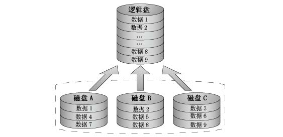
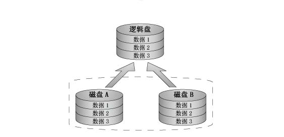
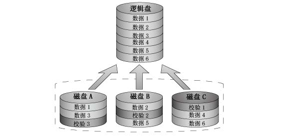

# 磁盘及 RAID
<!-- vim-markdown-toc GFM -->
* [磁盘管理](#磁盘管理)
    * [查看磁盘信息](#查看磁盘信息)
        * [lsscsi](#lsscsi)
        * [smartctl](#smartctl)
            * [解释下各属性的含义](#解释下各属性的含义)
            * [各个属性的含义](#各个属性的含义)
            * [对于 SSD 硬盘，需要关注的几个参数](#对于-ssd-硬盘需要关注的几个参数)
        * [MegaCli](#megacli)
        * [LSIUtil](#lsiutil)
        * [lsblk](#lsblk)
    * [磁盘扩展](#磁盘扩展)
        * [Linux 下 XFS 扩展](#linux-下-xfs-扩展)
    * [测试硬盘](#测试硬盘)
        * [dd 测试硬盘读写速度](#dd-测试硬盘读写速度)
* [RAID](#raid)
    * [RAID 分类](#raid-分类)
        * [RAID 0(striped)](#raid-0striped)
        * [RAID 1(mirroring)](#raid-1mirroring)
        * [RAID 5 分布式奇偶校验的独立磁盘结构](#raid-5-分布式奇偶校验的独立磁盘结构)
        * [RAID0+1/1+0](#raid0110)
    * [MegaCli 管理工具](#megacli-管理工具)
    * [RAID 日常运维](#raid-日常运维)
        * [查看 RAID 信息](#查看-raid-信息)
        * [更换硬盘时需要注意地方](#更换硬盘时需要注意地方)
        * [RAID5 单块硬盘故障恢复方法](#raid5-单块硬盘故障恢复方法)

<!-- vim-markdown-toc -->
# 磁盘管理


## 查看磁盘信息

### lsscsi

```
--classic|-c      alternate output similar to 'cat /proc/scsi/scsi'
--device|-d       show device node's major + minor numbers
--generic|-g      show scsi generic device name
--help|-h         this usage information
--hosts|-H        lists scsi hosts rather than scsi devices
--kname|-k        show kernel name instead of device node name
--list|-L         additional information output one
                  attribute=value per line
--long|-l         additional information output
--protection|-p   show data integrity (protection) information
--sysfsroot=PATH|-y PATH    set sysfs mount point to PATH (def: /sys)
--transport|-t    transport information for target or, if '--hosts'
                  given, for initiator
--verbose|-v      output path names where data is found
--version|-V      output version string and exit
```

查看磁盘运行状态

```
lsscsi -l
[0:0:0:0]    disk    ATA      ST2000LM003 HN-M 0007  -
  state=running queue_depth=64 scsi_level=6 type=0 device_blocked=0 timeout=0
[0:0:1:0]    disk    ATA      ST2000LM003 HN-M 0007  -
  state=running queue_depth=64 scsi_level=6 type=0 device_blocked=0 timeout=0
[0:0:2:0]    disk    ATA      ST2000LM003 HN-M 0007  /dev/sda
  state=running queue_depth=64 scsi_level=6 type=0 device_blocked=0 timeout=30
[0:0:3:0]    disk    ATA      ST2000LM003 HN-M 0007  /dev/sdb
  state=running queue_depth=64 scsi_level=6 type=0 device_blocked=0 timeout=30
[0:0:4:0]    disk    ATA      ST2000LM003 HN-M 0007  /dev/sdc
  state=running queue_depth=64 scsi_level=6 type=0 device_blocked=0 timeout=30
[0:0:5:0]    disk    ATA      ST2000LM003 HN-M 0007  /dev/sdd
  state=running queue_depth=64 scsi_level=6 type=0 device_blocked=0 timeout=30
[0:0:6:0]    disk    ATA      ST2000LM003 HN-M 0007  /dev/sde
  state=running queue_depth=64 scsi_level=6 type=0 device_blocked=0 timeout=30
[0:0:7:0]    disk    ATA      ST2000LM003 HN-M 0006  /dev/sdf
  state=running queue_depth=64 scsi_level=6 type=0 device_blocked=0 timeout=30
[0:1:0:0]    disk    LSILOGIC Logical Volume   3000  /dev/sdg
  state=running queue_depth=64 scsi_level=3 type=0 device_blocked=0 timeout=30
```

### smartctl

smartctl 可以查看磁盘的 SN，WWN 等信息。还有是否有磁盘坏道的信息

```
$ smartctl -a -f brief /dev/sdb

# 如果磁盘位于 RAID 下面，比如 megaraid，可以使用如下命令
# smartctl -a -f brief -d megaraid,1 /dev/sdb

smartctl 5.43 2012-06-30 r3573 [x86_64-linux-3.12.21-1.el6.x86_64] (local build)
Copyright (C) 2002-12 by Bruce Allen, http://smartmontools.sourceforge.net

=== START OF INFORMATION SECTION ===
Device Model:     ST2000LM003 HN-M201RAD
Serial Number:    S34RJ9EG109476
LU WWN Device Id: 5 0004cf 20eeefc42
Firmware Version: 2BC10007
User Capacity:    2,000,398,934,016 bytes [2.00 TB]
Sector Sizes:     512 bytes logical, 4096 bytes physical
Device is:        Not in smartctl database [for details use: -P showall]
ATA Version is:   8
ATA Standard is:  ATA-8-ACS revision 6
Local Time is:    Mon Jun 22 07:48:24 2015 UTC
SMART support is: Available - device has SMART capability.
SMART support is: Enabled

Vendor Specific SMART Attributes with Thresholds:
ID# ATTRIBUTE_NAME          FLAGS    VALUE WORST THRESH FAIL RAW_VALUE
  1 Raw_Read_Error_Rate     POSR-K   91   91   051    -    11787
  2 Throughput_Performance  -OS--K   252   252   000    -    0
  3 Spin_Up_Time            PO---K   086   086   025    -    4319
  4 Start_Stop_Count        -O--CK   100   100   000    -    16
  5 Reallocated_Sector_Ct   PO--CK   252   252   010    -    0
  7 Seek_Error_Rate         -OSR-K   252   252   051    -    0
  8 Seek_Time_Performance   --S--K   252   252   015    -    0
  9 Power_On_Hours          -O--CK   100   100   000    -    2277
 10 Spin_Retry_Count        -O--CK   252   252   051    -    0
 12 Power_Cycle_Count       -O--CK   100   100   000    -    34
191 G-Sense_Error_Rate      -O---K   252   252   000    -    0
192 Power-Off_Retract_Count -O---K   252   252   000    -    0
194 Temperature_Celsius     -O----   064   064   000    -    22 (Min/Max 18/28)
195 Hardware_ECC_Recovered  -O-RCK   100   100   000    -    0
196 Reallocated_Event_Count -O--CK   252   252   000    -    0
197 Current_Pending_Sector  -O--CK   100   100   000    -    11
198 Offline_Uncorrectable   ----CK   252   252   000    -    0
199 UDMA_CRC_Error_Count    -OS-CK   200   200   000    -    0
200 Multi_Zone_Error_Rate   -O-R-K   100   100   000    -    3
223 Load_Retry_Count        -O--CK   252   252   000    -    0
225 Load_Cycle_Count        -O--CK   090   090   000    -    108289
                            ||||||_ K auto-keep
                            |||||__ C event count
                            ||||___ R error rate
                            |||____ S speed/performance
                            ||_____ O updated online
                            |______ P prefailure warning

SMART Error Log Version: 1
No Errors Logged
```

#### 解释下各属性的含义

ID# ATTRIBUTE_NAME FLAG VALUE WORST THRESH TYPE UPDATED WHEN_FAILED RAW_VALUE

> - **ID**    属性 ID，1~255
> - **ATTRIBUTE_NAME**    属性名
> - **FLAG**  表示这个属性携带的标记。使用 -f brief 可以打印
> - **VALUE**     Normalized value, 取值范围 1 到 254. 越低表示越差。越高表示越好。(with 1 representing the worst case and 254 representing the best)。注意 wiki 上说的是 1 到 253. 这个值是硬盘厂商根据 RAW_VALUE 转换来的，smartmontools 工具不负责转换工作。
> - **WORST**     表示 SMART 开启以来的，所有 Normalized values 的最低值。(which represents the lowest recorded normalized value.)
> - **THRESH**    阈值，当 Normalized value 小于等于 THRESH 值时，表示这项指标已经 failed 了。注意这里提到，如果这个属性是 pre-failure 的，那么这项如果出现 Normalized value<=THRESH, 那么磁盘将马上 failed 掉
> - **TYPE**      这里存在两种 TYPE 类型，Pre-failed 和 Old_age.
    1. Pre-failed 类型的 Normalized value 可以用来预先知道磁盘是否要坏了。例如 Normalized value 接近 THRESH 时，就赶紧换硬盘吧。
    2. Old_age 类型的 Normalized value 是指正常的使用损耗值，当 Normalized value 接近 THRESH 时，也需要注意，但是比 Pre-failed 要好一点。
> - **UPDATED**   这个字段表示这个属性的值在什么情况下会被更新。一种是通常的操作和离线测试都更新 (Always), 另一种是只在离线测试的情况下更新 (Offline).
> - **WHEN_FAILED**   这字段表示当前这个属性的状态 : failing_now(normalized_value <= THRESH), 或者 in_the_past(WORST <= THRESH), 或者 - , 正常 (normalized_value 以及 wrost >= THRESH).
> - **RAW_VALUE** 表示这个属性的未转换前的 RAW 值，可能是计数，也可能是温度，也可能是其他的。
注意 RAW_VALUE 转换成 Normalized value 是由厂商的 firmware 提供的，smartmontools 不提供转换。

注意有个 FLAG 是 KEEP, 如果不带这个 FLAG 的属性，值将不会 KEEP 在磁盘中，可能出现 WORST 值被刷新的情况，例如这里的 ID=1 的值，已经 89 了，重新执行又变成 91 了，但是 WORST 的值并不是历史以来的最低 89。遇到这种情况的解决办法是找个地方存储这些值的历史值。

因此监控磁盘的重点在哪里呢？
严重情况从上到下 :

> * 1. 最严重的情况 WHEN_FAILED = FAILING_NOW 并且 TYPE=Pre-failed, 表示现在这个属性已经出问题了。并且硬盘也已经 failed 了。
> * 2. 次严重的情况 WHEN_FAILED = in_the_past 并且 TYPE=Pre-failed, 表示这个属性曾经出问题了。但是现在是正常的。
> * 3. WHEN_FAILED = FAILING_NOW 并且 TYPE=Old_age, 表示现在这个属性已经出问题了。但是硬盘可能还没有 failed.
> * 4. WHEN_FAILED = in_the_past 并且 TYPE=Old_age, 表示现在这个属性曾经出问题了。但是现在是正常的。

为了避免这 4 种情况的发生。

> * 1. 对于 UPDATE=Offline 的属性，应该让 smartd 定期进行测试 (smartd 还可以发邮件）. 或者 crontab 进行测试。
> * 2. 应该时刻关注磁盘的 Normalized value 以及 WORST 的值是否接近 THRESH 的值了。当有值要接近 THRESH 了，提前更换硬盘。
> * 3. 温度，有些磁盘对温度比较敏感，例如 PCI-E SSD 硬盘。如果温度过高可能就挂了。这里读取 RAW_VALUE 就比较可靠了。

#### 各个属性的含义

> * **read error rate** 错误读取率：记录读取数据错误次数（累计），非 0 值表示硬盘已经或者可能即将发生坏道
> * **throughput performance** 磁盘吞吐量：平均吞吐性能（一般在进行了人工 Offline S.M.A.R.T. 测试以后才会有值。）；
> * **spinup time** 主轴电机到达要求转速时间（毫秒 / 秒）；
> * **start/stop count** 电机启动 / 停止次数（可以当作开机 / 关机次数，或者休眠后恢复，均增加一次计数。全新的硬盘应该小于 10）；
> * **reallocated sectors count** 重分配扇区计数：硬盘生产过程中，有一部分扇区是保留的。当一些普通扇区读 / 写 / 验证错误，则重新映射到保留扇区，挂起该异常扇区，并增加计数。随着计数增加，io 性能骤降。如果数值不为 0，就需要密切关注硬盘健康状况；如果持续攀升，则硬盘已经损坏；如果重分配扇区数超过保留扇区数，将不可修复；
> * **seek error rate** 寻道错误率：磁头定位错误一次，则技术增加一次。如果持续攀升，则可能是机械部分即将发生故障；
> * **seek timer performance** 寻道时间：寻道所需要的时间，越短则读取数据越快，但是如果时间增加，则可能机械部分即将发生故障；
> * **power-on time** 累计通电时间：指硬盘通电时间累计值。（单位：天 / 时 / 分 / 秒。休眠 / 挂起不计入？新购入的硬盘应小于 100hrs）；
> * **spinup retry count** 电机启动失败计数：电机启动到指定转速失败的累计数值。如果失败，则可能是动力系统产生故障；
> * **power cycle count** 电源开关计数：每次加电增加一次计数，新硬盘应小于 10 次；
> * **g-sensor error rate** 坠落计数：异常加速度（例如坠落，抛掷）计数——磁头会立即回到 landing zone，并增加一次计数；
> * **power-off retract count** 异常断电次数：磁头在断电前没有完全回到 landing zone 的次数，每次异常断电则增加一次计数；
> * **load/unload cycle count** 磁头归位次数：指工作时，磁头每次回归 landing zone 的次数。（ps：流言说某个 linux 系统——不点名，在使用电池时候，会不断强制磁头归为，而磁头归位次数最大值约为 600k 次，所以认为 linux 会损坏硬盘，实际上不是这样的）；
> * **temperature** 温度：没嘛好说的，硬盘温度而已，理论上比工作环境高不了几度。（sudo hddtemp /dev/sda）
> * **reallocetion event count** 重映射扇区操作次数：上边的重映射扇区还记得吧？这个就是操作次数，成功的，失败的都计数。成功好说，也许硬盘有救，失败了，也许硬盘就要报废了；
> * **current pending sector count** 待映射扇区数：出现异常的扇区数量，待被映射的扇区数量。 如果该异常扇区之后成功读写，则计数会减小，扇区也不会重新映射。读错误不会重新映射，只有写错误才会重新映射；
> * **uncorrectable sector count** 不可修复扇区数：所有读 / 写错误计数，非 0 就证明有坏道，硬盘报废；

#### 对于 SSD 硬盘，需要关注的几个参数

SSD 磨损数据分析：
SLC 的 SSD 可以擦除 10 万次，MLC 的 SSD 可以擦除 1 万次

**Media Wearout Indicator**

定义：表示 SSD 上 NAND 的擦写次数的程度，初始值为 100，随着擦写次数的增加，开始线性递减，递减速度按照擦写次数从 0 到最大的比例。一旦这个值降低到 1，就不再降了，同时表示 SSD 上面已经有 NAND 的擦写次数到达了最大次数。这个时候建议需要备份数据，以及更换 SSD。

解释：直接反映了 SSD 的磨损程度，100 为初始值，0 为需要更换，有点类似游戏中的血点。

结果：磨损 1 点

**Re-allocated Sector Count**

定义：出厂后产生的坏块个数，如果有坏块，从 1 开始增加，每 4 个坏块增加 1

解释：坏块的数量间接反映了 SSD 盘的健康状态。

结果：基本上都为 0

**Host Writes Count**

定义：主机系统对 SSD 的累计写入量，每写入 65536 个扇区 raw value 增加 1

解释：SSD 的累计写入量，写入量越大，SSD 磨损情况越严重。每个扇区大小为 512bytes，65536 个扇区为 32MB

结果：单块盘 40T

**Timed Workload Media Wear**

定义：表示在一定时间内，盘片的磨损比例，比 Media Wearout Indicator 更精确。

解释：可以在测试前清零，然后测试某段时间内的磨损数据，这个值的 1 点相当于 Media Wearout Indicator 的 1/100，测试时间必须大于 60 分钟。另外两个相关的参数：Timed Workload Timer 表示单次测试时间，Timed Workload Host Read/Write Ratio 表示读写比例。

**Available_Reservd_Space**

SSD 上剩余的保留空间，初始值为 100，表示 100%，阀值为 10，递减到 10 表示保留空间已经不能再减少

### MegaCli

查看 media error, other error

### LSIUtil

查看磁盘的物理位置，error 检测

### lsblk


## 磁盘扩展

### Linux 下 XFS 扩展

XFS 是一个开源的（GPL）日志文件系统，最初由硅谷图形（SGI）开发，现在大多数的 Linux 发行版都支持。事实上，XFS 已被最新的 CentOS/RHEL 7 采用，成为其默认的文件系统。在其众多的特性中，包含了“在线调整大小”这一特性，使得现存的 XFS 文件系统在已经挂载的情况下可以进行扩展。

扩展前
```
[root@meetbill ~]# xfs_info /mnt/
meta-data=/dev/sdb    isize=512    agcount=4, agsize=196608 blks
         =            sectsz=512   attr=2, projid32bit=1
         =            crc=1        finobt=0 spinodes=0
data     =            bsize=4096   blocks=786432, imaxpct=25
         =            sunit=0      swidth=0 blks
naming   =version 2   bsize=4096   ascii-ci=0 ftype=1
log      =internal    bsize=4096   blocks=2560, version=2
         =            sectsz=512   sunit=0 blks, lazy-count=1
realtime =none        extsz=4096   blocks=0, rtextents=0


[root@meetbill ~]# df -h
Filesystem           Size  Used Avail Use% Mounted on
/dev/mapper/cl-root   17G  8.4G  8.7G  49% /
devtmpfs             902M     0  902M   0% /dev
tmpfs                912M     0  912M   0% /dev/shm
tmpfs                912M  8.7M  904M   1% /run
tmpfs                912M     0  912M   0% /sys/fs/cgroup
/dev/sda1           1014M  141M  874M  14% /boot
tmpfs                183M     0  183M   0% /run/user/0
/dev/sdb             3.0G   33M  3.0G   2% /mnt
```
将磁盘 (/dev/sdb) 进行扩展后，扩展磁盘的方式比如虚拟机对虚拟磁盘进行扩展或 isics 对存储进行扩展，磁盘扩展后，我们还需要对文件系统进行扩展 (/mnt)

我们用到的是 `xfs_growfs` 命令
```
[root@meetbill ~]# xfs_growfs /mnt/
meta-data=/dev/sdb    isize=512    agcount=4, agsize=196608 blks
         =            sectsz=512   attr=2, projid32bit=1
         =            crc=1        finobt=0 spinodes=0
data     =            bsize=4096   blocks=786432, imaxpct=25
         =            sunit=0      swidth=0 blks
naming   =version 2   bsize=4096   ascii-ci=0 ftype=1
log      =internal    bsize=4096   blocks=2560, version=2
         =            sectsz=512   sunit=0 blks, lazy-count=1
realtime =none        extsz=4096   blocks=0, rtextents=0
data blocks changed from 786432 to 1310720
```
大功告成，如果`xfs_growfs` 不加任何参数，则会对指定挂载目录自动扩展 XFS 文件系统到最大的可用大小。`-D`参数可以设置为指定大小

## 测试硬盘

### dd 测试硬盘读写速度

如何正确使用 dd 工具测试磁盘的 I/O 速度

一般情况下，我们都是使用 dd 命令创建一个大文件来测试磁盘的读写速度。我们分析一下 dd 命令是如何工作的。
```
dd if=/dev/zero of=/xiaohan/test.iso bs=1024M count=1
```
测试显示的速度是 dd 命令将数据写入到内存缓冲区中的速度
```
dd if=/dev/zero of=/xiaohan/test.iso bs=1024M count=1;sync
```
测试显示的跟上一种情况是一样的，两个命令是先后执行的，当 sync 开始执行的时候，dd 命令已经将速度信息打印到了屏幕上，仍然无法显示从内存写硬盘时的真正速度。
```
dd if=/dev/zero of=/xiaohan/test.iso bs=1024M count=1 conv=fdatasync
```
这种情况加入这个参数后，dd 命令执行到最后会真正执行一次“同步 (sync)”操作，所以这时候你得到的是读取这 128M 数据到内存并写入到磁盘上所需的时间，这样算出来的时间才是比较符合实际的。
```
dd if=/dev/zero of=/xiaohan/test.iso bs=1024M count=1 oflag=dsync
```
这种情况下，dd 在执行时每次都会进行同步写入操作。也就是说，这条命令每次读取 1M 后就要先把这 1M 写入磁盘，然后再读取下面这 1M，一共重复 128 次。这可能是最慢的一种方式，基本上没有用到写缓存 (write cache)。

总结：
```
建议使用测试写速度的方式为：
dd if=/dev/zero of=/xiaohan/test.iso bs=1024M count=1 conv=fdatasync

建议使用测试读速度的方式为：
dd if=/xiaohan/test.iso of=/dev/zero bs=1024M count=1 iflag=direct
*注：要正确测试磁盘读写能力，建议测试文件的大小要远远大于内存的容量！！！
```

# RAID
RAID, Redundant Arrays of Inexpensive Disks, 容错式廉价磁盘阵列.RAID 的基本原理是把多个便宜的小磁盘组合到一起，成为一个磁盘组，使性能达到或超过一个容量巨大、价格昂贵的磁盘。目前 RAID 技术大致分为两种：基于硬件的 RAID 技术和基于软件的 RAID 技术。其中在 Linux 下通过自带的软件就能实现 RAID 功能，这样便可省去购买昂贵的硬件 RAID 控制器和附件就能极大地增强磁盘的 IO 性能和可靠性。由于是用软件去实现的 RAID 功能，所以它配置灵活、管理方便。同时使用软件 RAID，还可以实现将几个物理磁盘合并成一个更大的虚拟设备，从而达到性能改进和数据冗余的目的。当然基于硬件的 RAID 解决方案比基于软件 RAID 技术在使用性能和服务性能上稍胜一筹，具体表现在检测和修复多位错误的能力、错误磁盘自动检测和阵列重建等方面。

RAID 动画演示

[RAID 动画演示下载](https://raw.githubusercontent.com/meetbill/op_practice_code/master/store/RAID/raid.exe)

## RAID 分类

常用的 RAID RAID0/RAID1/RAID5/RAID10

| 级别   |     优点      |     缺点|
|------------|----------|---------|
|RAID 0 | 存取速度最快 | 没有容错 |
|RAID 1 | 完全容错 | 成本高 |
|RAID 5 | 多任务可容错 | 写入时有 overhead |
|RAID 0+1/RAID 10 | 速度快，完全容错，成本高 |


### RAID 0(striped)



Striped 模式，把连续的数据分散懂啊多个磁盘上存取。速度快，但是没有冗余。

### RAID 1(mirroring)



RAID 1 可以用于两个或 2xN 个磁盘，并使用 0 块或更多的备用磁盘，每次写数据时会同时写入镜像盘。这种阵列可靠性很高，但其有效容量减小到总容量的一半，同时这些磁盘的大小应该相等，否则总容量只具有最小磁盘的大小。

### RAID 5 分布式奇偶校验的独立磁盘结构



### RAID0+1/1+0

raid0 over raid1

## MegaCli 管理工具

[Megacli_tui](https://github.com/meetbill/megacli_tui)

## RAID 日常运维
### 查看 RAID 信息

    dmesg | grep -i raid

### 更换硬盘时需要注意地方

    (1) 更换损坏硬盘前，必须查看阵列的当前状态，保证除损坏的硬盘外，其他硬盘处于正常的 ONLINE 状态
    (2) 更换硬盘必须及时
    (3) 更换的新硬盘必须是完好的
    (4) 在阵列数据重建完成之前，不能插拔任何硬盘

### RAID5 单块硬盘故障恢复方法

    单个硬盘失效，我们通过热插拔拔下来再插上去。如热插拔没用在进入 RAID 配置界面，将该硬盘进行 ForceOnLine 操作。还可以通过更换其它硬盘插槽，切记不要打乱磁盘顺序。如果上面操作不能解决问题，尝试将该硬盘格式化后插入，然后使用 ReBuild 操作。在这过程中可能会遇到不能格式化现象，这是因为硬盘物理错误严重，应该更换硬盘后重建数据来解决问题。
