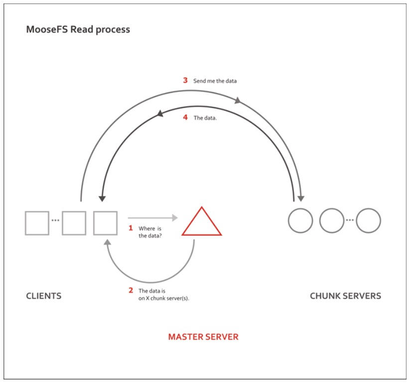
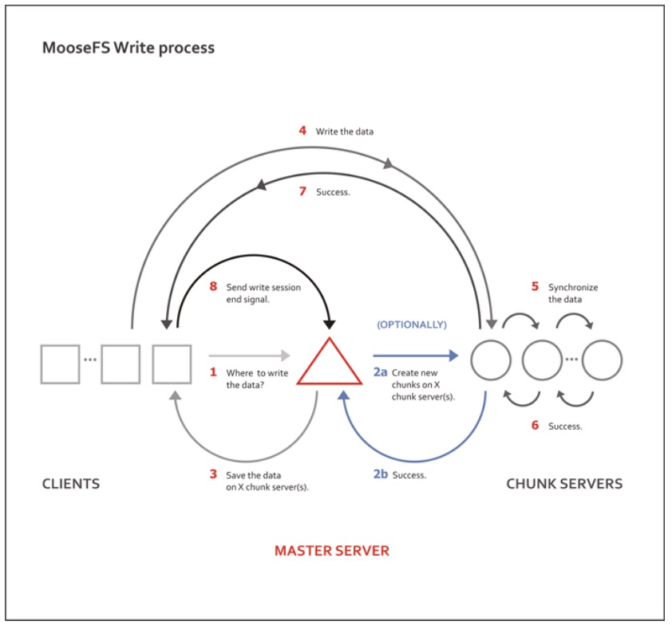

## MooseFS

<!-- vim-markdown-toc GFM -->
* [MooseFS 简介](#moosefs-简介)
    * [功能特性](#功能特性)
    * [架构原理](#架构原理)
        * [关于分片](#关于分片)
        * [容错／高可靠](#容错高可靠)
        * [chunk 存储选择算法](#chunk-存储选择算法)
* [安装及使用](#安装及使用)
    * [配置要求](#配置要求)
    * [安装](#安装)
    * [使用方法](#使用方法)
        * [挂载](#挂载)
        * [设置冗余度](#设置冗余度)
        * [设置 Trash time](#设置-trash-time)
        * [使用快照](#使用快照)
        * [启动顺序与停止顺序](#启动顺序与停止顺序)
        * [数据恢复](#数据恢复)
        * [Automated Failover](#automated-failover)
* [日常问题及修复方法](#日常问题及修复方法)
    * [Client 操作与修复](#client-操作与修复)
        * [关于修复](#关于修复)
    * [Chunker 的空间](#chunker-的空间)
    * [快照 snapshot](#快照-snapshot)
    * [mfsappendchunks](#mfsappendchunks)
    * [回收站机制](#回收站机制)
* [MFS 集群的维护](#mfs-集群的维护)
    * [启动和停止 MFS 集群](#启动和停止-mfs-集群)
    * [MFS chunkservers 的维护](#mfs-chunkservers-的维护)
    * [MFS 元数据备份](#mfs-元数据备份)
    * [MFS Master 的恢复](#mfs-master-的恢复)
    * [从 MetaLogger 中恢复 Master](#从-metalogger-中恢复-master)

<!-- vim-markdown-toc -->
# MooseFS 简介

本文介绍 `MooseFS` 架构原理，安装配置和使用方法。

`MooseFS` 是一种容错的分布式文件系统。它将数据分散到多个物理位置（服务器），在用户看来是一个统一的资源。
`MooseFS` 支持 `FUSE` 标准接口，能够无缝实现从本地文件的迁移。
同时，`MooseFS` 提供比 `NFS` 更好的可运维性。

## 功能特性

对于标准的文件操作，`MooseFS` 表现与其它类 Unix 文件系统一致。

支持的通用文件系统特性有：

* 层次结构（目录数），是一种操作友好的文件系统。
* 兼容 POSIX 文件属性
* 支持特殊文件（块设备与字符设备，管道和套接字）
* 符号链接（软链接）和硬链接。
* 基于 IP 地址和（或）密码的访问权限控制

`MooseFS` 独特的特性有：

* 高可靠性（数据的多个副本存储在多个不同服务器上）
* 容量动态扩展。只要增加新的机器／磁盘
* 删除的文件保留一段时间（可配），像是文件系统的回收站。
* 即使文件在被读写，也可以持续做文件快照。

## 架构原理

MooseFS 包含 4 个组件

* 管理节点 master servers。支持单活。存储所有文件的元数据
* 数据节点 chunk servers 数量不限。存储文件数据，相互同步文件。
* 元数据备份服务器 metalogger server。数量不限。保存元数据变更日志，周期性的下载元数据文件。主节点失效时可以替代主节点。
* 客户端。挂载使用文件系统。

文件的读写流程可以根据以下图示来理解：





### 关于分片

文件数据分片（chunks）后保存，分片默认最大值为 64MiB。分片对应 chunkserver 中的文件。
分片数据是版本化的，如果文件执行更新后，某台机器还有旧版本的数据，则会删除该机器上的旧版本文件，并同步到改文件的最新版本。

### 容错／高可靠

将文件分发多份到多个服务器中存储，以实现高可靠。通过设置单个文件的 `goal` 来指定文件应该可以保留的副本数。
重要数据建议将 goal 设置大于 2；而将 goal 设为 1，则文件只在 1 台数据节点上保存

### chunk 存储选择算法

如果自己设计一套 chunkserver 选择算法，我们要达到哪些目标呢？

> 1. 文件打散后尽量平均分布到各台 chunkserver 上
> 2. 各台 chunkserver 上的 chunk 数量尽可能的平均
> 3. 数据分发过程衡量系统负载，尽量把数据放在负载低的 chunkserver 上
> 4. 数据分发过程是否应该衡量各台 chunkserver 的可用空间？
> 5. 机架感应？

回到 MFS 使用过程中会有一个疑问.chunkserver 的选择是怎么选择的. 怎么才能保证数据保存占用空间平衡甚至平均？这就是数据分布算法. 也正是分布式文件系统的核心容. 所以在此，转来一篇关于 MFS 的 chunk 存储选择算法的文章。

* * *

还记得 matocsserventry 结构中的 carry 字段么，这个字段就是分布算法的核心. 每台 chunkserver 会有自己的 carry 值，在选择 chunkserver 会将每台 chunkserver 按照 carry 从大到小做快速排序，优先选择 carry 值大的 chunkserver 来使用。

在描述具体算法前，先介绍三个概念：

> * allcnt:mfs 中可用的 chunkserver 的个数
> * availcnt:mfs 中当前可以直接存储数据的 chunkserver 的个数
> * demand: 当前文件的副本数目

先说 allcnt, 可用的 chunkserver 要满足下面几个条件：

> 1. chunkserver 是活着的
> 2. chunkserver 的总空间大于 0
> 3. chunkserver 的可用空间（总空间 - 使用空间）大于 1G

availcnt 指的是 carry 值大于 1 的可用 chunkserver 的个数. 也就是在 allcnt 的约束条件上加一条 carry 值大于 1. 文件 1.txt 需要存储 2 个副本，但是 mfs 中仅仅有 1 台 chunkserver 可用，也就是```demand>allcnt```的时候，mfs 会自动减少文件的副本个数到 allcnt, 保证文件可以成功写入系统。

关于 carry 有下面几个规则：

> 1. 仅 carry 值大于 1 的 chunkserver 可以存储新数据
> 2. 每台 chunkserver 存储新数据后其 carry 会减 1
> 3. demand>availcnt 的时候，会递归的增加每台 chunkserver 的 carry 值，直到```demand<=availcnt```为止
> 4. 每台 chunkserver 每次 carry 值的增加量等于当前 chunkserver 总空间除以最大的 chunkserver 总空间

上面的规则比较复杂. 举个例子就更加清晰了。

```
chunkserver 1：totalspace:3.94G carry:0.463254
chunkserver 2：totalspace:7.87G carry:0.885674
```
文件 1.txt 大小 1k,mfs 默认一个 chunk 大小为 64M, 所以仅仅需要一个 chunk 就够了. 此时 availcnt=0,demand=1, 所以需要增加 carry 值
```
chunkserver 1：carry=0.463254 + (3.94/7.87) = 0.463254 + 0.500005 = 0.963259
chunkserver 2：carry=0.885674 + (7.87/7.87) = 0.885674 + 1.000000 = 1.885674
```
此时 availcnt=1,demand=1, 所以不需要增加 carry 值，对 chunkserver 按照 carry 从大到小排序结果为：```chunkserver 2 > chunkserver 1```, 文件 1.txt 的 chunk 会存储到 chunkserver 2 上，同时 chunkserver 2 的 carry 会减 1

如下：
```
chunkserver 1：carry=0.963259
chunkserver 2：carry=1.885674 – 1 = 0.885674
```
文件 2.txt 大小 1k,mfs 默认一个 chunk 大小为 64M, 所以仅仅需要一个 chunk 就够了. 此时 availcnt=0,demand=1. 所以需要增加 carry 值
```
chunkserver 1：carry=0.963259 + (3.94/7.87) = 0.963259 + 0.500005 = 1.463264
chunkserver 2：carry=0.885674 + (7.87/7.87) = 0.885674 + 1.000000 = 1.885674
```
此时 availcnt=2,demand=1, 所以不需要增加 carry 值，对 chunkserver 按照 carry 从大到小排序结果为：```chunkserver 2 > chunkserver 1```, 文件 2.txt 的 chunk 会存储到 chunkserver 2 上，同时 chunkserver 2 的 carry 会减 1

如下：
```
chunkserver 1：carry=1.463264
chunkserver 2：carry=1.885674 – 1 = 0.885674
```
文件 3.txt 大小 1k,mfs 默认一个 chunk 大小为 64M, 所以仅仅需要一个 chunk 就够了. 此时 availcnt=1,demand=1, 所以不需要增加 carry 值. 对 chunkserver 按照 carry 从大到小排序结果为：```chunkserver 1 > chunkserver 2```, 文件 3.txt 的 chunk 会存储到 chunkserver 1 上，同时 chunkserver 1 的 carry 会减 1

如下：
```
chunkserver 1：carry=1.463264 – 1 = 0.463264
chunkserver 2：carry=0.885674
```
因为两台 chunkserver 的总空间大小不一致，根据算法总空间大的那台 chunkserver 会存储更多的新数据。

记住：**仅仅和 chunkserver 的总空间有关系和可用空间没有任何关系**, 也就是说，当各台 chunkserver 总空间大小差不多的情况下，chunk 能更好的平均分布，否则 mfs 会更倾向于选择总空间大的机器来使用。

* * *
最后一个问题，当 mfs 刚刚启动的时候，carry 值是如果获得的？

答案：随机产生，通过 rndu32() 这个函数，随机产生一个小于 1, 大于等于 0 的数。

测试结果如下：
```
Nov 23 01:01:25 sunwg mfsmaster[13175]: 192.168.0.159,0.594834
Nov 23 01:01:25 sunwg mfsmaster[13175]: 192.168.0.160,0.000000
Nov 23 01:03:58 sunwg mfsmaster[13187]: 192.168.0.159,0.516242
Nov 23 01:03:58 sunwg mfsmaster[13187]: 192.168.0.160,0.826559
Nov 23 01:04:17 sunwg mfsmaster[13192]: 192.168.0.159,0.123765
Nov 23 01:04:17 sunwg mfsmaster[13192]: 192.168.0.160,0.389592
```

# 安装及使用

## 配置要求

**管理节点** 是系统的核心，需要使用稳定性高的硬件设备，如冗余电源，ECC 内存，RAID1/RAID5/RAID10。
根据文件数量的不同，也需要配置比较多的内存（一般来说，100 万个文件对应 300MiB 内存）。
硬盘容量需要考虑文件数量和文件操作数量（一般来说，20GiB 磁盘可以保存 2500 万文件的元数据，或者 50 小时的文件操作日志）。
管理节点如此重要，也需要根据情况做好安全设置。

**元数据备份服务器** 只需要和管理节点有同样多的内存和磁盘来存储数据即可。

**数据节点** 只需要保持足够的磁盘容量。

## 安装

在 CentOS 系统上安装。

首先配置使用软件仓库。

将 moosefs 仓库到 GPG KEY 加入本地软件包管理工具。

    curl "http://ppa.moosefs.com/RPM-GPG-KEY-MooseFS" -o /etc/pki/rpm-gpg/RPM-GPG-KEY-MooseFS

增加 MooseFS3.0 仓库配置项。

    curl "http://ppa.moosefs.com/MooseFS-3-el$(grep -o '[0-9]*' /etc/centos-release |head -1).repo" -o /etc/yum.repos.d/MooseFS.repo

使用以下命令来安装软件包：

    # For Master Server:
    yum install moosefs-master moosefs-cli moosefs-cgi moosefs-cgiserv

    # For Chunkservers:
    yum install moosefs-chunkserver

    # For Metaloggers:
    yum install moosefs-metalogger

    # For Clients:
    yum install moosefs-client


启动文件系统

    # To start process manually:
    mfsmaster start
    mfschunkserver start
    # For sysv os family - EL5, EL6:
    service moosefs-master start
    service moosefs-chunkserver start
    # For systemd os family - EL7:
    systemctl start moosefs-master.service
    systemctl start moosefs-chunkserver.service


系统参数

    # for master server
    sysctl vm.overcommit_memory=1

## 使用方法

### 挂载

    $ sudo mfsmount -H <mfs-master> [-P 9421] [-S /] [-o rw|ro] /mnt/mfs

其中，
`-H` / `-P` 代表 mfsmaster 的 IP 和端口；
`-S` 挂载 MooseFS 中的路径；
`-o rw` 或 `-o ro` 设置读写或只读模式；
`/mnt/mfs` 为本地挂载路径。


### 设置冗余度

通过配置冗余度来保证出现失效时不丢失数据。
冗余度为 N 时，能够在不超过 N-1 个 chunkserver 同时出现失效时不丢失数据。

默认我们设置文件的冗余度为 2，即支持有 1 个 chunkserver 失败时不影响使用。

调整数据冗余度 (goal)

    $ sudo mfssetgoal -r 2 /mnt/mfs

其中，
`-r` 选项代表递归目录及子目录的文件。

可以通过 `mfsgetgoal` 来读取当前的冗余度

    $ sudo mfsgetgoal /mnt/mfs
    /mnt/mfs 2

可以通过 `mfscheckfile` 来读取特定文件的冗余度设置与生效情况

    $ sudo mfscheckfile /mnt/mfs/testfile
    /mnt/mfs/testfile:
    2 copies: 1 chunks

建议：

*  最低设置为 2，保证不出现文件丢失；
*  一般情况下设置为 3，应该是足够安全的；
*  对于足够重要的数据，可以设置为 4 或者更高，但是不能超过 chunkserver 实例数量。

### 设置 Trash time

文件删除后会在 moosefs 的垃圾站中保留一段时间。
通过 `mfsgettrashtime` 能读取过期时间的设置。

### 使用快照

使用 MooseFS 的一个好处是可以支持文件或目录的快照。
我们知道 MooseFS 的分块都是版本化的，因此支持快照的方式保留一个文件的副本。
在文件被修改前，这个副本并不会占用额外的空间。

### 启动顺序与停止顺序

启动顺序

*  启动 mfsmaster
*  启动 mfschunkserver
*  启动 mfsmetalogger
*  在 client 节点执行 mfsmount

停止顺序

*  在所有 client 节点执行 umount
*  mfschunkserver stop
*  mfsmetalogger stop
*  mfsmaster stop

### 数据恢复

当出现 master 节点出现问题时，可以通过 `mfsmetarestore` 来恢复元数据。

    mfsmetarestore -a -d /storage/mfsmaster

如果 master 节点故障严重无法启动，可以利用 metalogger 节点的元数据备份来恢复。
首先在选定的节点上按照 mfsmaster，使用之前 master 节点的相同配置；
从备份设备或 metalogger 拷贝 `metadata.mfs.back` 文件到新 master 节点；
从 metalogger 拷贝失败前元数据最新的 changelog 文件（`changelog.*.mfs`）；
执行 `mfsmetarestore -a`。

### Automated Failover

生产环境使用 MooseFS 时，需要保证 master 节点的高可用。
使用 `ucarp` 是一种比较成熟的方案。

`ucarp` 类似于 `keepalived`，通过主备服务器间的健康检查来发现集群状态，并执行相应操作。

# 日常问题及修复方法

## Client 操作与修复
客户端强制 `kill -9` 杀掉 `mfsmount` 进程，需要先 `umount` , 然后再 `mount` , 否则会提示：

```
fuse: bad mount point `/mnt/test/': Transport endpoint is not connected
see: /data/jingbo.li/mfs/bin/mfsmount -h for help
```

### 关于修复
使用过程中遭遇 master 断电导致服务停止，可以使用 `mfsmetarestore -a` 修复才能启动，如果无法修复，使用 `metalogger` 上的备份日志进行恢复：`mfsmetarestore -m metadata.mfs.back -o metadata.mfs changelog_ml.*.mfs` , 但是此方法也不是万能的，但凡此过程 chunks 块出现问题，可以使用 `mfsfilerepair` 进行修复。

`mfsfilerepair` 主要是处理坏文件的（如写操作引起的 I/O 错误）使文件能够部分可读. 作用如下：在丢失块的情况下使用 0 对丢失文件进行填充；在块的版本号不匹配时设置快的版本号为 master 上已知的能在 chunkerservers 找到的最高版本号；

注意：

> 因为在第二种情况的内容不匹配，可能发生在块具有相同的版本，建议进行文件的拷贝（而不是进行不快照！), 并删除原始文件再进行文件的修复. 恢复后会有文件丢失或损坏。

* * *

## Chunker 的空间
查看 MooseFS 文件的使用情况，请使用 `mfsdirinfo` 命令，相当于 `df`.

* * *

## 快照 snapshot
可以快照任何一个文件或目录，语法：`mfsmakesnapshot src dst` , 但是 src 和 dst 必须都属于 mfs 体系，即不能 mfs 体系中的文件快照到其他文件系统。

* * *

## mfsappendchunks
追加 chunks 到一个文件，追加文件块到另一个文件. 如果目标文件不存在，则会创建一个空文件，然后继续将块进行追加。

* * *

## 回收站机制
其实 MFS 有类似 windows 的回收站这种机制，当文件不小心删除了，不用担心，去回收站去找. 随时可以恢复. 当然，我所说的随时随地恢复要看你回收站的数据保存多长时间了（默认 24 小时）.

* 首先挂载辅助系统

单独安装或挂载 **MFSMETA** 文件系统，它包含目录 /trash （包含仍然可以被还原的删除文件的信息）和 `/trash/undel` （用于获取文件）, 用一个 `-m` 或 `-o mfsmeta` 的选项，这样可以挂接一个辅助的文件系统 MFSMETA, 这么做的目的是对于意外的从 MooseFS 卷上删除文件或者是为了释放磁盘空间而移动的文件而又此文件又过去了垃圾文件存放期的恢复。
> 例如：

        mfsmount -m /mnt/mfsmeta -H mfs1.com.org
        或者
        mfsmount -o mfsmeta -H mfs1.com.org /mnt/mfsmeta
需要注意的是，如果要挂载 mfsmeta, 一定要在 mfsmaster 的 mfsexports.cfg 文件中加入如下条目：\* . rw

挂载后在 /mnt/mfsmeta 目录下分 reserved 和 trash 两个目录，trash 为已删除文件存放目录，删除时间根据 mfsgettrashtime 设置时间来自动删除。

* 设置文件或目录的删除时间
> 一个删除的文件能够存放在“ 垃圾箱”中的时间称为隔离时间，这个时间可以用 `mfsgettrashtime` 命令来查看：
    默认时间为 86400, 即时间为 24 小时

```
[root@linux mnt]# mfsgettrashtime filename（某文件名）
filename: 86400
```
> 用 `mfssettrashtime` 命令来设置上面的这个有效时间，要注意的是，保存时间单位为秒。

```
[root@Linux mnt]# mfssettrashtime 60 filename
filename: 60
```

* 恢复删除的文件

把删除的文件移到 /trash/undel 下，就可以恢复此文件. 在 MFSMETA 的目录里，除了 `trash` 和 `trash/undel` 两个目录，还有第三个目录 `reserved` , 该目录内有已经删除的文件，但却被其他用户一直打开着。
在用户关闭了这些被打开的文件后，`reserved` 目录中的文件将被删除，文件的数据也将被立即删除. 此目录不能进行操作。


# MFS 集群的维护

## 启动和停止 MFS 集群

***启动***

最安全的启动 MooseFS 集群（避免任何读或写的错误数据或类似的问题）的方式是按照以下命令步骤：
```
(1) 启动 mfsmaster 进程
(2) 启动所有的 mfschunkserver 进程
(3) 启动 mfsmetalogger 进程（如果配置了 mfsmetalogger）
(4) 当所有的 chunkservers 连接到 MooseFS master 后，任何数目的客户端可以利用 mfsmount 去挂接被 export 的文件系统。（可以通过检查 master 的日志或是 CGI 监视器来查看是否所有的 chunkserver 被连接）。
```
***停止***

```
(1) 在所有的客户端卸载 MooseFS 文件系统（用 umount 命令或者是其它等效的命令）
(2) 用 mfschunkserver stop 命令停止 chunkserver 进程
(3) 用 mfsmetalogger stop 命令停止 metalogger 进程
(4) 用 mfsmaster stop 命令停止 master 进程
```
## MFS chunkservers 的维护
若每个文件的 goal（目标）都不小于 2，并且没有 under-goal 文件（这些可以用 mfsgetgoal -r 和 mfsdirinfo 命令来检查），那么一个单一的 chunkserver 在任何时刻都可能做停止或者是重新启动。以后每当需要做停止或者是重新启动另一个 chunkserver 的时候，要确定之前的 chunkserver 被连接，而且要没有 under-goal chunks。

## MFS 元数据备份

通常元数据有两部分的数据：
> + 主要元数据文件 metadata.mfs，当 mfsmaster 运行的时候会被命名为 metadata.mfs.back
> + 元数据改变日志 changelog.*.mfs，存储了过去的 N 小时的文件改变（N 的数值是由 BACK_LOGS 参数设置的，参数的设置在 mfschunkserver.cfg 配置文件中）。
主要的元数据文件需要定期备份，备份的频率取决于取决于多少小时 changelogs 储存。元数据 changelogs 实时的自动复制。

## MFS Master 的恢复

一旦 mfsmaster 崩溃（例如因为主机或电源失败），需要最后一个元数据日志 changelog 并入主要的 metadata 中。这个操作时通过 mfsmetarestore 工具做的，最简单的方法是：

$/usr/local/mfs/bin/mfsmetarestore -a

如果 master 数据被存储在 MooseFS 编译指定地点外的路径，则要利用 -d 参数指定使用，如：

$/usr/local/mfs/bin/mfsmetarestore -a -d /opt/mfsmaster

## 从 MetaLogger 中恢复 Master

有些童鞋提到：如果 mfsmetarestore -a 无法修复，则使用 metalogger 也可能无法修复，暂时没遇到过这种情况，这里不暂不考虑。
找回 metadata.mfs.back 文件，可以从备份中找，也可以中 metalogger 主机中找（如果启动了 metalogger 服务），然后把 metadata.mfs.back 放入 data 目录，一般为{prefix}/var/mfs
从在 master 宕掉之前的任何运行 metalogger 服务的服务器上拷贝最后 metadata 文件，然后放入 mfsmaster 的数据目录。
利用 mfsmetarestore 命令合并元数据 changelogs，可以用自动恢复模式 mfsmetarestore –a，也可以利用非自动化恢复模式
$mfsmetarestore -m metadata.mfs.back -o metadata.mfs changelog_ml.*.mfs
或：强制使用 metadata.mfs.back 创建 metadata.mfs，可以启动 master，但丢失的数据暂无法确定。
