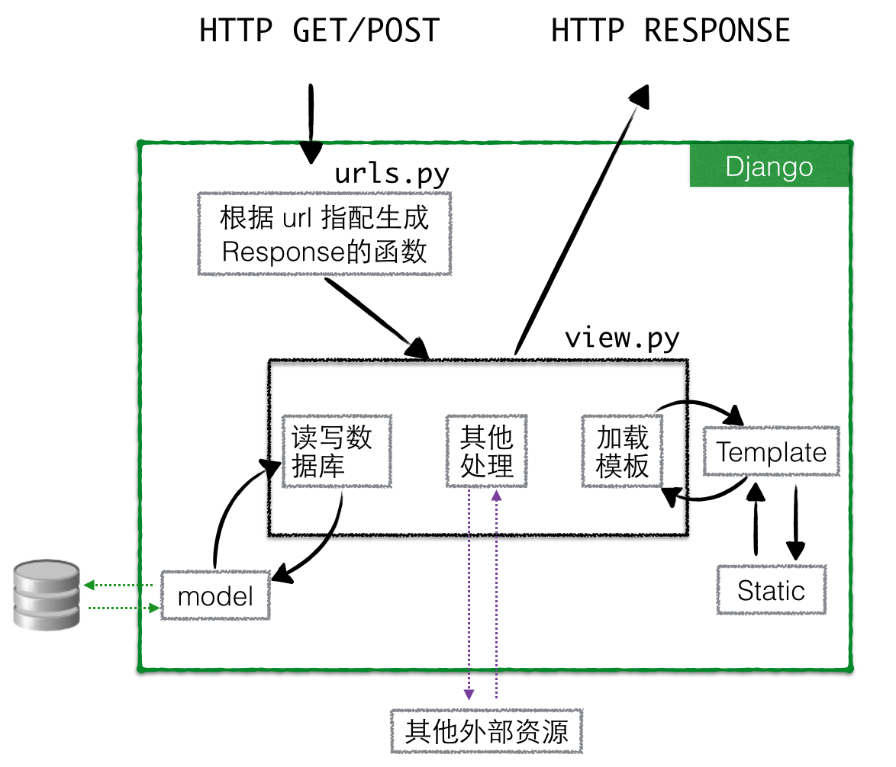
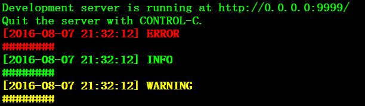

# django

env

```bash
    python 2.6.6
    django_1.4.22

```

##【目录】


<!-- vim-markdown-toc GFM -->
* [django 开始](#django-开始)
* [使用 bootstrap](#使用-bootstrap)
    * [settings](#settings)
    * [bootstrap](#bootstrap)
* [django 登陆](#django-登陆)
    * [flow chart](#flow-chart)
    * [detailed](#detailed)
    * [django admin 密码重置](#django-admin-密码重置)
* [django 输出到固定日志](#django-输出到固定日志)
    * [将 log 封装成一个单独的 app](#将-log-封装成一个单独的-app)
    * [编写 log 程序](#编写-log-程序)
    * [在本项目其他应用中的 view.py 中调用 BLog](#在本项目其他应用中的-viewpy-中调用-blog)
    * [测试](#测试)
* [django FAQ](#django-faq)
* [django 自用开发模板](#django-自用开发模板)

<!-- vim-markdown-toc -->

# django 开始
django

Django 里是模型（Model）、模板 (Template) 和视图（Views）， Django 也被称为 MTV 框架 。在 MTV 开发模式中：
* M 代表模型（Model），即数据存取层。 该层处理与数据相关的所有事务：如何存取、如何验证有效
* T 代表模板 (Template)，即表现层。 该层处理与表现相关的决定：如何在页面或其他类型文档中进行显示。
* V 代表视图（View），即业务逻辑层。 该层包含存取模型及调取恰当模板的相关逻辑。可以把它看作模型与模板之间的桥梁。



我个人理解：可以把 Template 看作是含有变量的字符串，View 调用模板时，就是将变量传给 Template 的字符串，并将页面显示出来，具体如何显示不是咱们要关心的事，咱们只需要将变量传递给 template 即可

# 使用 bootstrap
django
## settings

神奇的 Python 内部变量 __file__ , 该变量被自动设置为代码所在的 Python 模块文件名。
```
import os.path
TEMPLATE_DIRS = (
    os.path.join(os.path.dirname(__file__), 'templates').replace('\\','/'),
)
```
or

```
import os.path
SITE_ROOT = os.path.abspath(os.path.dirname(__file__))

STATIC_ROOT = os.path.join(SITE_ROOT,'static')
STATICFILES_DIRS = (
    # Don't forget to use absolute paths, not relative paths.
    ("css", os.path.join(STATIC_ROOT,'css')),
    ("js", os.path.join(STATIC_ROOT,'js')),
    ("img", os.path.join(STATIC_ROOT, 'img')),
    ("font", os.path.join(STATIC_ROOT, 'font')),
    ("liger", os.path.join(STATIC_ROOT, 'liger')),
    ("bootstrap3", os.path.join(STATIC_ROOT, 'bootstrap3')),
)
TEMPLATE_DIRS = (
    os.path.join(SITE_ROOT,'templates'),
)
```
## bootstrap
Bootstrap 的使用一般有两种方法。一种是引用在线的 Bootstrap 的样式，一种是将 Bootstrap 下载到本地进行引用。
使用本地的 Bootstrap

下载 Bootstrap 到本地进行解压，解压完成，你将得到一个 Bootstrap 目录，结构如下：

```
[root@Linux bootstrap-3.3.5-dist]# tree
.
├── css
│   ├── bootstrap.css
│   ├── bootstrap.css.map
│   ├── bootstrap.min.css
│   ├── bootstrap-theme.css
│   ├── bootstrap-theme.css.map
│   └── bootstrap-theme.min.css
├── fonts
│   ├── glyphicons-halflings-regular.eot
│   ├── glyphicons-halflings-regular.svg
│   ├── glyphicons-halflings-regular.ttf
│   ├── glyphicons-halflings-regular.woff
│   └── glyphicons-halflings-regular.woff2
└── js
    ├── bootstrap.js
    ├── bootstrap.min.js
    └── npm.js
```
本地调用如下：
```
<!DOCTYPE html>
<html lang="en">
    <head>
        <meta charset="utf-8">
        <title>Hello Bootstrap</title>
        <!-- Bootstrap core CSS -->
        <link
            href="./bootstrap-3.3.5-dist/css/bootstrap.min.css" rel="stylesheet">
        <style type='text/css'>
            body {
                background-color: #CCC;
            }
        </style>
    </head>
    <body>
        <h1>hello Bootstrap<h1>
    </body>
</html>
```

# django 登陆

## flow chart
```
 +---------+      +---------+       +------------+
 | url.py  |----->| view.py |------>| templates  |
 | (Login) |      | (Login) |       | login.html |
 +---------+      +---------+       +------------+

 在登陆页输入账号密码后，通过认证函数进行认证，如果认证通过跳转到主页，否则重新登陆
```

## detailed
url.py
```
  url('^$','strap.view.LogIn'),
  url('^login/$','strap.view.LogIn'),         //login
  url('^index/$','strap.view.account_auth'),  //authentication
  url('^showDashboard/$','strap.view.show'),  //Go to the home page

```
view.py
```
  from django.http import HttpResponseRedirect, HttpResponse
  from django.shortcuts import render_to_response, render
  from django.contrib import auth
  import datetime
  def index(request):
      now = datetime.datetime.now()
      return render(request,'index.html')

  def LogIn(request):
      if request.user is not None:
          logout_view(request)
      return render(request,'login.html')

  def logout_view(request):
      user = request.user
      auth.logout(request)
      # Redirect to a success page.
      return HttpResponse("%s logged out!" % user)

  def account_auth(request):
      username = request.POST.get('username')
      password = request.POST.get('password')
      tri_user = auth.authenticate(username=username,password=password)
      if tri_user is not None:
      auth.login(request,tri_user)
      return HttpResponseRedirect('/showDashboard')
      else:
      return render_to_response('login.html',{'login_err':'Wrong username or password!'})

  def show(request):
      return render(request,'index.html')

```
templates
```
  <!DOCTYPE html>
  <html lang="en">
    <head>
      <meta charset="utf-8">
      <meta http-equiv="X-UA-Compatible" content="IE=edge" />

      <title>Admin</title>
      <meta name="description" content="">
      <meta name="author" content="">

      <!-- http://davidbcalhoun.com/2010/viewport-metatag -->
      <meta name="HandheldFriendly" content="True">
      <meta name="MobileOptimized" content="320">
      <meta name="viewport" content="width=device-width, initial-scale=1.0, maximum-scale=1.0, user-scalable=no">

      <!-- For Modern Browsers -->
      <link rel="shortcut icon" href="img/favicons/favicon.png">
      <!-- For everything else -->
      <link rel="shortcut icon" href="img/favicons/favicon.ico">
      <!-- For retina screens -->
      <link rel="apple-touch-icon-precomposed" sizes="114x114" href="img/favicons/apple-touch-icon-retina.png">
      <!-- For iPad 1-->
      <link rel="apple-touch-icon-precomposed" sizes="72x72" href="img/favicons/apple-touch-icon-ipad.png">
      <!-- For iPhone 3G, iPod Touch and Android -->
      <link rel="apple-touch-icon-precomposed" href="img/favicons/apple-touch-icon.png">

      <!-- iOS web-app metas -->
      <meta name="apple-mobile-web-app-capable" content="yes">
      <meta name="apple-mobile-web-app-status-bar-style" content="black">
      <!-- Add your custom home screen title: -->
      <meta name="apple-mobile-web-app-title" content="Jarvis">

      <!-- Startup image for web apps -->
      <link rel="apple-touch-startup-image" href="img/splash/ipad-landscape.png" media="screen and (min-device-width: 481px) and (max-device-width: 1024px) and (orientation:landscape)">
      <link rel="apple-touch-startup-image" href="img/splash/ipad-portrait.png" media="screen and (min-device-width: 481px) and (max-device-width: 1024px) and (orientation:portrait)">
      <link rel="apple-touch-startup-image" href="img/splash/iphone.png" media="screen and (max-device-width: 320px)">

      <link type="text/css" rel="stylesheet" href="/static/css/login.css"></link>
      <link type="text/css" rel="stylesheet" href="/static/bootstrap3/css/bootstrap.css"></link>
  </head>

  <body class="eternity-form scroll-animations-activated">
  <section data-panel="sixth" id="loginPage" class="colorBg6 colorBg dark active">
          <div class="container">
          <div class="login-form-section">
              <br>
              <br>
              <br>

              <div data-animation="bounceInLeft" class="forgot-password-section animated bounceInLeft">
                  <div class="section-title">
                     <h3>Login</h3>
                  </div>

                  <div class="forgot-content">
                      <form method ="post" id="target" action="/index/">
                          <div class="textbox-wrap">
                              <div class="input-group">
                                 <span class="input-group-addon "><i
                                      class="glyphicon glyphicon-user"></i></span> <input type="text"
                                      placeholder="Username" name="username" class="form-control" required="required">
                              </div>
                          </div>
                          <div class="textbox-wrap">
                              <div class="input-group">
                                 <span class="input-group-addon "><i
                                      class="glyphicon glyphicon-lock"></i></span> <input type="password"
                                      placeholder="Password" name="password" class="form-control "
                                      required="required">
                              </div>
                          </div>
                          <div class="forget-form-action clearfix">
                             <button class="btn btn-success pull-right green-btn"
                                  type="submit">
                                  LogIn &nbsp; <i class="glyphicon glyphicon-chevron-right"></i>
                              </button>
                          </div>
                      </form>
                  </div>
              </div>
          </div>
          </div>
      </section>
      <script type="text/javascript" src="/static/js/jquery-1.9.1.js"></script>
      <script type="text/javascript" src="/static/bootstrap3/js/bootstrap.min.js"></script>

      <script type="text/javascript">
          $(function() {
              $(".form-control").focus(function() {
                  $(this).closest(".textbox-wrap").addClass("focused");
              }).blur(function() {
                  $(this).closest(".textbox-wrap").removeClass("focused");
              });

              if('{{login_err}}') {
                  var html = '<div data-animation-delay=".2s" data-animation="fadeInRightBig" class="login-form-links link1 animated fadeInRightBig"						style="animation-delay: 0.2s;"><h4 class="blue">{{login_err}}</h4></div>'
                  $('div.login-form-section').append(html);
              }
          });
      </script>
  </body>
  </html>
```
## django admin 密码重置

```
python manage.py shell


然后获取你的用户名，并且重设密码：
from django.contrib.auth.models import User
user = User.objects.get(username='admin')
user.set_password('new_password')
user.save()
```
这样就可以使用新密码进行登陆了


# django 输出到固定日志

## 将 log 封装成一个单独的 app
```
[root@Linux mysite]# django-admin.py startapp log
[root@Linux mysite]# cd log
[root@Linux log]# ls
__init__.py  models.py  tests.py  views.py
```

## 编写 log 程序
```
curl -o BLog.py https://raw.githubusercontent.com/meetbill/MyPythonLib/master/log_utils/BLog/BLog.py
```
## 在本项目其他应用中的 view.py 中调用 BLog
```
from django.shortcuts import render,render_to_response

from log.BLog import Log
# 是否在终端显示
debug=True
# 日志文件
logpath = "/tmp/test.log"
# 设置日志文件为 5Mb 时进行轮转，并且最多只保留个日志
logger = Log(logpath,level="debug",is_console=debug, mbs=5, count=5)


def face(request):
    logstr="########"
    logger.error(logstr)
    logger.info(logstr)
    logger.warn(logstr)
    return render_to_response('register.html',{})
```
## 测试

当在 view.py 中设置了终端显示时



注：如果修改前 django 项目是运行的，那么当我们在程序中加入导入模块的程序时，需要重启下 django 应用，如果我们修改的程序不涉及导入模块部分，则不需要重启应用

# django FAQ
django
(1)Django 表单提交出现 CSRF verification failed. Request aborted
```
  由于我们创建一个 POST 表单（它具有修改数据的作用），所以我们需要小心跨站点请求伪造。
  谢天谢地，你不必太过担心，因为 Django 已经拥有一个用来防御它的非常容易使用的系统。
  简而言之，所有针对内部 URL 的 POST 表单都应该使用模板标签。
  [templates-form]
  

  [View]
  return render_to_response(’polls/detail.html’, {’poll’: p},
                    context_instance=RequestContext(request))
```
# django 自用开发模板

[pine](https://github.com/meetbill/pine)
