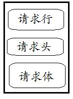
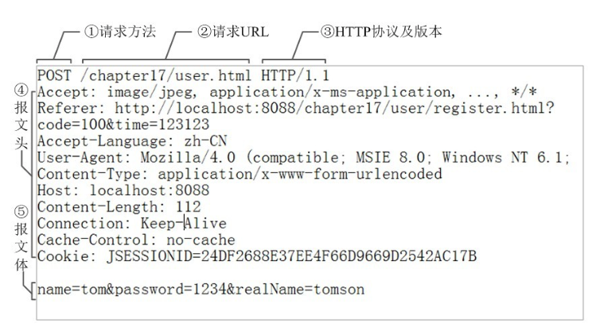
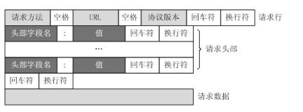
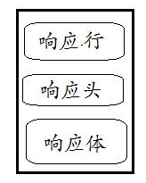
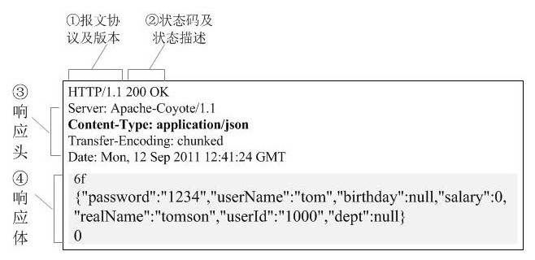

## web 基础
<!-- vim-markdown-toc GFM -->

* [1 一次完整的 HTTP 请求所经历的 7 个步骤](#1-一次完整的-http-请求所经历的-7-个步骤)
* [2 HTTP 报文](#2-http-报文)
    * [2.1 HTTP 请求报文解剖](#21-http-请求报文解剖)
        * [HTTP 请求报文头属性](#http-请求报文头属性)
        * [常见的 HTTP 请求报文头属性](#常见的-http-请求报文头属性)
    * [2.2 HTTP 响应报文解剖](#22-http-响应报文解剖)
        * [响应报文结构](#响应报文结构)
        * [响应状态码](#响应状态码)
        * [常见的 HTTP 响应报文头属性](#常见的-http-响应报文头属性)

<!-- vim-markdown-toc -->

## 1 一次完整的 HTTP 请求所经历的 7 个步骤

HTTP 通信机制是在一次完整的 HTTP 通信过程中，Web 浏览器与 Web 服务器之间将完成下列 7 个步骤：

> * (1) 建立 TCP 连接
>   * 在 HTTP 工作开始之前，Web 浏览器首先要通过网络与 Web 服务器建立连接，该连接是通过 TCP 来完成的，该协议与 IP 协议共同构建 Internet，即著名的 TCP/IP 协议族，因此 Internet 又被称作是 TCP/IP 网络。HTTP 是比 TCP 更高层次的应用层协议，根据规则， 只有低层协议建立之后才能，才能进行更层协议的连接，因此，首先要建立 TCP 连接，一般 TCP 连接的端口号是 80。
> * (2) Web 浏览器向 Web 服务器发送请求命令
>   * 一旦建立了 TCP 连接，Web 浏览器就会向 Web 服务器发送请求命令。例如：GET/sample/hello.jsp HTTP/1.1。
> * (3) Web 浏览器发送请求头信息
>   * 浏览器发送其请求命令之后，还要以头信息的形式向 Web 服务器发送一些别的信息，之后浏览器发送了一空白行来通知服务器，它已经结束了该头信息的发送。
> * (4) Web 服务器应答
>   * 客户机向服务器发出请求后，服务器会客户机回送应答， HTTP/1.1 200 OK ，应答的第一部分是协议的版本号和应答状态码。
> * (5) Web 服务器发送应答头信息
>   * 正如客户端会随同请求发送关于自身的信息一样，服务器也会随同应答向用户发送关于它自己的数据及被请求的文档。
> * (6) Web 服务器向浏览器发送数据
>   * Web 服务器向浏览器发送头信息后，它会发送一个空白行来表示头信息的发送到此为结束，接着，它就以 Content-Type 应答头信息所描述的格式发送用户所请求的实际数据。
> * Web 服务器关闭 TCP 连接
>   * 一般情况下，一旦 Web 服务器向浏览器发送了请求数据，它就要关闭 TCP 连接，然后如果浏览器或者服务器在其头信息加入了这行代码：
>   * Connection:keep-alive
>   * TCP 连接在发送后将仍然保持打开状态，于是，浏览器可以继续通过相同的连接发送请求。保持连接节省了为每个请求建立新连接所需的时间，还节约了网络带宽。

## 2 HTTP 报文

HTTP 报文是面向文本的，报文中的每一个字段都是一些 ASCII 码串，各个字段的长度是不确定的。HTTP 有两类报文：请求报文和响应报文。

### 2.1 HTTP 请求报文解剖

HTTP 请求报文由 3 部分组成（请求行 + 请求头 + 请求体）：



下面是一个实际的请求报文：



> * (1) 是请求方法，GET 和 POST 是最常见的 HTTP 方法，除此以外还包括 DELETE、HEAD、OPTIONS、PUT、TRACE。不过，当前的大多数浏览器只支持 GET 和 POST，Spring 3.0 提供了一个 HiddenHttpMethodFilter，允许你通过“_method”的表单参数指定这些特殊的 HTTP 方法（实际上还是通过 POST 提交表单）。服务端配置了 HiddenHttpMethodFilter 后，Spring 会根据_method 参数指定的值模拟出相应的 HTTP 方法，这样，就可以使用这些 HTTP 方法对处理方法进行映射了。
> * (2) 为请求对应的 URL 地址，它和报文头的 Host 属性组成完整的请求 URL，
> * (3) 是协议名称及版本号。
> * (4) 是 HTTP 的报文头，报文头包含若干个属性，格式为“属性名：属性值”，服务端据此获取客户端的信息。
> * (5) 是报文体，它将一个页面表单中的组件值通过 param1=value1&param2=value2 的键值对形式编码成一个格式化串，它承载多个请求参数的数据。不但报文体可以传递请求参数，请求 URL 也可以通过类似于“/chapter15/user.html? param1=value1&param2=value2”的方式传递请求参数。

对照上面的请求报文，我们把它进一步分解，你可以看到一幅更详细的结构图：



#### HTTP 请求报文头属性

报文头属性是什么东西呢？我们不妨以一个小故事来说明吧。
```
快到中午了，张三丰不想去食堂吃饭，于是打电话叫外卖：老板，我要一份『鱼香肉丝』，要 12：30 之前给我送过来哦，我在江湖湖公司研发部，叫张三丰。
```
这里，你要『鱼香肉丝』相当于 HTTP 报文体，而“12：30 之前送过来”，你叫“张三丰”等信息就相当于 HTTP 的报文头。它们是一些附属信息，帮忙你和饭店老板顺利完成这次交易。

请求 HTTP 报文和响应 HTTP 报文都拥有若干个报文关属性，它们是为协助客户端及服务端交易的一些附属信息。


#### 常见的 HTTP 请求报文头属性

**Accept**

请求报文可通过一个“Accept”报文头属性告诉服务端 客户端接受什么类型的响应。

如下报文头相当于告诉服务端，俺客户端能够接受的响应类型仅为纯文本数据啊，你丫别发其它什么图片啊，视频啊过来，那样我会歇菜的~~~：
```
Accept:text/plain
```
Accept 属性的值可以为一个或多个 MIME 类型的值，关于 MIME 类型，大家请参考：http://en.wikipedia.org/wiki/MIME_type

**Cookie**

客户端的 Cookie 就是通过这个报文头属性传给服务端的哦！如下所示：
```
Cookie: $Version=1; Skin=new;jsessionid=5F4771183629C9834F8382E23BE13C4C
```

服务端是怎么知道客户端的多个请求是隶属于一个 Session 呢？注意到后台的那个 jsessionid=5F4771183629C9834F8382E23BE13C4C 木有？原来就是通过 HTTP 请求报文头的 Cookie 属性的 jsessionid 的值关联起来的！（当然也可以通过重写 URL 的方式将会话 ID 附带在每个 URL 的后面哦）。

**Referer**

表示这个请求是从哪个 URL 过来的，假如你通过 google 搜索出一个商家的广告页面，你对这个广告页面感兴趣，鼠标一点发送一个请求报文到商家的网站，这个请求报文的 Referer 报文头属性值就是 http://www.google.com。
```
唐僧到了西天。
如来问：侬是不是从东土大唐来啊？
唐僧：厉害！你咋知道的！
如来：呵呵，我偷看了你的 Referer...
```
**Cache-Control**

对缓存进行控制，如一个请求希望响应返回的内容在客户端要被缓存一年，或不希望被缓存就可以通过这个报文头达到目的。

如以下设置，相当于让服务端将对应请求返回的响应内容不要在客户端缓存：
```
Cache-Control: no-cache
```
其它请求报文头属性

参见：http://en.wikipedia.org/wiki/List_of_HTTP_header_fields

### 2.2 HTTP 响应报文解剖

#### 响应报文结构

HTTP 的响应报文也由三部分组成（响应行 + 响应头 + 响应体）：



以下是一个实际的 HTTP 响应报文：




> * (1) 报文协议及版本；
> * (2) 状态码及状态描述；
> * (3) 响应报文头，也是由多个属性组成；
> * (4) 响应报文体，即我们真正要的“干货”。

#### 响应状态码

和请求报文相比，响应报文多了一个“响应状态码”，它以“清晰明确”的语言告诉客户端本次请求的处理结果。

HTTP 的响应状态码由 5 段组成：

> * 1xx 消息，一般是告诉客户端，请求已经收到了，正在处理，别急...
> * 2xx 处理成功，一般表示：请求收悉、我明白你要的、请求已受理、已经处理完成等信息。
> * 3xx 重定向到其它地方。它让客户端再发起一个请求以完成整个处理。
> * 4xx 处理发生错误，责任在客户端，如客户端的请求一个不存在的资源，客户端未被授权，禁止访问等。
> * 5xx 处理发生错误，责任在服务端，如服务端抛出异常，路由出错，HTTP 版本不支持等。


以下是几个常见的状态码：

> * 200 OK

你最希望看到的，即处理成功！

> * 303 See Other

我把你 redirect 到其它的页面，目标的 URL 通过响应报文头的 Location 告诉你。
```
悟空：师傅给个桃吧，走了一天了
唐僧：我哪有桃啊！去王母娘娘那找吧
```
> * 304 Not Modified

告诉客户端，你请求的这个资源至你上次取得后，并没有更改，你直接用你本地的缓存吧，我很忙哦，你能不能少来烦我啊！

> * 404 Not Found

你最不希望看到的，即找不到页面。如你在 google 上找到一个页面，点击这个链接返回 404，表示这个页面已经被网站删除了，google 那边的记录只是美好的回忆。

> * 500 Internal Server Error

看到这个错误，你就应该查查服务端的日志了，肯定抛出了一堆异常，别睡了，起来改 BUG 去吧！

其它的状态码参见：http://en.wikipedia.org/wiki/List_of_HTTP_status_codes

有些响应码，Web 应用服务器会自动给生成。你可以通过 HttpServletResponse 的 API 设置状态码：

#### 常见的 HTTP 响应报文头属性

**Cache-Control**

响应输出到客户端后，服务端通过该报文头属告诉客户端如何控制响应内容的缓存。

下面，的设置让客户端对响应内容缓存 3600 秒，也即在 3600 秒内，如果客户再次访问该资源，直接从客户端的缓存中返回内容给客户，不要再从服务端获取（当然，这个功能是靠客户端实现的，服务端只是通过这个属性提示客户端“应该这么做”，做不做，还是决定于客户端，如果是自己宣称支持 HTTP 的客户端，则就应该这样实现）。

```
Cache-Control: max-age=3600
```

**ETag** 

一个代表响应服务端资源（如页面）版本的报文头属性，如果某个服务端资源发生变化了，这个 ETag 就会相应发生变化。它是 Cache-Control 的有益补充，可以让客户端“更智能”地处理什么时候要从服务端取资源，什么时候可以直接从缓存中返回响应。

关于 ETag 的说明，你可以参见：http://en.wikipedia.org/wiki/HTTP_ETag。

**Location**

我们在 JSP 中让页面 Redirect 到一个某个 A 页面中，其实是让客户端再发一个请求到 A 页面，这个需要 Redirect 到的 A 页面的 URL，其实就是通过响应报文头的 Location 属性告知客户端的，如下的报文头属性，将使客户端 redirect 到 iteye 的首页中：

```
Location: http://www.iteye.com
```


**Set-Cookie**

服务端可以设置客户端的 Cookie，其原理就是通过这个响应报文头属性实现的：

```
Set-Cookie: UserID=JohnDoe; Max-Age=3600; Version=1
```
其它 HTTP 响应报文头属性

更多其它的 HTTP 响应头报文，参见：http://en.wikipedia.org/wiki/List_of_HTTP_header_fields

